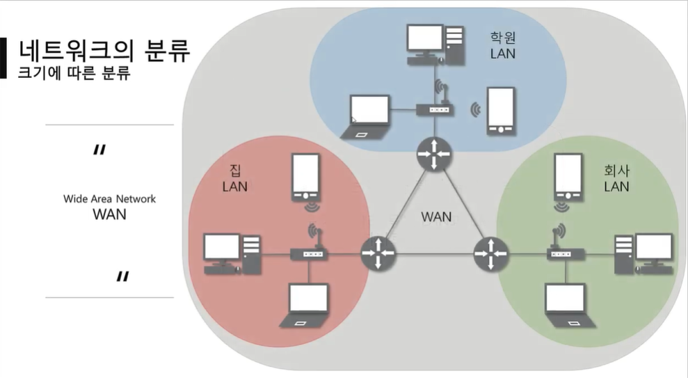
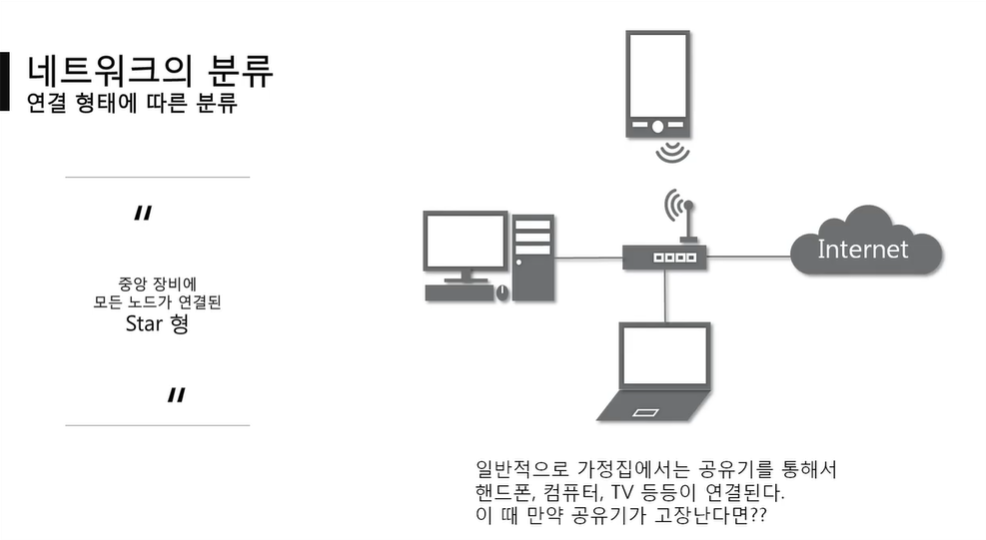
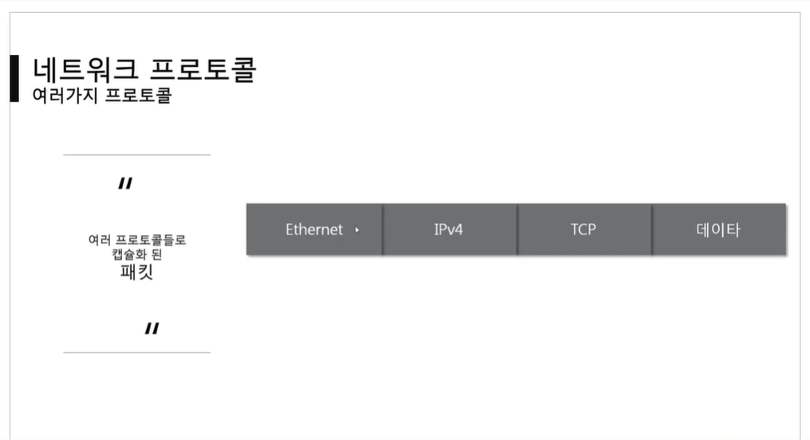
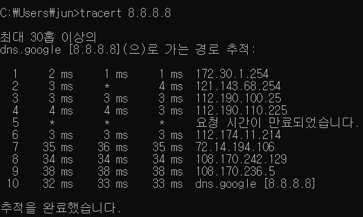
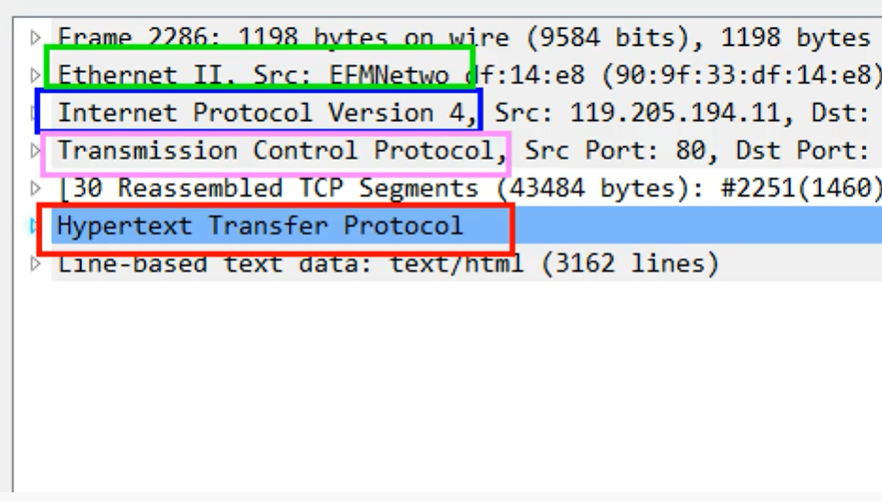
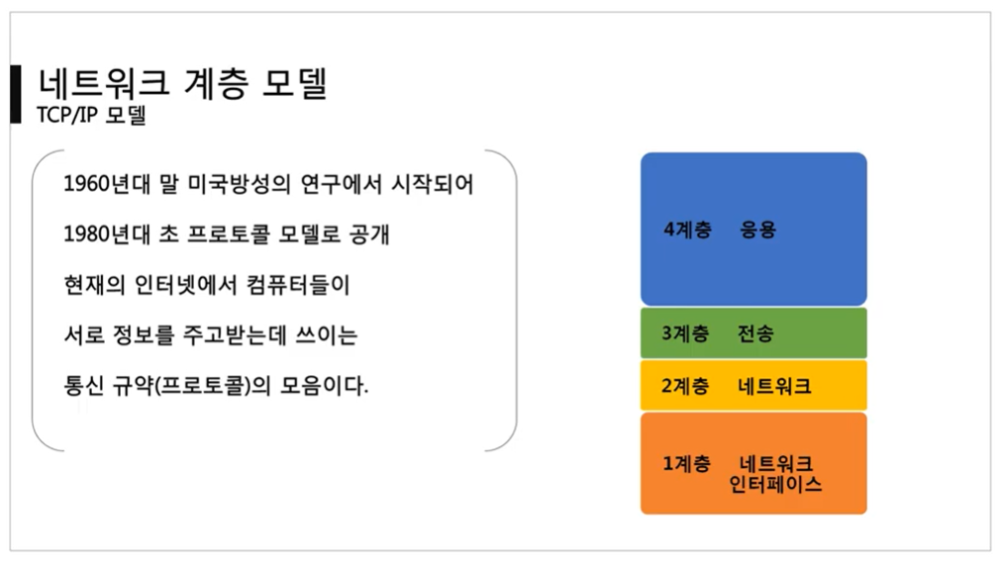
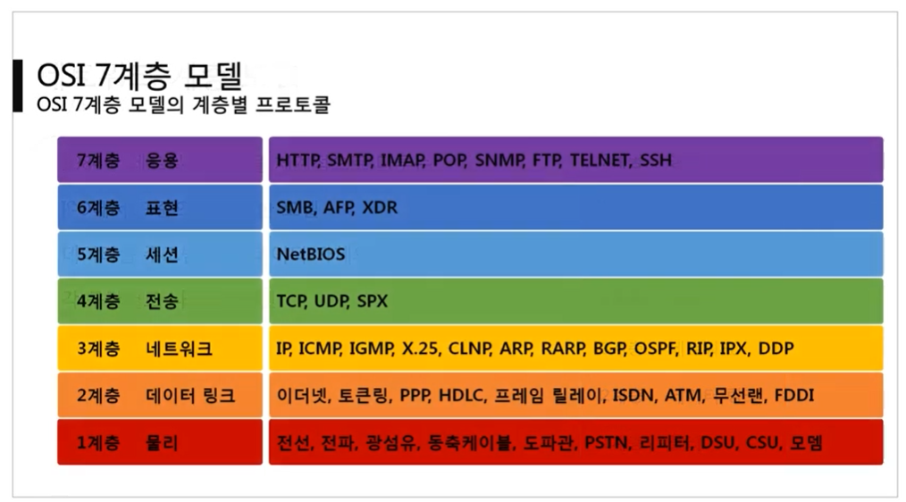
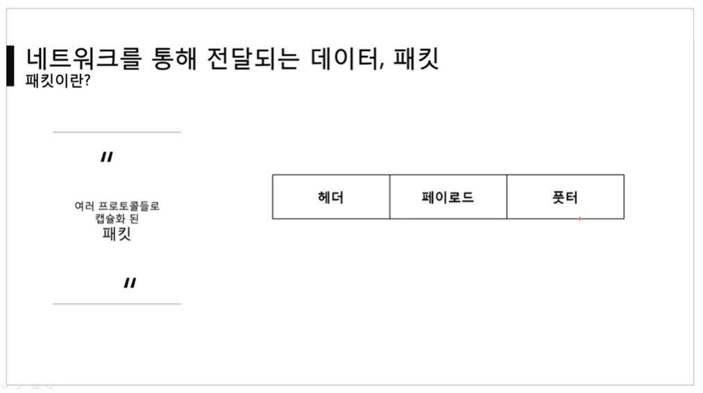
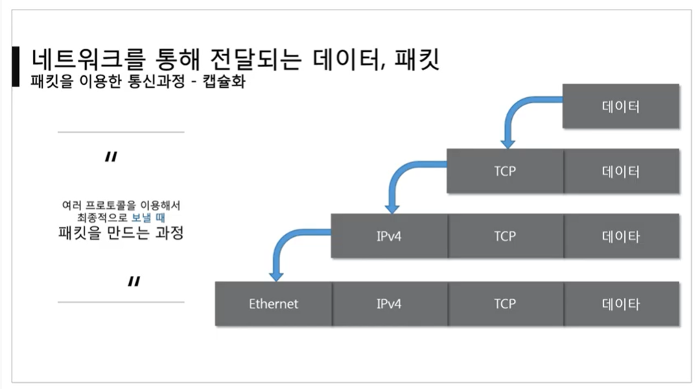
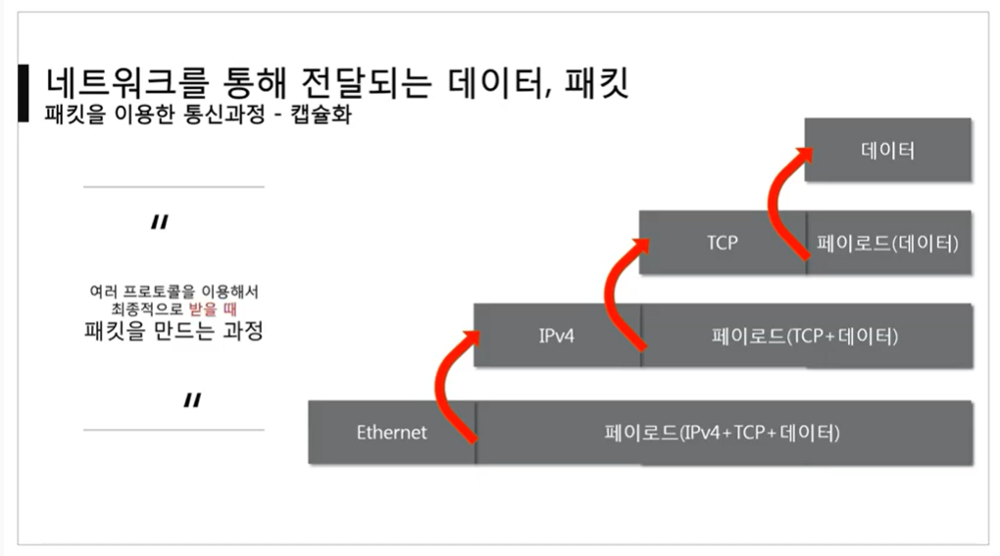

전체영상: [네트워크 기초(개정판)](https://www.youtube.com/playlist?list=PL0d8NnikouEWcF1jJueLdjRIC4HsUlULi)

<br>

[TOC]

<hr>

<br>

<br>

# [네트워크란?](https://youtu.be/Av9UFzl_wis?list=PL0d8NnikouEWcF1jJueLdjRIC4HsUlULi)

### 네트워크

- 노드들이 데이터를 공유할 수 있게 하는 디지털 전기통신망의 하나
  - 노드 : 네트워크에 속한 컴퓨터 또는 통신 장비를 뜻하는 말
- 분산되어 있는 컴퓨터를 통신망으로 연결한 것
- 네트워크에서 여러 장치들은 노드 간 연결을 사용하여 서로에게 데이터를 교환

<br>

### 인터넷

- 문서, 그림 영상과 같은 여러 가지 데이터를 공유하도록 구성된 세상에서 가장 큰, 전세계를 연결하는 네트워크
  - www는 인터넷을 통해 웹과 관련된 데이터를 공유하는 것

<br>

### 크기에 따른 네트워크의 분류 

- LAN (Local Area Network) : **가까운 지역**을 하나로 묶은 네트워크

  - ex) 스타크래프트의 근거리 통신망 대전 : 같은 집/피시방에 있을 때 가능한 대전 모드

- WAN (Wide Area Networt) : **멀리 있는 지역**을 한데 묶은 네트워크. 가까운 지역끼리 묶은 LAN과 LAN을 다시 하나로 묶은 것

  - LAN과 WAN의 관계 정리

    

- MAN (Metropolitan Area Network)
- VLAN, CAN, PAN 등등

<br>

### 연결 형태에 따른 네트워크의 분류

- Star형 : 중앙 장비에 모든 노드가 연결됨

  - 중앙 장비에 오류가 생기면 모든 네트워크 장비가 작동하지 않음.

  - 가까운 거리의 노드들을 연결할 때 사용됨

    

- Mesh형 : 여러 노드들이 서로 그물처럼 연결됨

  - 먼 거리의 노드들을 연결할 때 사용됨

  - 실제 인터넷은 Star형과 Mesh형을 혼합한 형태로 연결됨 (LAN과 WAN의 혼용) 

    

- Tree형 : 나무의 가지처럼 계층 구조로 연결됨

- 링형, 버스형, 혼합형 등등

<br>

### 네트워크 통신방식

- 유니 캐스트 : 특정 대상이랑만 1:1로 통신
- 멀티 캐스트 : 특정 다수와 1:N으로 통신
- 브로드 캐스트 : 네트워크에 있는 모든 대상과 통신

<br>

### 네트워크 프로토콜

- 프로토콜 

  - 일종의 약속, 양식
  - 네트워크에서 노드와 노드가 통신할 때, **어떤 노드**가 **어느 노드**에게 **어떤 데이터**를 **어떻게** 보내는지 작성하기 위한 양식

- 종류

  - 가까운 곳과 연락할 때 : Ethernet 프로토콜 (MAC 주소)
  - 멀리 있는 곳과 연락할 때 : ICMP, IPv4, ARP (IP 주소)
  - 여러가지 프로그램으로 연락할 때 : TCP, UCP (포트 번호)
    - 여러 메신저를 사용하고 있을 때, 내가 지금 보내는 메시지를 어느 메신저로 띄워야 할 지 결정할 때 사용

- 패킷 : 여러 프로토콜들로 캡슐화된 형태

  

<br>

<br>

# [실습1 (tracert)](https://youtu.be/paJf7JbBWqY?list=PL0d8NnikouEWcF1jJueLdjRIC4HsUlULi)

### 네트워크 대역 추적하기

- ```tracert 8.8.8.8``` 

  

- 가장 첫 번째로 오는 IP가 나와 가장 가까운 IPTIME

<br>

<br>

# [실습2 (Wireshark)](https://youtu.be/vBrQ3yzerMg?list=PL0d8NnikouEWcF1jJueLdjRIC4HsUlULi)

### Wireshark로 네트워크 구성요소 파악하기



- Ethernet : 특정한 컴퓨터를 찾기
- Internet Protocol Version 4 : 멀리 떨어져 있을 때 사용하는 프로토콜
- Transmission Control Protocol : 서로 다른 프로그램을 연결
- Hypertext Transfer Protocol : HTTP 프로토콜을 통한 데이터 전송

<br>

<br>

# [네트워크 모델](https://youtu.be/y9nlT52SAcg?list=PL0d8NnikouEWcF1jJueLdjRIC4HsUlULi)

### TCP/IP 모델

​	

<br>

### OSI 7계층 모델

- 중요 프로토콜

  - 2계층 : 이더넷

  - 3계층 : IP, ICMP, ARP

  - 4계층 : TCP, UDP

  - 7계층 : HTTP

    

<br>

### 두 모델의 공통점과 차이점

- 공통점
  - 계층적 네트워크 모델
  - 계층간 역할 정의
- 차이즘
  - 계층의 수 차이
  - OSI는 역할 기반, TCP/IP는 프로토콜 기반 : OSI는 논리적, TCP/IP는 실무적
    -  OSI는 분류 기준이 애매함 : 가령, http는 하나의 프로토콜이 응용, 표현, 세션 역할을 모두 담당한다.
  - OSI는 통신 전반에 대한 표준
  - TCP/IP는 데이터 전송기술 특화
- 면접에서는 OSI를 더 많이 물어 봄!

<br>

###  패킷

- 네트워크 상에서 전달되는 데이터를 통칭하는 말로 네트워크에서 전달하는 데이터의 형식화된 블록

- 패킷은 제어 정보와 사용자 데이터로 이루어지며, 사용자 데이터는 페이로드라고도 한다.

- 패킷은 헤더, 페이로드, 풋터로 이루어져 있지만 풋터는 잘 사용하지 않는다.

  - Ethernet 프로토콜만 풋터를 사용함!

    

- 캡슐화

  - 데이터를 보낼 때 프로토콜을 앞에 하나씩 헤더로 붙이는 과정

  - 하위 프로토콜 앞에 상위 프로토콜이 올 수 없다!

  - 같은 계층은 앞에 여러 개가 붙을 수 있다.

    

- 디캡슐화

  - 데이터를 받을 때 하위 프로토콜부터 하나씩 확인해나가는 과정

    

<br>

### 계층별 패킷의 이름 (PDU : Protocol Data Unit)

- 세그먼트 : 데이터에 TCP만 붙어있는 형태
- 패킷 : 3계층까지 붙은 형태
- 프레임 : 2계층까지 붙은 형태

