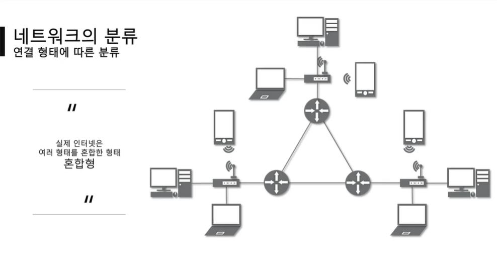

전체영상: [네트워크 기초(개정판)](https://www.youtube.com/playlist?list=PL0d8NnikouEWcF1jJueLdjRIC4HsUlULi)

 

 

# [네트워크란?](https://youtu.be/Av9UFzl_wis?list=PL0d8NnikouEWcF1jJueLdjRIC4HsUlULi)

### 네트워크

- 노드들이 데이터를 공유할 수 있게 하는 디지털 전기통신망의 하나
  - 노드 : 네트워크에 속한 컴퓨터 또는 통신 장비를 뜻하는 말
- 분산되어 있는 컴퓨터를 통신망으로 연결한 것
- 네트워크에서 여러 장치들은 노드 간 연결을 사용하여 서로에게 데이터를 교환

 

### 인터넷

- 문서, 그림 영상과 같은 여러 가지 데이터를 공유하도록 구성된 세상에서 가장 큰, 전세계를 연결하는 네트워크
  - www는 인터넷을 통해 웹과 관련된 데이터를 공유하는 것

 

### 크기에 따른 네트워크의 분류 

- LAN (Local Area Network) : **가까운 지역**을 하나로 묶은 네트워크

  - ex) 스타크래프트의 근거리 통신망 대전 : 같은 집/피시방에 있을 때 가능한 대전 모드

- WAN (Wide Area Networt) : **멀리 있는 지역**을 한데 묶은 네트워크. 가까운 지역끼리 묶은 LAN과 LAN을 다시 하나로 묶은 것

  - LAN과 WAN의 관계 정리

  

- MAN (Metropolitan Area Network)
- VLAN, CAN, PAN 등등

 

### 연결 형태에 따른 네트워크의 분류

- Star형 : 중앙 장비에 모든 노드가 연결됨

  - 중앙 장비에 오류가 생기면 모든 네트워크 장비가 작동하지 않음.

  - 가까운 거리의 노드들을 연결할 때 사용됨

  

- Mesh형 : 여러 노드들이 서로 그물처럼 연결됨

  - 먼 거리의 노드들을 연결할 때 사용됨

  - 실제 인터넷은 Star형과 Mesh형을 혼합한 형태로 연결됨 (LAN과 WAN의 혼용) 

    

- Tree형 : 나무의 가지처럼 계층 구조로 연결됨

- 링형, 버스형, 혼합형 등등

 

### 네트워크 통신방식

- 유니 캐스트 : 특정 대상이랑만 1:1로 통신
- 멀티 캐스트 : 특정 다수와 1:N으로 통신
- 브로드 캐스트 : 네트워크에 있는 모든 대상과 통신

 

### 네트워크 프로토콜

- 프로토콜 

  - 일종의 약속, 양식
  - 네트워크에서 노드와 노드가 통신할 때, **어떤 노드**가 **어느 노드**에게 **어떤 데이터**를 **어떻게** 보내는지 작성하기 위한 양식

- 종류

  - 가까운 곳과 연락할 때 : Ethernet 프로토콜 (MAC 주소)
  - 멀리 있는 곳과 연락할 때 : ICMP, IPv4, ARP (IP 주소)
  - 여러가지 프로그램으로 연락할 때 : TCP, UCP (포트 번호)
    - 여러 메신저를 사용하고 있을 때, 내가 지금 보내는 메시지를 어느 메신저로 띄워야 할 지 결정할 때 사용

- 패킷 : 여러 프로토콜들로 캡슐화된 형태

  

 

 

# [실습1 (tracert)](https://youtu.be/paJf7JbBWqY?list=PL0d8NnikouEWcF1jJueLdjRIC4HsUlULi)

- 

# [실습2 (Wireshark)](https://youtu.be/vBrQ3yzerMg?list=PL0d8NnikouEWcF1jJueLdjRIC4HsUlULi)

- 

# [네트워크 모델](https://youtu.be/y9nlT52SAcg?list=PL0d8NnikouEWcF1jJueLdjRIC4HsUlULi)

-