[TOC]

<hr>

<br>

<br>

# [HTTP 프로토콜](https://youtu.be/TwsQX1AnWJU?list=PL0d8NnikouEWcF1jJueLdjRIC4HsUlULi)

### 웹을 만드는 기술들

- HTML, JavaScript, CSS

  - 웹을 만드는 표준

  - 클라이언트 컴퓨터에서 동작하는 코드들

  - 클라이언트 쪽에서 동작하는 모든 코드는 클라이언트가 조작할 수 있음.

  - 이것을 다루는 개발자를 **프론트 엔드 개발자**라고 한다.

    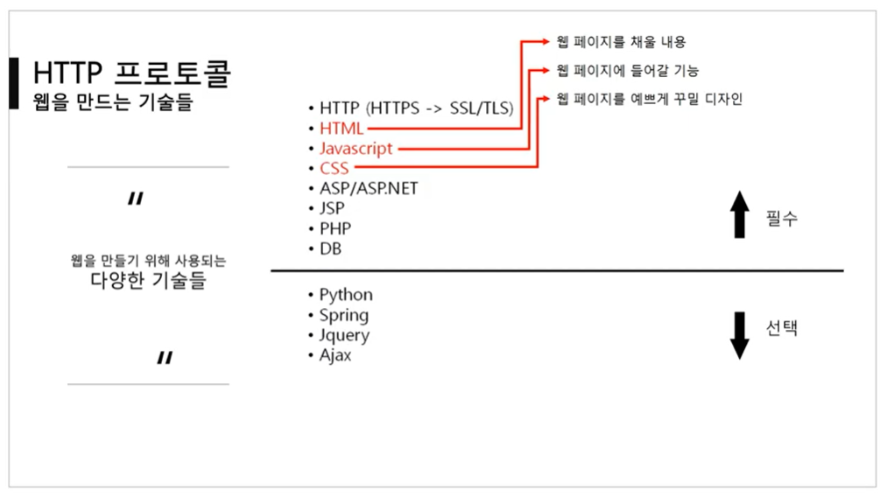

- 웹 표준은 모두 서버에서 저장을 함! 

  -  웹 브라우저는 서버에서 데이터를 다운로드를 받아 화면에 보여준다.

  - 이 때 웹 표준 데이터를 받아오는 것이 HTTP다.

  - HTTPS는 HTTP에 보안적인 요소를 추가시킨 것.

    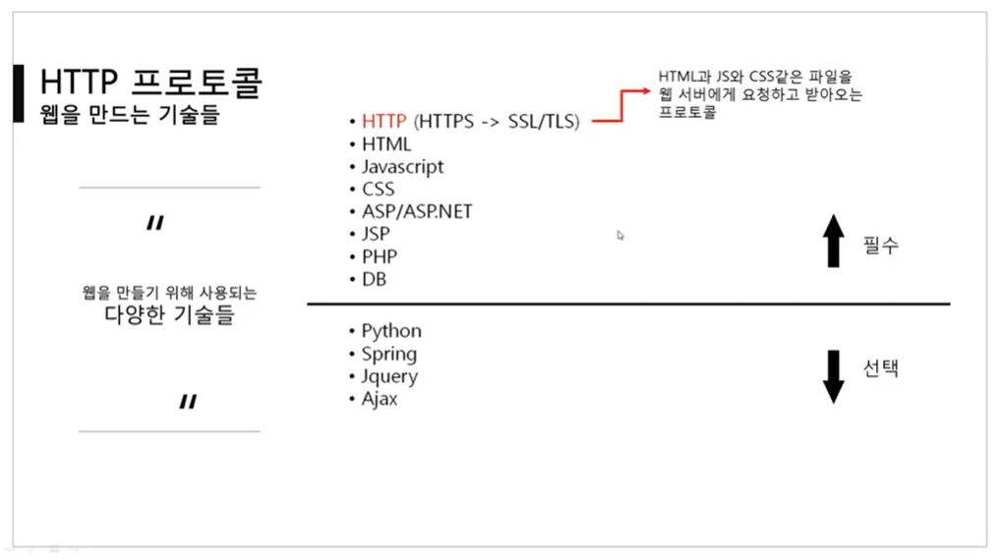

- ASP/ASP.NET, JSP, PHP

  - 서버 컴퓨터에서 실행시키는 코드

  - 이것을 다루는 개발자를 **백 엔드 개발자**라고 한다.

  - ASP/ASP.NET은 윈도우에만 호환이 되기 때문에 활용도가 낮다.

  - JSP는 호환성이 좋은 JAVA로 만들어졌기에 활용도가 높다. → 우리나라 공공 기반 홈페이지는 모두  JAVA 기반이다.

  - PHP는 간단하게 홈페이지를 만들 때 쓰인다. (비용이 낮음.)

    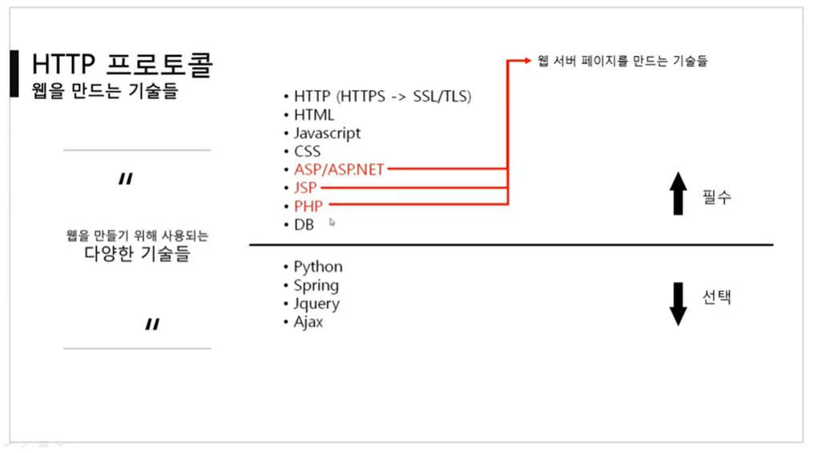

<br>

### HTTP 프로토콜의 특징

- HyperText Transfer Protocol (하이퍼 텍스트 전송 프로토콜)
- www에서 쓰이는 핵심 프로토콜로 문서의 전송을 위해 쓰이며, 오늘날 거의 모든 웹 애플리케이션에서 사용되고 있다.
  - 음성, 화상 등 여러 종류의 데이터는 MIME으로 정의하여 전송 가능
- HTTP의 특징
  - Request / Response (요청 / 응답) 동작에 기반하여 서비스 제공

<br>

### HTTP 1.0

- HTTP 1.0의 특징

  - "연결 수립, 동작, 연결 해제"의 단순함이 특징 → 하나의 URL은 하나의 TCP 연결
  - HTML 문서를 전송 받은 뒤 연결을 끊고 다시 연결하여 데이터를 전송한다.

- HTTP 1.0의 문제점

  - 단순 동작(연결 수립, 동작, 연결 해제)이 반복되어 통신 부하 문제 발생

    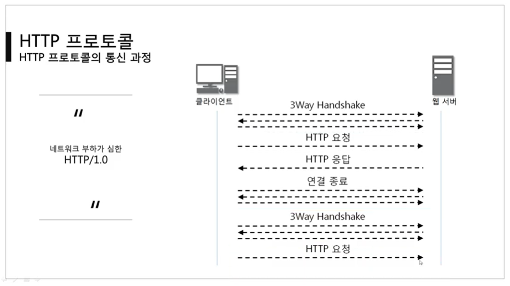

<br>

### HTTP 1.1의 특징

- HTTP 1.0과 호환 가능
- Multiple Request 처리가 가능하여 Client의 Request가 많을 경우 연속적인 응답 제공 → Pipeline 방식의 Request / Response 진행\
- HTTP 1.0과는 달리 Server가 갖는 하나의 IP Address와 다수의 Web Site 연결 가능
- 빠른 속도와 Internet Protocol 설계에 최적화될  수 있도록 Cache 사용
- Data를 압축해서 전달이 가능하도록 하여 전달하는 Data 양이 감소

<br>

<br>

# [HTTP 요청 프로토콜](https://youtu.be/rxaBwwI_JnI?list=PL0d8NnikouEWcF1jJueLdjRIC4HsUlULi)

### HTTP 요청 프로토콜의 구조

- 16진수를 쓰지 않고 글자(영어)를 사용함.

- Header :  옵션들이 여러 가지 붙는다.

- 공백은 한 줄 들어간다.

- Body : 데이터를 요청할 때 보내는 추가적인 데이터가 들어감.

  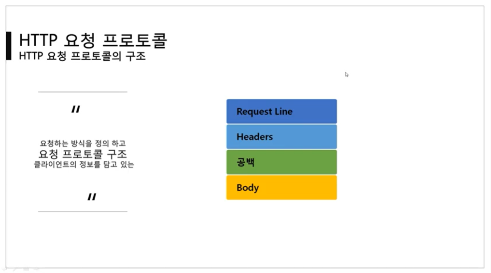

- 실제 HTTP 요청 프로토콜의 모습

  - 첫 번째 칸이 Request Line

  - 두 번째 칸이 Headers

  - 세 번째 칸이 공백

  - 네 번째 칸이 Body (여기에서는 없음)

    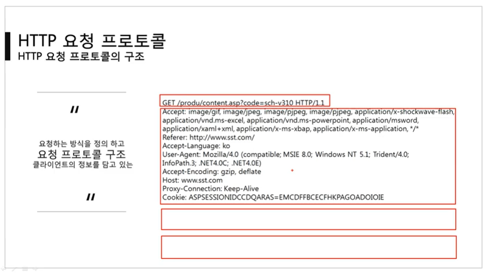

<br>

### Request Line

- 기본 구조 : 요청타입과 URI가 매우 중요함!

  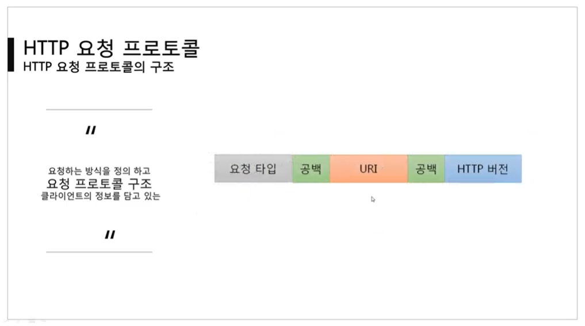

- 요청 타입

  - 가장 중요한 것은 GET과 POST

    - GET은 보통 서버에 데이터를 요청할 때 사용한다. 그러나 요청하면서 서버에 데이터를 보낼 수 있다.
    - POST는 원래 서버에 데이터를 보낼 용도로 만들어졌다. 그러나 데이터를 보내면서 서버에 요청을 할 수 있다.

  - GET 방식과 POST 방식의 차이점

    - GET 방식은 데이터를 서버에 보낼 때 URI에 포함시켜서 보낸다.
    - POST 방식은 데이터를 주소창이 아닌 Body에 포함시켜서 보낸다. 그래서 데이터가 URI에 드러나지 않는다.
    - 중요한 데이터는 GET 방식으로 보내지 않는다! → ID, 패스워드와 같은 정보는 무조건 POST  방식으로 보낸다!
    - 대부분의 사이트들은 여기에 더해, 보안 이슈를 막기 위해 **https**를 사용한다.

  - COPY. MOVE, DELETE는 보통 클라이언트의 접근을 방지하기 위해 막아놓는다.

  - HTTP Method 설명 중 GET, POST만 사용해야 한다고 하지만 개발자 입장에서 RESTful API 개발시 PUT, DELETE도 사용하는게 원칙임

    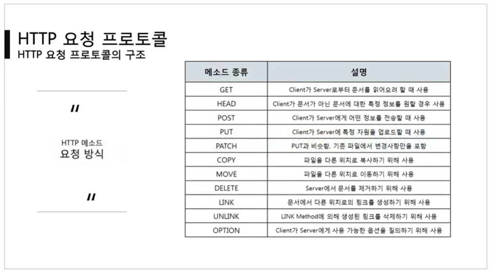

<br>

<br>

# [URL, URI란?](https://youtu.be/2ikhZ_fNP5Y?list=PL0d8NnikouEWcF1jJueLdjRIC4HsUlULi)

### URI

- 인터넷 상에서 특정 자원(파일)을 나타내는 유일한 주소

- 과거에는 URL와 URI를 혼용하여 사용하였지만, 이제는 URI라고 정확하게 지칭해주어야 한다.

  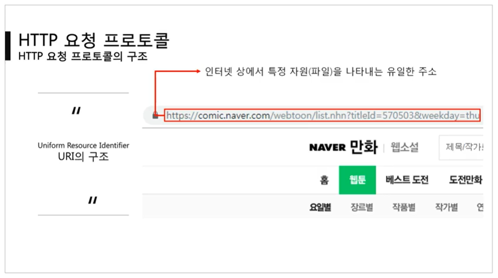

<br>

### URI의 구조

- scheme : 내가 요청하는 요청 형식을 지정하는 것  **ex)** ftp, http

- IP 주소에는 보통 도메인 주소를 사용한다. 컴퓨터는 DNS 서버를 통해 도메인 주소를 IP 주소로 변환하여 사용한다!

- 포트 번호를 지정하지 않으면 웹 브라우저가 80번 또는 443번 포트를 웹 브라우저가 알아서 지정해준다! 단, 표시하지 않고 생략함.

- 폴더이름, 파일이름 : 서버에 저장된 요청 파일의 경로

- query : 내가 전달하는 데이터 (보통 ? 뒤에 붙는다.)

  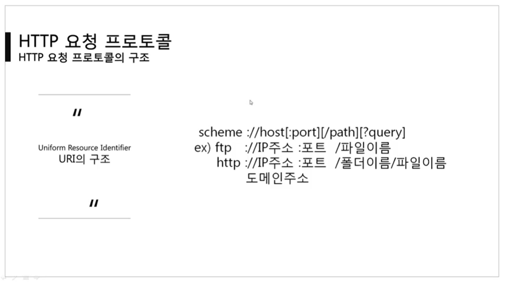

<br>

<br>

# [HTTP 요청 프로토콜 작성 실습](https://youtu.be/XbGJYsxed2w?list=PL0d8NnikouEWcF1jJueLdjRIC4HsUlULi)

- cmd에서 웹 사이트 접속하기 (예시 : 네이버) : ```nc.exe www.naver.com 80```
- 요청 프로토콜 형식 : ```GET / HTTP/1.1```
- 웹이 아닌 다른 프로그램으로도 웹 통신을 할 수 있다!
- 요청의 Server 부분을 통해 웹 사이트가 어떤 서버를 사용하고 있는지 알 수 있다.

<br>

<br>

# [URI 이해를 위한 실습](https://youtu.be/HBojczyd1Ac?list=PL0d8NnikouEWcF1jJueLdjRIC4HsUlULi)

- jdk, apache tomcat 설치
- JAVA 개발환경 설정 : 환경변수(Path) 설정
  - 기존의 Path 값이 지워지면 문제가 생기므로 주의하기!
- 시스템 변수 설정
- cmd를 재부팅하여 새로 실행한 뒤 ```javac -version```을 입력하여 설치 여부 확인
- apache tomcat의 압축 풀기
- bin 폴더 안의 ```startup.bat``` 실행

<br>

<br>

# [HTTP 응답 프로토콜](https://youtu.be/kuucNF4Zvbs?list=PL0d8NnikouEWcF1jJueLdjRIC4HsUlULi)

### HTTP 응답 프로토콜의 구조

- Status Line

-  Header

  - 요청과 응답이 모두 쓰는 Header
  - 요청할 때만 쓰는 Header
  - 응답할 때만 쓰는 Header

- 공백

- Body : 사용자가 요청한 데이터가 들어감

  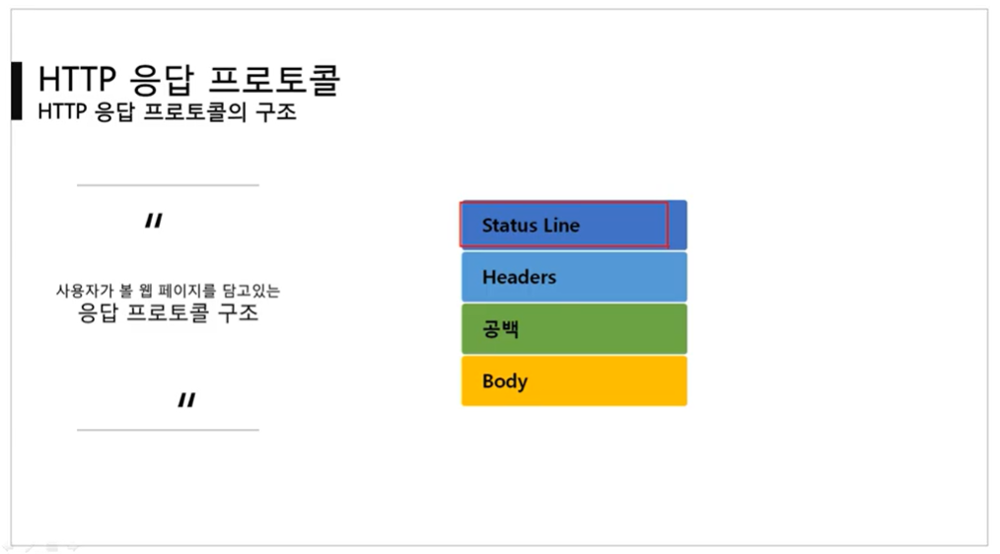

<br>

### 응답 프로토콜의 구조

- 첫 번째 칸이 Status Line

- 두 번째 칸이 Headers

- 세 번째 칸이 Body

- 이 사진에서 공백은 생략되어 있음.

  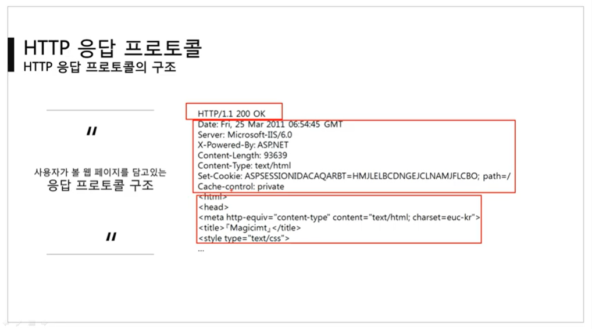

<br>

### Status Line

- 기본 구조

  - 상태 코드와 상태 문구는 하나의 세트

    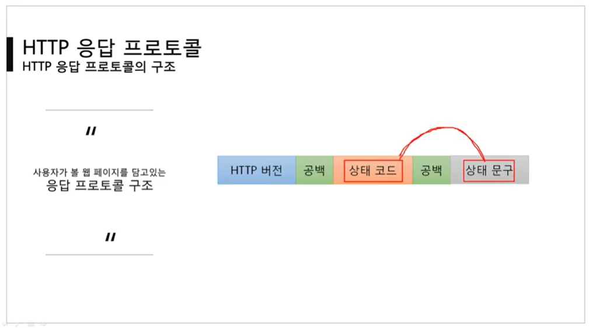

- 상태 코드

  - 상태 코드의 종류

    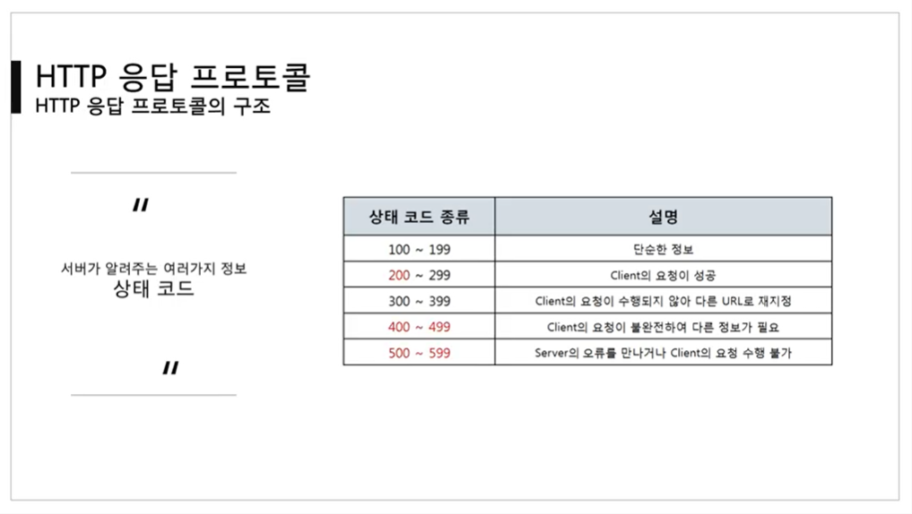

  - 200번대 : 요청이 정상적으로 완료되었을 때의 상태 코드

    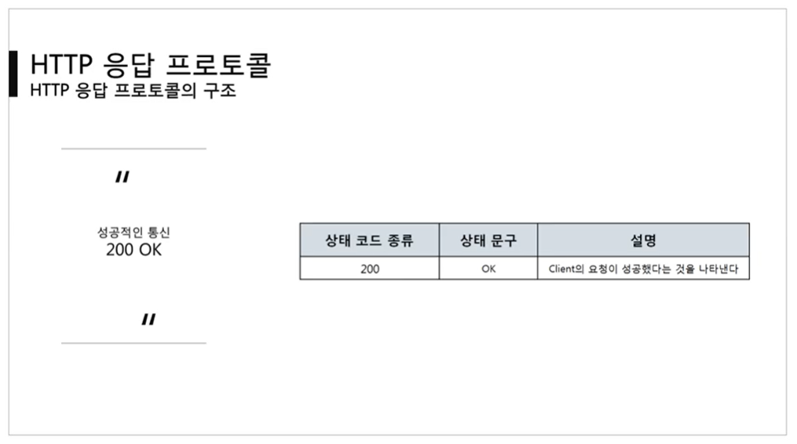

  - 400번대 : Client가 잘못했을 때의 상태 코드

    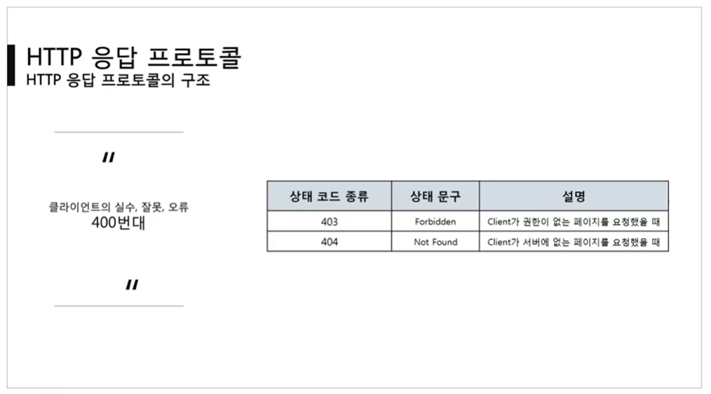

  - 500번대 : 서버가 잘못했을 때의 상태 코드

    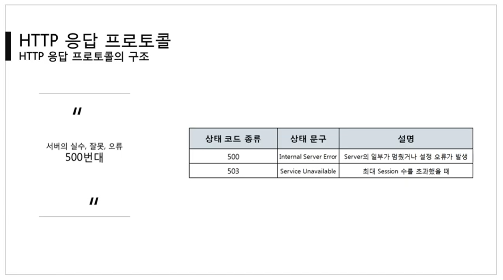

<br>

<br>

# [HTTP 헤더 포맷](https://youtu.be/mQTGmxendk8?list=PL0d8NnikouEWcF1jJueLdjRIC4HsUlULi)

### HTTP 헤더 구조

- 일반 헤더 : 요청과 응답 모두 사용할 수 있는 헤더

- 요청 헤더 : 요청만 사용할 수 있는 헤더

- 응답 헤더 : 응답만 사용할 수 있는 헤더

- 항목 헤더 : 특별한 경우에만 사용하는 항목 헤더

  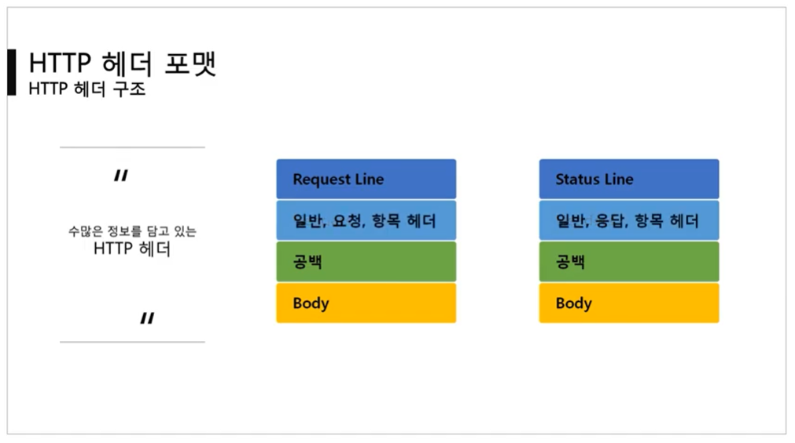

<br>

### 일반 헤더

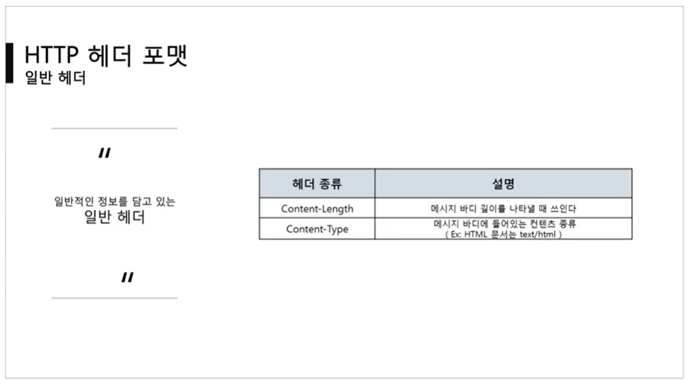

<br>

### 요청 헤더

- Cookie : 서버로부터 받은 값

- User-Agent : 클라이언트의 프로그램 정보를 서버에게 전달해주는 것

  - 이것을 통해 PC 화면과 모바일 화면을 구분해서 보여줌!

    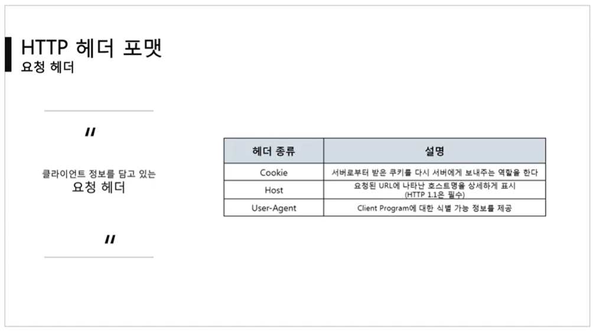

<br>

### 응답 헤더

- Server : 웹 서버의 프로그램 정보를 클라이언트에게 알려줌

  - 알려줄 수도 있고, 알려주지 않을 수도 있다.

    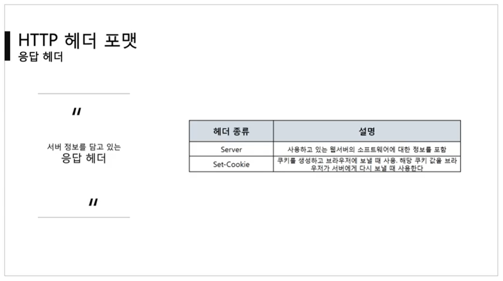

<br>

<br>

# [HTTP 프로토콜 분석 실습](https://youtu.be/dhMrKTwNI8U?list=PL0d8NnikouEWcF1jJueLdjRIC4HsUlULi)

- burpsuite를 활용

  - http 내용을 받아서 고치고 싶은 부분을 고쳐서 요청을 보낼 수 있음.

  - 응답을 받을 때도 고치고 싶은 부분을 고쳐서 받을 수 있음.

    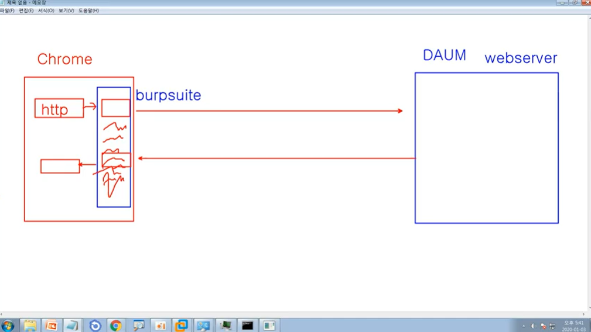