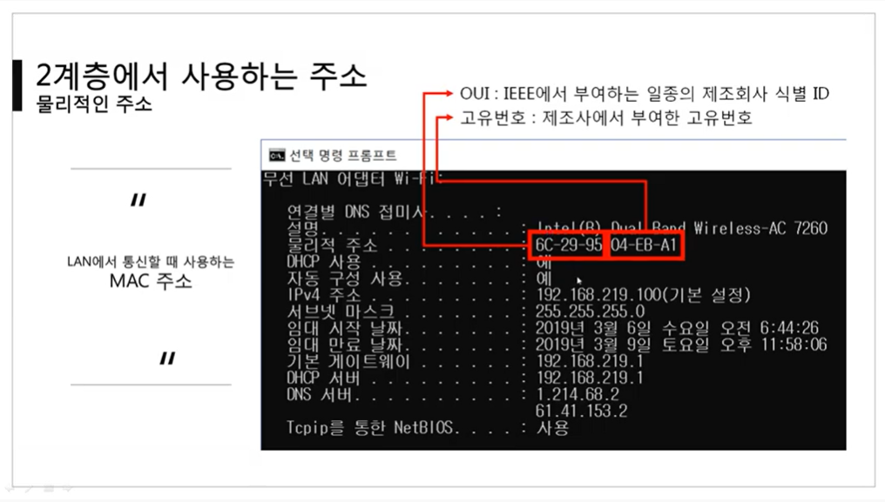
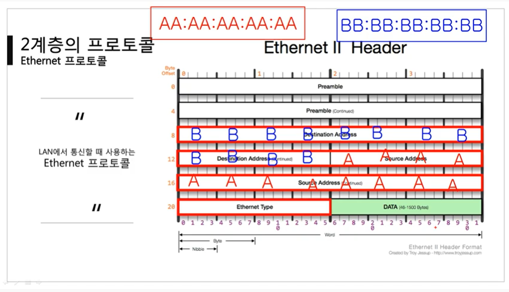
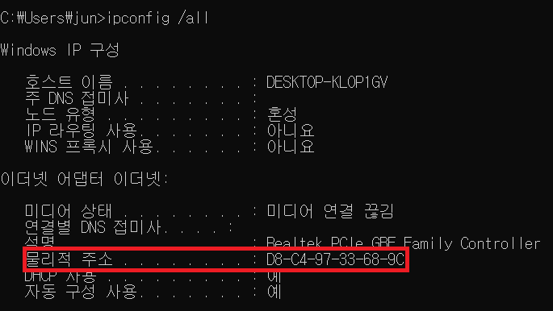

영상: [[따라學IT] 03. 가까이 있는 컴퓨터끼리는 이렇게 데이터를 주고받는다](https://youtu.be/HkiOygWMARs?list=PL0d8NnikouEWcF1jJueLdjRIC4HsUlULi)

<br>

[TOC]

<hr>

<br>

<br>

# 2계층에 대하여

### 2계층의 기능

- 2계층은 하나의 네트워크 대역, 즉 같은 네트워크 상에 존재하는 여러 장비들 중에서 어떤 장비가 어떤 장비에게 보내는 데이터를 전달
- 추가적으로 오류제어, 흐름제어 수행
  - 오류제어 : 보내는 데이터에 오류가 있는가?
  - 흐름제어 : 누가 누구에게 데이터는 보내는가?
- 하나의 네트워크 대역 LAN에서만 통실할 때 사용
  - 다른 네트워크와 통신할 때는 항상 3계층이 도와주어야 함.
  - 3계층의 주소와 3계층의 프로토콜을 이용하여야만 다른 네트워크와 통신이 가능

<br>

### 2계층에서 사용하는 주소 : 물리적인 주소

- LAN에서 통신할 때 사용하는 MAC 주소

- 12개의 16진수로 이루어짐

  - OUI : 앞 6개의 16진수. IEEE에서 부여하는 일종의 제조회사 식별 ID

  - 고유번호 : 뒤 6개의 16진수. 제조사에서 부여한 고유번호

    

<br>

<br>

# 2계층(Ethernet) 프로토콜

### 2계층의 프로토콜 : Ethernet 프로토콜

- 보내는 사람과 받는 사람 주소를 Ethernet 프로토콜에 넣는다.

- Destination Address : 목적지 주소

- Source Address : 출발지 주소

- Ethernet Type : DATA(페이로드) 안에 있는 3계층 프로토콜의 타입을 미리 알려준다!

  - 타입을 미리 알고 있으면 DATA를 분석하기가 용이하기 때문이다.

  - 다른 프로토콜들도 이런 방식으로 상위 프로토콜이 무엇인지 미리 파악한다.

  - 상위 프로토콜 타입 : 2바이트, IPv4(0x0800), ARP(0x0806)

    

<br>

### 본인 PC의 MAC주소 파악하기

- ```ipconfig /all```

  

- MAC주소를 통해 LAN카드 제조사 파악하기

  - https://aruljohn.com/mac.pl

-