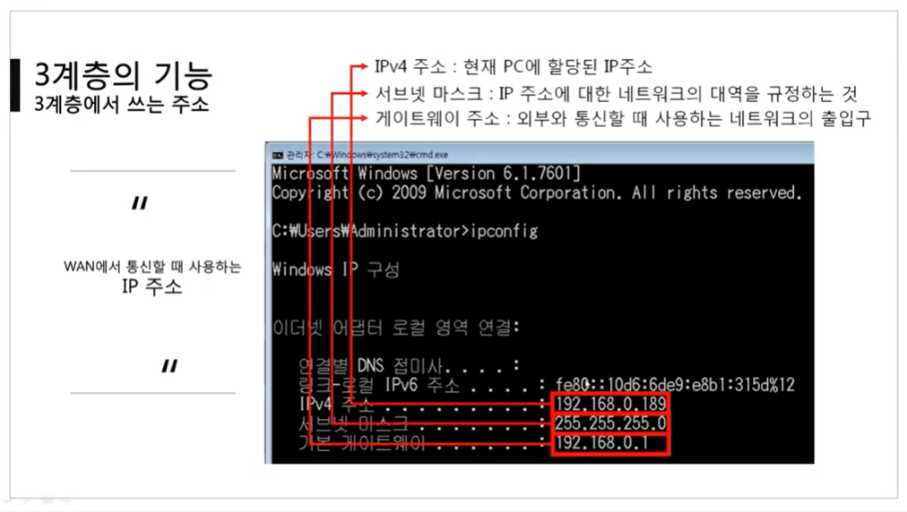

영상: [[따라學IT] 04. 실제로 컴퓨터끼리는 IP주소를 사용해 데이터를 주고받는다](https://youtu.be/s5kIGnaNFvM?list=PL0d8NnikouEWcF1jJueLdjRIC4HsUlULi)

 

[TOC]

 

 

# 3계층에 대하여

### 3계층에서 하는 일

- 3계층은 다른 네트워크 대역, 즉 멀리 떨어진 곳에 존재하는 네트워크까지 어떻게 데이터를 전달할지 제어하는 일을 담당
  - LAN과 LAN을 연결시켜주는 역할
- 발심에서 착신까지의 패킷의 경로를 제어
- 3계층의 대표적인 장비 : 라우터

 

### 3계층에서 쓰는 주소

- IP주소 : WAN에서 통신할 때 사용하는 주소

  - 원거리 통신에서 필수!

  - 원거리 통신의 필수 요소는 아래와 같다.

    

 

### 3계층 프로토콜

- ARP 프로토콜 : IP주소를 이용해 MAC 주소를 알아옴
- IPv4 프로토콜 : WAN에서 통실할 때 사용
- ICMP 프로토콜 : 서로가 통신되는지 확인할 때 사용

 

 

# 일반적인 IP 주소

### Classful IP 주소

- 초창기의 주소
- 낭비가 심함
  - 하나의 공간에 1Byte 밖에 못 씀
  - 2진수 8개로 표현할 수 있는 숫자까지만 표현 가능 (0 ~ 255)
  - 하나의 IP 주소에 여러 개의 컴퓨터를 연결해야 하는데, 컴퓨터 수가 너무 많아지면 불가능해짐 → 낭비의 원인

- 각 클래스별 IP 주소 특징

  - A 클래스 : 0 0000000.00000000.00000000.00000000 ~ 0 1111111.11111111.11111111.11111111

    - A 클래스는 첫 번째 필드만 네트워크 대역을 구분한다.
    - 따라서 A 클래스의 네트워크 대역은 최대 128개까지만 존재할 수 있다.
    - 대신에 하나의 네트워크 대역이 크다.
      - 나머지 필드를 컴퓨터를 구분하는 데에 쓸 수 있어서 굉장히 많은 컴퓨터를 구분할 수 있다.

  - B 클래스 : 10 000000.00000000.00000000.00000000 ~ 10 111111.11111111.11111111.11111111

    - 두 번째 필드까지는 네트워크를 구분하는 데에 쓰고, 세 번째 필드부터는 PC를 구분하는 데에 쓴다.
    - 구분할 수 있는 네트워크 대역 수는 늘고, 하나의 네트워크 대역 수가 포함하는 PC의 수는 줄었다.

  - C 클래스 : 110 00000.00000000.00000000.00000000 ~ 110 11111.11111111.11111111.11111111

    - 세 번째 필드까지는 네트워크를 구분하는 데에 쓰고, 마지막 필드만 PC를 구분하는 데에 쓴다.
    - 구분할 수 있는 네트워크 대역 수가 굉장히 많아짐.
    - 일반적으로 많이 사용함.

  - D 클래스 : 1110 0000.00000000.00000000.00000000 ~ 1110 1111.11111111.11111111.11111111

    - 멀티캐스트를 위해 남겨둔 주소

  - E 클래스 : 1111 0000.00000000.00000000.00000000 ~ 1111 1111.11111111.11111111.11111111

    - 실험용으로 남겨둔 IP 주소

      

 

### Classfulless IP 주소

- 서브넷 마스크가 도입됨 : 서브넷 마스크를 통해 네트워크 대역과 호스트 정보를 구분!

- 서브넷 마스크

  - Classful한 네트워크 대역을 나눠주는 데에 사용하는 값
  - 어디까지가 네트워크 대역을 구분하는 데에 사용하고 어디서부터 호스트를 구분하는데 사용하는지 지정
  - 32bit 4바이트
  - 2진수로 표기했을 때 1로 시작, 1과 1사이에는 0이 올 수 없다는 규칙을 가지고 있다.
    - 그리고 0이 한 번 나오면, 그 뒤는 모두 0이어야 한다!
    - **ex)** 255.255.255.192 → 11111111.11111111.11111111.11000000
    - 1에서 0으로 바뀌는 지점이 구분점
  - 서브넷팅 : 서브넷 마스크를 이용해서 하나의 큰 네트워크 대역을 잘게 쪼개는 것
  - 슈퍼넷팅 : 쪼개진 네트워크 대역을 하나로 합치는 것

- 네트워크 대역폭은 늘리고, 네트워크가 포함할 수 있는 호스트 정보를 줄임으로써 낭비를 막을 수 있다.

  

 

### 사설 IP와 공인 IP

- 공인 IP 1개당 2^32개의 사설 IP
- 공인 IP : 네트워크 통신망(인터넷)과 통신할 때 사용하는 IP 주소
  - 외부 네트워크와 통신할 때는 공인 IP로 통신한다!
    - 그래서 외부에서는 사설 네트워크 대역이 없는 것처럼 보인다.
- 사설 IP :  같은 네트워크 대역에서 사용하는 IP 주소
  - 사설 IP는 나갔다가 들어오는 것만 통신이 가능하다!
  - 바깥에서 바로 안쪽으로 들어올 수는 없다.
    - 이걸 가능하게 하려면 **포트포워딩**을 해야 함.
- NAT (Network Address Translation) 
  - 특정 IP를 다른 IP로 바꾸어주는 것
  - 이 기술을 통해 네트워크 주소를 사설 IP에서 공인 IP로 바꾸어줄 수 있다.
- 공유기의 역할
  - IP에서 요청이 나갈 떄 NAT 테이블에 기록을 하고, 그것에 대한 응답이 왔을 때 NAT 테이블을 보고 요청한 대상에게 전달해준다.
  - 나간 적이 없는 패킷이 응답으로 들어올 경우에는 공유기가 받고 끝남. 컴퓨터에는 전달되지 않음!

 

 

# 특수한 IP 주소

### 0.0.0.0

- Wildcard

- **나머지** 모든 IP

 

### 127.0.0.1

- 나 자신을 나타내는 주소

 

### 게이트웨이 주소

- 어딘가로 가려면 일단 여기로 : 외부 세상으로 나가는 문
- 일반적으로 공유기의 IP를 사용한다.
- 기본 게이트웨이 주소에는 네트워크 대역에서 사용할 수 있는 IP 중 가장 낮거나, 가장 높은 IP를 쓴다!
  - 기본 게이트웨이는 외부 세상으로 나가는 기본 문의 위치
  - 기본 게이트웨이를 설정하지 않으면 인터넷을 사용할 수 없다.
    - 인터넷을 사용하기 위해 필수로 필요한 것 : IP 주소, 서브넷 마스크, 기본 게이트웨이

