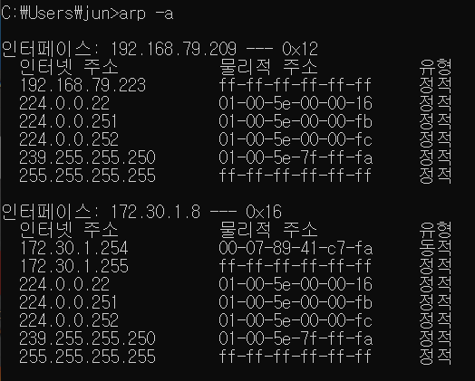

[TOC]

<hr>

<br>

<br>

# [ARP 프로토콜](https://youtu.be/LDsp-Xb168E?list=PL0d8NnikouEWcF1jJueLdjRIC4HsUlULi)

### ARP 프로토콜이란?

- ARP 프로토콜은 같은 네트워크 대역에서 통신을 하기 위해 필요한 MAC 주소를 IP 주소를 이용해서 알아오는 프로토콜이다.
- 같은 네트워크 대역에서 통신을 하더라도, 데이터를 보내기 위해서는 7계층부터 캡슐화를 통해 데이터를 보내기 때문에 IP 주소와 MAC 주소가 모두 필요하다. 이 떄 IP 주소는 알고 MAC 주소는 모르더라도 ARP를 통해 통신이 가능하다.
- 컴퓨터가 계속 사용하는 프로토콜
- 보안 상으로 중요함!
  - ARP 스푸핑 : ARP 테이블을 속이는 네트워크 공격

<br>

### ARP 프로토콜의 구조

- 28 Bytes
- Ethernet 프로토콜만 목적지가 먼저 오고, 나머지 프로토콜들은 출발지가 먼저 온다!
- Hardware type : 2계층에서 사용하는 프로토콜의 타입 → 거의 00 01로 되어있음. (Ethernet만 옴)
- Protocol type : Protocol Address의 타입 → 거의 08 00으로 되어있음. (IPv4만 옴)
- Hardware Address Length : Mac 주소의 길이 → 06 (byte)
- Protocol Address Length : IPv4의 길이 → 04 (byte)
- OPcode  (Operation Code) : 어떻게 동작하는지 나타내는 코드값
  - 상대방이 MAC 주소를 요청하고 있는가?
  - 요청에 대한 응답을 나타내고 있는가?
  - 물어볼 때는 00 01, 응답을 해줄 때는 00 02
- 3계층이지만 같은 네트워크 대역에서만 쓰인다.

<br>

<br>

# ARP 프로토콜의 통신 과정

1. 요청 보낼 정보를 브로드캐스트해서 캡슐화한 다음 가운데에 있는 스위치로 보낸다.
2. 가운데에 있는 스위치는 2계층 장비이기 때문에 2계층까지만 디캡슐화한다.
3. 같은 네트워크 대역에 있는 모든 PC에 보낸다.
4. 요청을 받은 모든 PC는 3계층까지 모두 확인한다.
5. 본인의 IP 주소와 목적지 IP 주소가 일치하는 PC가 요청을 받아들인다.
6. 요청은 받은 PC는 출발지 주소에 자신의 주소를, 도착지 주소에 요청을 보낸 PC 주소를 넣어서 스위치로 응답을 보낸다.
7. 스위치는 2계층까지 디캡슐화해서 목적지 주소와 일치하는 주소를 가진 PC에 응답을 보낸다.
8. 응답을 받은 PC는 ARP 테이블에 응답을 보낸 PC의 주소를 등록한다.
9. 이렇게 최초에 MAC 주소를 알아낸 이후 통신을 진행한다.

<br>

<br>

# ARP 테이블

### ARP 테이블

- 나와 통신했던 컴퓨터들의 IP 주소와 MAC 주소를 맵핑한 테이블
- 통신했던 컴퓨터들의 주소는  ARP 테이블에 남는다.
- 일정 시간이 지나면 기록이 사라져서 ARP 프로토콜을 통해 다시 정보를 알아내야 한다.

<br>

<br>

# [ARP 프로토콜 실습](https://youtu.be/-M_S50Ga384?list=PL0d8NnikouEWcF1jJueLdjRIC4HsUlULi)

- ```arp -a```

  