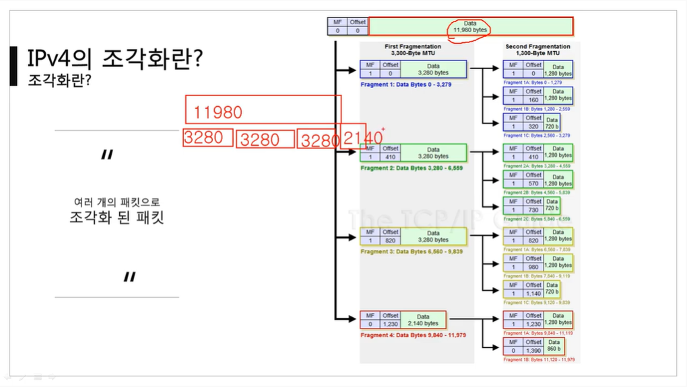

[TOC]


<hr>

<br>

<br>

# [IPv4 프로토콜](https://youtu.be/_i8O_o2ozlE?list=PL0d8NnikouEWcF1jJueLdjRIC4HsUlULi)

### IPv4 프로토콜이란?

- 네크워크 상에서 데이터를 교환하기 위한 프로토콜
  - 3계층 프로토콜
  - 3계층의 역할 : 멀리 있는 곳까지 최적의 경로로 찾아가는 것
- 데이터가 **정확하게 전달될 것을 보장하지 않는다**.
  - 전송은 하나 보장은 하지 않음! 데이터가 중간에 깨질 수도 있다.
  - 4계층에서는 보장을 함.
- 중복된 패킷을 전달하거나 패킷의 순서를 잘못 전달할 가능성도 있다.
  - 악의적으로 이용되면 DoS 공격이 됨
- 데이터의 정확하고 순차적인 전달은 그보다 상위 프로토콜인 TCP에서 보장한다.

<br>

### IPv4 프로토콜의 구조

- 크기는 기본적으로 20byte.

- 맨 끝의 IP Option은 붙을 수도 있고, 붙지 않을 수도 있다.

  - 붙을 때마다 크기가 4byte씩 늘어남.

- Source Address : 출발지 IP 주소

- Destination Address : 도착지 IP 주소

- Version : IP 프로토콜의 버전. 무조건 4만 온다고 생각하면 된다. (16진수 하나)

  - 6이 오는 경우는 없는데, IPv6는 구조 자체가 다르기 때문이다!

- IHL : 헤더 길이 (Header Length) → 최소 20byte ~ 최대 60byte

  - 2진수 4개로 표현됨. → 실제 헤더 길이를 4로 나눈 값이 저장됨!
  - 기본 헤더의 길이가 20byte이므로 주로 5가 오게 된다.

- TOS : 예전에 개발했을 때 쓰던 값으로, 지금은 쓰지 않음.

  - 0 0으로 비워져있다.
  - 세팅을 한다고 하더라고, 세팅된 값을 이해할 수 있는 장비가 없음.

- Total Length : 뒤의 페이로드까지 합쳐진 길이

  - 상위 계층에서부터 캡슐화되어서 내려온 데이터의 길이를 합친 전체의 길이

- Identification, IP Flags, Fragment Offset

  - 최대 전송 단위가 있기에 너무 큰 데이터를 보낼 때에는 데이터를 잘게 잘라서 본다.
  - 이 때 사용하는 값들!

- Identification : 잘게 잘라진 데이터들이 가지고 있는 ID 값

  - 데이터를 받는 쪽에서 잘려진 데이터들을 다시 합칠 때 사용함.

- IP Flags

  - 3비트로 이루어져 있음 
  - 첫 번째 값은 아예 쓰지 않음 (X)
  - 두 번째 값은 Don't Fragmentation (D)
    - 패킷을 보내는 사람이 데이터를 통째로 보내겠다고 명시한 것
    - 그러나 이렇게 보내면 최대 전송 단위를 초과해서 전송이 안 됨! 데이터 손실 일어남.
    - 데이터 손실 때문에 거의 사용할 수 없음!
  - 세 번째 값은 More Fragmentaion (M)
    - IP Flags에서 유일하게 사용되는 것
    - 다른 패킷들이 더 있다고 알려주는 역할을 함
    - 최대 전송 단위보다 큰 데이터를 전송하게 될 경우, 무조건 1로 세팅이 됨!
    - 그 이외의 경우 0으로 세팅이 됨.

- Fragment Offset

  - 13비트
  - 데이터를 받는 입장에서 잘게 잘려진 데이터의 순서를 알 수 있게 Offset을 지정함.
  - Offset : 어느 기준으로부터 얼마만큼 떨어져있는지를 의미함!
  - 앞의 데이터들을 합친 만큼의 크기가 Offset 값으로 지정됨.

- TTL (Time To Live) : 패킷이 살아있을 수 있는 시간

  - 패킷이 계속 살아있다면 패킷 경로를 잘못 설정했을 때 DoS 공격이 일어날 수 있음. 언제가는 없어져야 함!

    

  - 그래서 살아있는 시간은 TTL에 저장함.

  - 특정한 숫자를 지정하는데, 라우터와 같은 3계층 장비를 거칠 때마다 1씩 줄어듦.

  - 0이 되는 순간 네트워크 장비는 네트워크 패킷을 보내지 않고 버린다.

  - 이것을 통해 상대방 컴퓨터의 운영체제가 무엇인지 알 수 있다. → 해킹에 이용됨.

    - 운영체제마다 설정하는 값이 다르기 때문! 
    - 윈도우 : 128
    - 리눅스 : 64

- Protocol : 상위 프로토콜이 무엇인지 알려줌.

  - 이더넷의 이더넷 타입과 비슷한 역할
  - 상위 프로토콜로 올 수 있는 프로토콜 : ICMP, TCP, UDP
    - 3계층 : ICMP (1)
    - 4계층 : TCP (6) , UDP (17)

- Header Checksum : 헤더에 오류가 있는지 없는지 체크함

  - 헤더에 있는 여러 가지 필드들로 값을 계산한 뒤 세팅하여 전송함.

  - 데이터를 받는 쪽에서는 세팅된 값들을 스스로 계산하여 Header Checksum에 들어가있는 값과 비교함.

    

<br>

<br>

# [ICMP 프로토콜](https://youtu.be/JaBCIUsFE74?list=PL0d8NnikouEWcF1jJueLdjRIC4HsUlULi)

### ICMP 프로토콜이란?

- Internet Control Message Protocol : 인터넷 제어 메시지 프로토콜
- 네트워크 컴퓨터 위에서 돌아가는 운영체제에서 **오류 메시지**를 전송 받는 데에 주로 쓰인다.
- 프로토콜 구조의  Type과 Code를 통해 오류 메시지를 전송 받는다.

<br>

### ICMP 프로토콜의 구조

- Type : 대분류 (카테고리)

  - 0, 8 : 기본적인 것

    - 8 : 요청
    - 0 : 응답

  - 3, 11 : 잘못되었을 때

    - 3 : Destination Unreachable → 목적지까지 가지 못 함! → 경로 상의 문제
    - 11 : 요청시간이 만료되었습니다. → 목적지까지 갔으나 응답을 받지 못 함! → 상대 방의 문제 (ex: 방화벽)
    - 네트워크가 안 될 때 무슨 상황인지 알 수 있음!

  - 5 : 보안

    - ICMP Redirect (옛날에 쓰던 것)

    - 원격지에 있는 상대방의 라우팅 테이블을 ICMP로 수정할 때 쓰는 것

    - 상대방의 라우팅 테이블을 마음껏 수정할 수 있기에 해킹의 위험이 있다!

      

- Code : 소분류

  

<br>

<br>

# [IPv4, ICMP프로토콜 실습](https://youtu.be/8ZwTvTuZlVw?list=PL0d8NnikouEWcF1jJueLdjRIC4HsUlULi)

- ICMP는 통신할 때 자기 자신만 가는 것이 아니라, 뒤에 쓸 데 없는 데이터를 붙여서 보낸다.
- IPv4 프로토콜은 내가 보내는 패킷과 상대방이 받는 패킷이 모두 같다.
  - 하지만 내가 보내는 패킷의 이더넷 프로토콜과 상대방이 받는 패킷의 이더넷 프로토콜은 다르다!

<br>

<br>

# [라우팅 테이블](https://youtu.be/CjnKNIyREHA?list=PL0d8NnikouEWcF1jJueLdjRIC4HsUlULi)

### 라우팅 테이블이란?

- 3계층의 대표적인 역할은 최적의 경로를 프로토콜로 찾아가는 것

- 그 최적의 경로를 지도처럼 저장하는 것이 라우팅 테이블

- 라우팅 테이블에 적혀 있는 네트워크 대역만 찾아갈 수 있음! 적혀 있지 않은 네트워크 대역은 찾아갈 수 없음.

- 그래서 기본값을 하나 넣어줌. → 모르면 무조건 게이트웨이로 나가도록 설정.

  

<br>

### 다른 네트워크와 통신하는 과정

1. A라는 컴퓨터가 다른 네트워크 대역에 있는 B라는 컴퓨터와 통신한다고 가정

2. A가 자신의 라우팅 테이블을 확인 → B의 네트워크 대역이 라우팅 테이블에 있어야만 통신 가능!

   

3. ICMP 요청 작성 : **08**

   

4. IPv4 프로토콜 작성

   

5. 이더넷 프로토콜의 목적지 MAC 주소는 게이트웨이(공유기)의 MAC 주소가 들어감!

   - 이더넷 프로토콜은 가까운 곳만 통신할 수 있기 때문!

     

6. 스위치로 요청을 보냄. 이 때 스위치는 2계층 프로토콜만을 확인하여 공유기로 요청을 보냄.

   

7. 공유기는 요청을 받은 후 3계층 프로토콜을 확인해 목적지 주소를 파악한다.

8. 이후 자신의 라우팅 테이블을 확인하여 이더넷 프로토콜의 출발지, 목적지 MAC 주소를 다시 설정하여 라우터로 보낸다. 

   - 이 때 출발지 MAC 주소는 자신의 MAC 주소, 도착지 MAC 주소는 라우터의 MAC 주소

     

     

9. 라우터도 3계층 프로토콜을 통해 목적지 주소를 파악한 뒤, 자신의 라우팅 테이블과 비교한다.

   

10. 그리고 다시 이더넷 프로토콜을 작성한다. → 결국 이더넷 프로토콜은 네트워크 대역이 바뀔 때마다 새로 작성되는 것!

11. 6 ~ 9 과정을 B의 주소를 가진 공유기를 찾을 때까지 반복

    

    

12. 결국 B가 받게 되고, ICMP 응답 프로토콜  **00**을 작성한다.

    

13. 1 ~ 10 과정을 역순으로 거쳐 A에게 응답을 보냄.

    -  ```ping``` 명령어 한 번에 이 전체 과정이 4번 실행됨

    - 이 때 상대방의 MAC 주소를 모르면 ARP 과정을 사전에 거치게 된다.

<br>

<br>

# [라우팅 테이블 확인 실습](https://youtu.be/tVntagSJctc?list=PL0d8NnikouEWcF1jJueLdjRIC4HsUlULi)

### 라우팅 테이블 확인 명령어

- ```netstat -r```
  - 뒤에 붙는 키워드(ex : -r)에 따라서 4계층의 포트 번호, 네트워크 상태 등을 알 수 있기에 매우 중요함!
- 네트워크 설정을 했는데 통신이 안 되면 인터페이스를 확인해야 한다.

<br>

<br>

# [IPv4 조각화 이론](https://youtu.be/_AONcID7Sc8?list=PL0d8NnikouEWcF1jJueLdjRIC4HsUlULi)

### 조각화란?

- 큰 IP 패킷들이 적은 **MTU(Maximum Transmission Unit)**를 갖는 링크를 통하여 전송되려면 **여러 개의 작은 패킷으로 쪼개어/조각화되어 전송**되어야 한다.

  - MTU : 데이터 최대 전송 단위. 일반적으로 1500byte. (1500byte가 아닐 수도 있다!)
  - 따라서 페이로드가 1500byte보다 크면 조각화가 일어남
  - IPv4 프로토콜(20byte) 또한 MTU에 들어가기 때문에, 순수하게 페이로드를 전송할 수 있는 최대 단위는 (MTU - 20byte)이다.

- 즉, 목적지까지 패킷을 전달하는 과정에 통과하는 각 라우터마다 전송에 적합한 프레임으로 변환이 필요하다.

- 일단 조각화되면, 최종 목적지에 도달할 때까지 재조립되지 않는 것이 일반적이다.

- IPv4에서는 발신지 뿐만 아니라 중간 라우터에서도 IP 조각화가 가능

- IPv6에서는 IP 단편화가 발신지에서만 가능

- 재조립은 항상 최종 수신지에서만 가능함.

  

<br>

### 조각화 과정


<br>

<br>

# [IPv4 조각화 실습](https://youtu.be/QKEL9aBgHtg?list=PL0d8NnikouEWcF1jJueLdjRIC4HsUlULi)

### 문제 1

> - 보내려는 데이터 크기 : 2379
> - MTU : 980

- 몇 개의 패킷으로 쪼개지는가?  **3**

- 첫 번째 패킷의 데이터 크기는 얼마인가?  **960**

- 두 번째 패킷의 데이터 크기는 얼마인가?  **459**

  

<br>

### 문제 2

> - 보내려는 데이터 크기 : 4618
> - MTU : 1370

- 몇 개의 패킷으로 쪼개지는가?  **4**
- 첫 번째 패킷의 데이터 크기는 얼마인가?  **1350**
- 두 번째 패킷의 데이터 크기는 얼마인가?  **568**