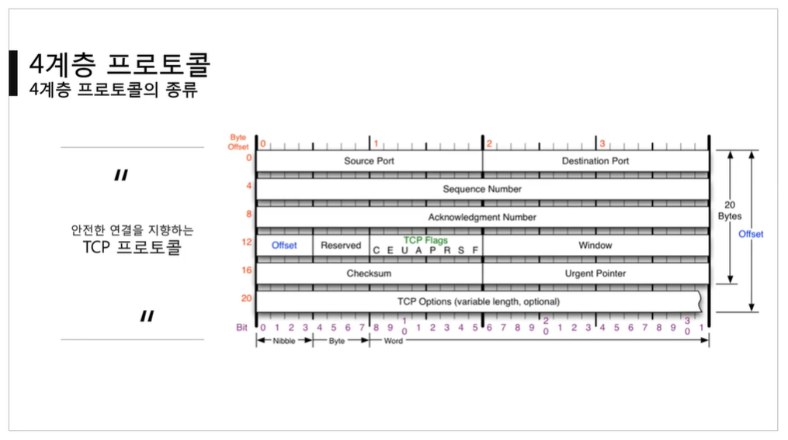
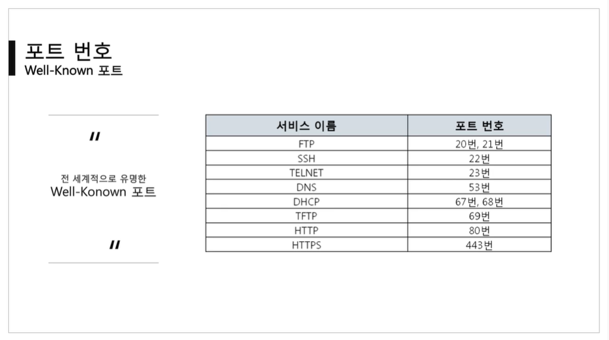
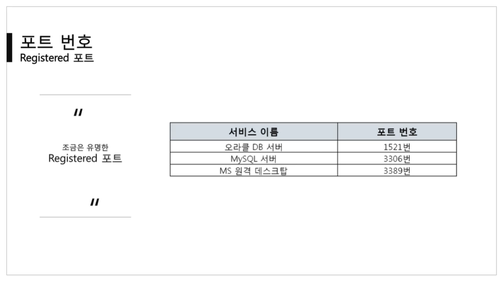
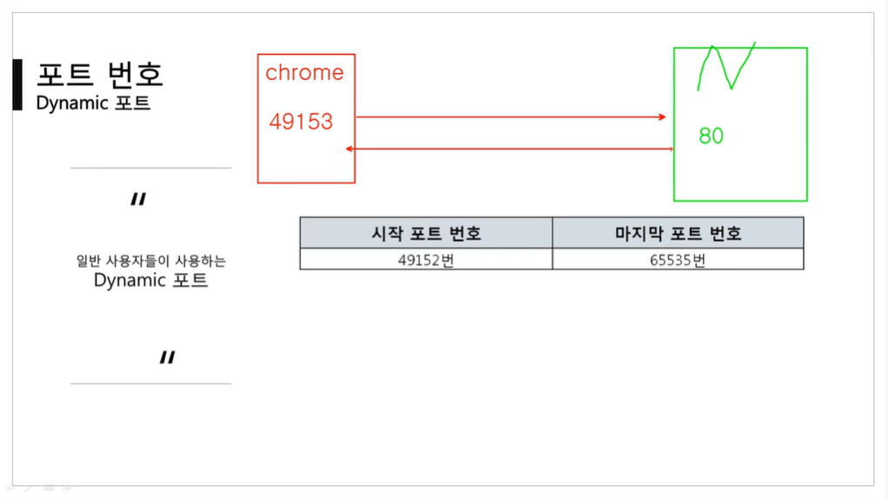
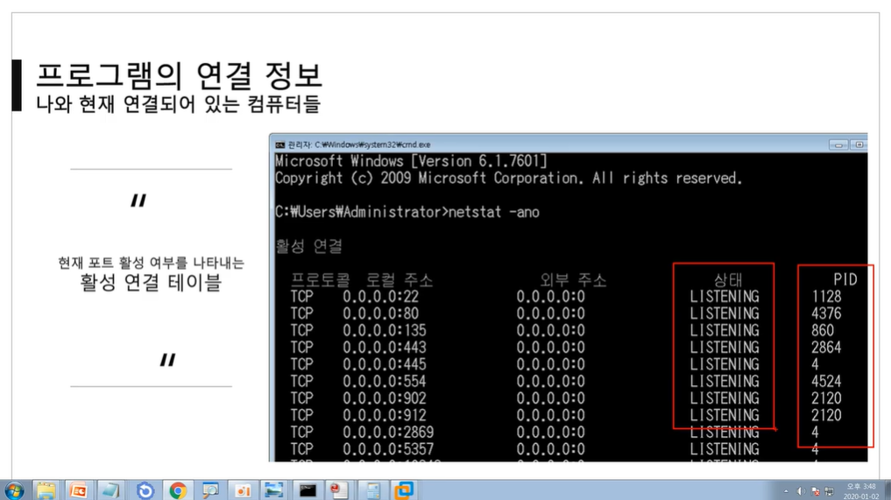

[TOC]

<hr>

<br>

<br>

# [4계층 프로토콜](https://youtu.be/tG0ldt4sBzY?list=PL0d8NnikouEWcF1jJueLdjRIC4HsUlULi)

### 4계층에서 하는 일

- 전송 계층(Transport Layer)은 송신자의 프로세스와 수신자의 프로세스를 연결하는 통신 서비스를 제공한다.
  - 프로세스 : 메모리에서 동작 중인 프로그램
- 전송 계층은 연결 지향 데이터 스트림 지원, 신뢰성, 흐름 제어, 그리고 다중화와 같은 편리한 서비스를 제공한다.
- 전송 프로토콜 중 가장 잘 알려진 것은 연결 지향 전송 방식을 사용하는 **전송 제어 프로토콜(TCP)**이다. 보다 단순한 전송에 사용되는 **사용자 데이터 프로그램 프로토콜(UDP)**도 있다.

<br>

### UDP 프로토콜

- 비연결지향형 프로토콜 : 연결된 상태를 지향하지 않음

- 연결을 하든 말든 데이터를 전송함.

- 과정이 간단함.

  

<br>

### TCP 프로토콜

- 연결지향형 프로토콜 : 연결이 되고 난 다음에 데이터를 전송함

- 상대방이 데이터를 잘 받았으면 다음 데이터를 보내고, 데이터를 잘 받지 못했으면 데이터를 다시 보낸다.

- 과정이 복잡함.

  

<br>

<br>

# 포트 번호

### 포트 번호의 특징

- 특정 프로세스와 특정 프로세스가 통신을 하기 위해 사용한다.
- **하나의 포트는 하나의 프로세스만** 사용 가능하다.
- 하나의 프로세스가 여러 개의 포트를 사용하는 것은 가능하다.
  - 내 컴퓨터 기준에서 하나의 포트는 하나의 프로그램만 실행 가능하다.
  - 그러나 상대방 컴퓨터의 여러 가지 프로그램들은 모두 나의 하나의 포트에 연결할 수 있다.
- 포트 번호는 일반적으로 정해져 있지만 **무조건 지켜야 하는 것은 아니다**.
- 예를 들어 일반적으로 웹 서비스는 80번 포트를 사용하지만 웹 서비스가 항상 80번 포트를 사용해야만 하는 것은 아니다.

<br>

### Well-Known 포트

- 꼭 알고 있어야 함! 전세계적으로 잘 알려진 웹 서비스들이기 때문!

- HTTP, HTTPS는 매우 대중적

  - **ex)** 네이버 웹 서버가 사용하는 포트는 80번

- 서버는 장비를 이야기하기도 하지만, 실질적으로는 사양히 좋은 컴퓨터이다.

  - 대신 프로그램이 실행되고 있어야 함.

- 포트 번호는 절대적이지 않다! 대신 포트 번호가 바뀌면 바뀐 포트 번호를 알고 있어야 접속이 가능하다.

  - 따라는 서비스를 제공할 경우에는 Well-Known 포트를 쓰게 됨.

    

<br>

### Registered 포트

- Well-Known  포트만큼은 아니지만 어느 정도 공신력 있는 포트들이 등록되어 있음.

- 원래는 엄청 많이 있음! 아래는 그 중 몇 개만 추린 것.

  

<br>

### Dynamic 포트

- 상대방 프로그램으로 연결할 때 쓰는 포트

- 클라이언트는 49152 ~ 65535 중 남는 거 하나 쓰게 됨.

  

<br>

### 활성 연결 테이블

- ```netstat -ano```

- 누가 어떤 프로그램과 어떤 상태로 연결되어 있는지 나옴.

  

<br>

<br>

# [포트 연결 확인 실습](https://youtu.be/Jb7tCFp-udM?list=PL0d8NnikouEWcF1jJueLdjRIC4HsUlULi)

- 크롬에서 네이버 접속 후 바로 cmd에 ```netstat -ano``` 치기

<br>

<br>

# [특정 포트 사용 실습](https://youtu.be/Qqmwm3rFihk?list=PL0d8NnikouEWcF1jJueLdjRIC4HsUlULi)

- Berryz WebShare를 이용하여 실습 진행

- www.naver.com에는 **.**과 **:443**이 숨겨져있다. 
  - :443은 포트번호