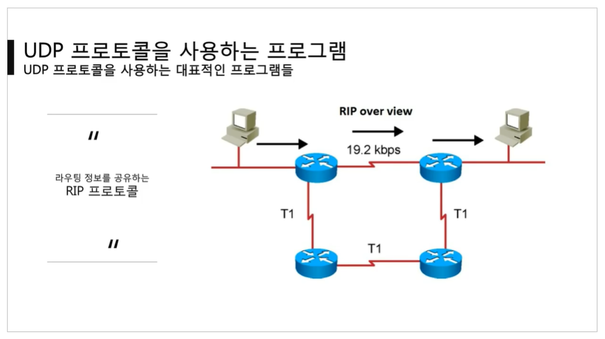

[TOC]

 

 

# [UDP 프로토콜](https://youtu.be/3MkI3FBFzX8?list=PL0d8NnikouEWcF1jJueLdjRIC4HsUlULi)

### UDP가 하는 일

- 사용자 **데이터그램 프로토콜(User Datagram Protocol, UDP)**은 **유니버설 데이터그램 프로토콜(Universal Datagram Protocol)**이라고 일컫기도 한다.
- UDP의 전송 방식은 **너무 단순**해서 서비스의 신뢰성이 낮고, 데이터그램 도착 순서가 바뀌거나, 중복되거나, 심지어는 통보 없이 누락시키기도 한다.
  - 비연결지향형 : 상대방과 연결되어 있는 상태를 지향하지 않는다.
- UDP는 일반적으로 **오류의 검사와 수정이 필요 없는 프로그램**에서 수행할 것으로 가정한다.
  - 중간에 문제가 생기면 검증, 재전송 요청이 불가하기 때문!

 

### UDP 프로토콜의 구조

- Source Port : 출발지 주소

- Destination Port : 목적지 주소

- Length : UDP 프로토콜 헤더와 페이로드 모두를 포함한 길이

- Checksum : 프로토콜이 손상되었는지 체크하는 값

  

 

### UDP 프로토콜을 사용하는 프로그램

- DNS 서버 :  도메일을 물으면 IP를 알려주는 서버

  

- tftp 서버 : UDP로 파일을 공유

  

- RIP  프로토콜 : 라우터들끼리 서로 라우팅 정보를 공유

  

 

 

# [tftpd로 파일 전송 실습](https://youtu.be/5Woau-EJChw?list=PL0d8NnikouEWcF1jJueLdjRIC4HsUlULi)

### 서버

- 서버 세팅, 클라이언트 세팅하기
- 서버 쪽에 전송할 파일 만들기
- 서버 인터페이스에 실제로 사용하는 IP주소 입력하기

 

### 클라이언트

- 클라이언트 세팅하기
- 클라이언트 탭으로 들어가서 Host에는 서버의 IP를, Port에는 서버의 포트 번호를 입력하기
- Local File에는 저장할 파일의 이름을 설정하기
- Remote File에는 서버 쪽에서 생성한 파일의 이름을 설정하기
- Get 버튼을 누르면 서버 쪽 파일을 클라이언트에 다운받게 됨.

 

### UDP 전송의 특징

- 단점 : 파일이 깨질 수 있다.

  - 그래서 큰 파일을 전송할 때에는 UDP 전송을 사용하지 않음.

- 주로 동영상 스트리밍 사이트에서 UDP 전송을 사용함.

  - 혹은 UDP와 TCP를 혼용해서 사용함

  

