[TOC]

 

 

# [TCP 프로토콜](https://youtu.be/cOK_f9_k_O0?list=PL0d8NnikouEWcF1jJueLdjRIC4HsUlULi)

### TCP가 하는 일

- TCP는 연결지향형 프로토콜이다.
- "전송 제어 프로토콜(Transmission Control Protocol, TCP)"은 인터넷에 연결된 컴퓨터에서 실행되는 프로그램 간에 통신을 안정적으로, 순서대로, 에러 없이 교환할 수 있게 한다.
- TCP의 안정성을 필요로 하지 않는 애플리케이션의 경우 일반적으로 TCP 대신 "비접속형 사용자 데이터그램 프로토콜(User Datagram Protocol)"을 사용한다.
- TCP는 UDP보다 안전하지만 느리다.
  - 여러 가지 기능을 사용하기 때문! 그러나 체감될 정도로 느리지는 않다.

 

### TCP 프로토콜의 구조

- Source Port : 출발지 포트 (2byte)

- Destination Port : 목적지 포트 (2byte)

- Sequence Number (4byte)

- Acknowledgement Number (4byte)

- Offset : 헤더의 길이

- Reserved : 예약된 필드로, 사용되지 않는 필드

- Window  : 나의 사용 공간이 얼마나 남아있는지 상대방에게 알려줌

  - TCP는 연결지향형이라 데이터를 보낼 때, 상대방에게 데이터를 보내도 되는지 묻는다. 그리고 상대방이 데이터를 보내도 된다고 응답할 경우에만 데이터를 보낸다.
  - 이후 데이터를 잘 받았냐고 물어보는데, 상대방은 데이터를 잘 받았는지의 여부를 대답함과 동시에 얼마나 더 보내면 되는지도 알려준다.
  - 이 때 얼마나 더 보내면 되는지 알려줄 때 사용하는 것이 Window이다.

- Urgent Pointer : 어디서부터가 긴급 데이터인지 알려주는 위치값

- TCP Options

  - 일반적으로 잘 안 붙고, 붙더라도 4byte씩 붙는다.

  - 최대 10개까지 붙을 수 있다.

  - 따라서 일반적으로는 20byte이지만 최대 60byte까지 늘어날 수 있다.

    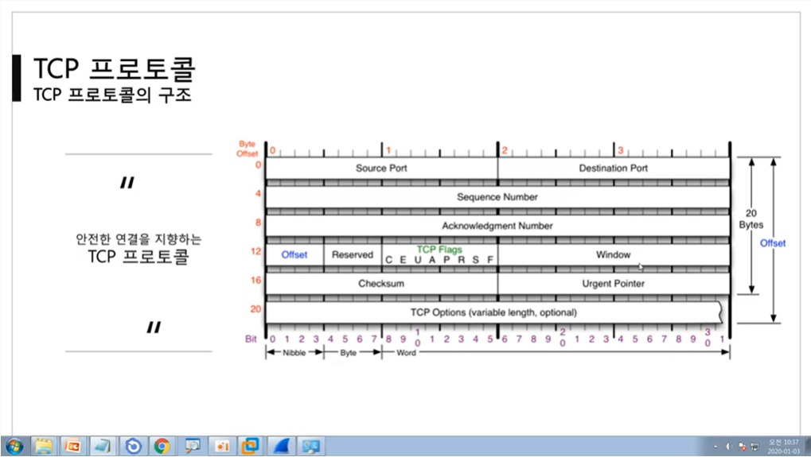

 

 

# TCP 플래그

### TCP Flags

- U, A, P, R, S, F가 중요!
-  TCP 프로토콜이 상대방과 통신을 할 때 상태를 나타내는 값
- U (Urgent Flag) : 긴급 비트
  - 지금 보내는 데이터에 우선 순위가 높은 데이터가 포함되어있다고 알려줌
  - Urgent Pointer와 세트
- A (Ack Flag) : 승인 비트
  - TCP에서 굉장히 많이 사용하는 중요한 비트
  - 들어온 요청에 대한 응답을 해 줄 때 사용하는 플래그
- P (Push Flag) : 밀어넣기 비트
  - 일반적으로 TCP 버퍼가 일정 크기만큼 쌓여야 패킷을 추가적으로 전송한다.
  - 그러나 이것에 상관 없이 계속 데이터를 밀어넣겠다는 것을 나타낼 때 사용.
  - 별로 중요하진 않음.
- R (Reset Flag) : 초기화 비트
  - 상대와 연결이 된 상태에서 데이터를 주고 받으려고 하는데, 문제가 생길 경우 연결을 새로고침(Reset)하는 비트
- S (Syn Flag) : 동기화 비트
  - 가장 중요한 플래그
  - 상대방과 연결을 시작할 때 무조건 사용하는 플래그
  - 처음 요청이 보내지고 난 후 동기화가 시작됨
- F (Fin Flag)
  - 연결을 끊을 때 사용하는 플래그
  
    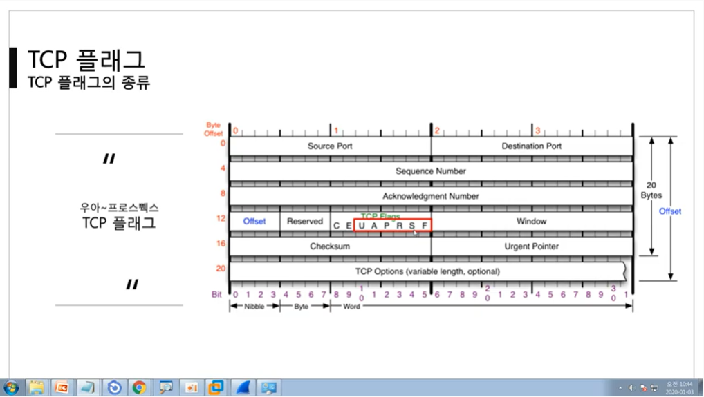
  
    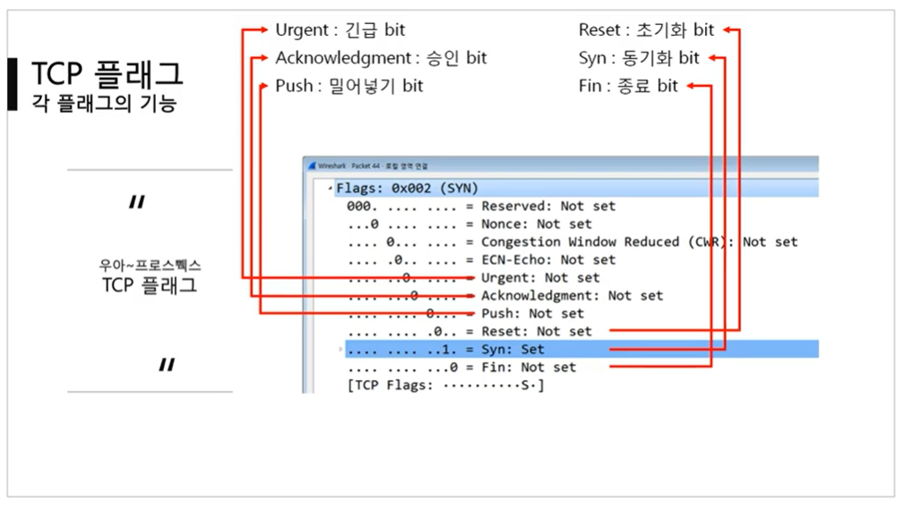

 

 

# [TCP 3Way Handshake](https://youtu.be/Ah4-MWISel8?list=PL0d8NnikouEWcF1jJueLdjRIC4HsUlULi)

### 연결 수립 과정

- TCP를 이용한 데이터 통신을 할 때  프로세스와 프로세르를 연결하기 위해 **가장 먼저 수행되는 과정**

- 과정

  > 1. 클라이언트가 서버에게 요청 패킷을 보내고 (항상 요청은 클라이언트가! 서버가 먼저 보내는 경우는 없다!)
  > 2. 서버가 클라이언트의 요청을 받아들이는 패킷을 보내고
  > 3. 클라이언트는 이를 최종적으로 수락하는 패킷을 보낸다.

- 위의 3개 과정을 3Way Handshake라고 부른다.

 

### 연결 수립 상세 과정

1. 클라이언트가 패킷을 만들어서 요청을 보낸다. (이더넷, IPv4, TCP 인캡슐레이션)
   - Flag는 Syn이 세팅, Ack 번호는 0이 세팅되어서 간다.
   
     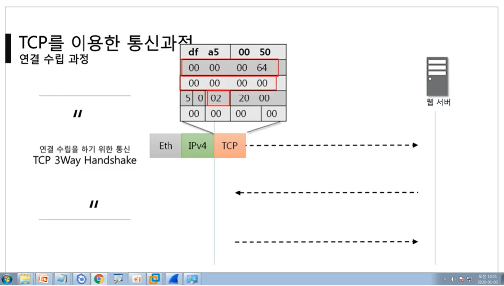
   
2. 요청을 받은 서버는 디캡슐레이션을 통해 내용을 확인한다.

   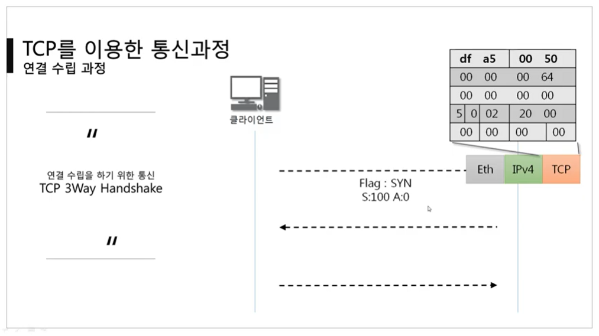

3. 이후 서버는 클라이언트에게 응답과 연결 요청을 보낸다.

   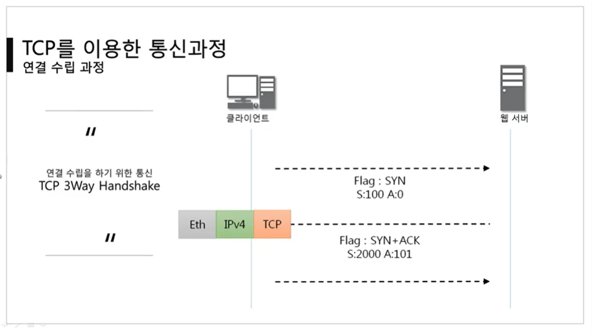

4. 응답을 받는 클라이언트는 디캡슐레이션을 통해 내용을 확인한다.

   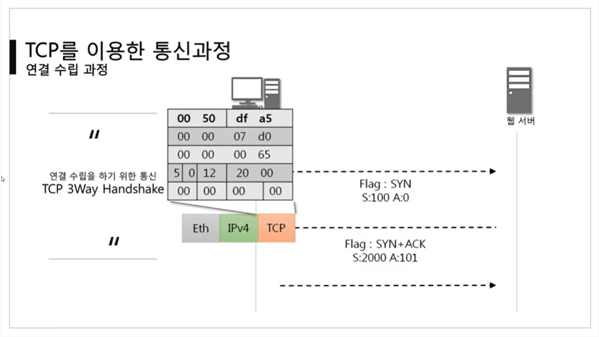

5. 이후 더 연결해도 되는지의 여부를 인캡슐레이션해서 다시 서버에 보낸다.

   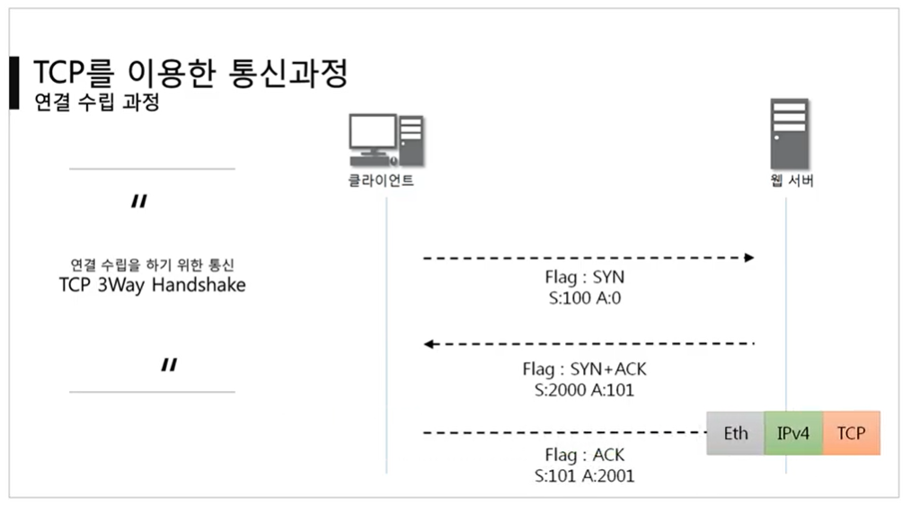

 

### Sequence 번호와 Ack 번호

- 맨 처음에 클라이언트가 Sequence 번호와 Ack 번호를 세팅해서 요청을 보낸다.
- 이후 요청을 받은 쪽에서, **받은 시퀀스 번호 + 1**을 해서 Ack 번호를 계산한다. 또한 받는 쪽에서 자신 만의 Sequence 번호를 랜덤으로 생성한다.
- Sequence 번호가 처음 받은 번호가 아닐 경우, **기존 Sequence 번호에 1을 추가**해서 보낸다.
- 보안에서 쓰이는 이유
  - 클라이언트가 아닌 누군가가 동기화 값을 계산해서 서버에 통신을 시도할 수 있다.
  
  - 이 경우 클라이언트는 통신을 할 수가 없다. 이것이 **세션 하이재킹**이다! 
  
    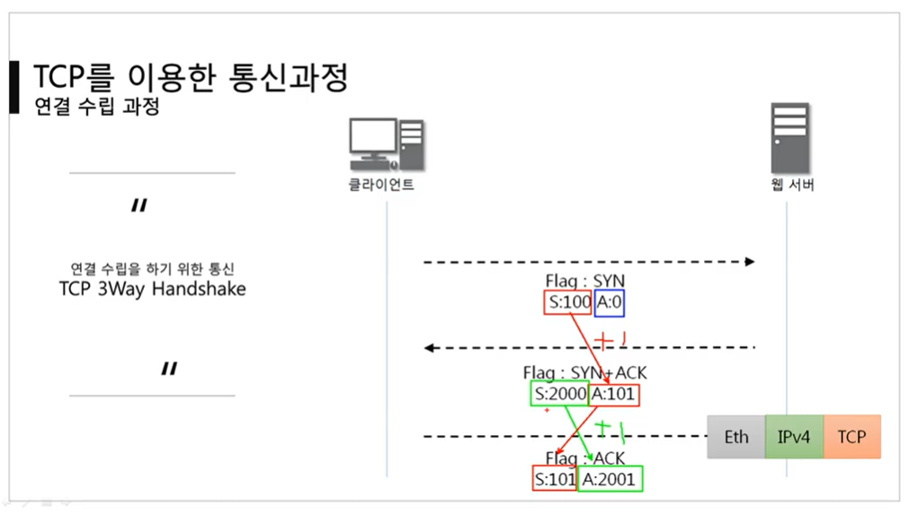

 

 

# [TCP를 이용한 데이터 전송 과정](https://youtu.be/0vBR666GZ5o?list=PL0d8NnikouEWcF1jJueLdjRIC4HsUlULi)

### 데이터 송수신 과정

- 연결 수립 과정에서 그대로 이어짐

- TCP를 이용한 데이터 통신을 할 때 단순히 TCP 패킷만을 캡슐화해서 통신하는 것이 아닌 페이로드를 포함한 패킷을 주고 받을 때의 일정한 규칙

  > 1. 보낸 쪽에서 또 보낼 때는 SEQ 번호와 ACK 번호가 그대로다.
  > 2. 받는 쪽에서 SEQ 번호는 받은 ACK 번호가 된다.
  > 3. 받는 쪽에서 ACK 번호는 **받은 SEQ 번호 + 데이터의 크기**
  
  

 

 

# [TCP의 연결 상태 변화](https://youtu.be/yY0uQf0BTH8?list=PL0d8NnikouEWcF1jJueLdjRIC4HsUlULi)

### TCP의 여러 가지 상태 변화

- 실선은 클라이언트의 상태 변화, 점선은 서버의 상태 변화

- LISTEN  상태 :  포트 번호를 열어 놓고 있는 상태.
  - 클라이언트의 요청을 계속 듣고 있는 상태
  
- ESTABLISHED 상태 : 연결이 수립된 상태

- 연결을 하기 위해서는 서버의 포트 상태가 LISTEN 상태인지 확인해야 함.

- 3Way Handshake가 끝나면 ESTABLISHED 상태가 됨. 

- 클라이언트는 능동적(active open), 서버는 수동적(passive open)

  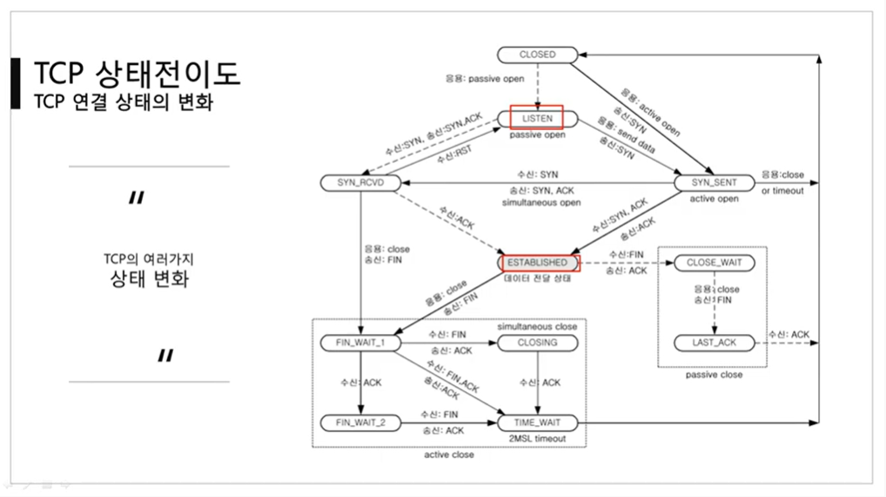

  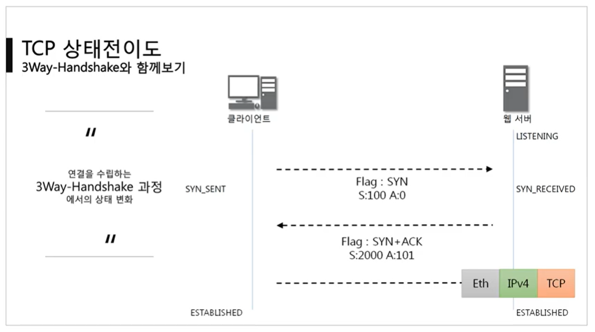

 

 

# [TCP 프로토콜 분석 실습](https://youtu.be/WseqBDo-j3Y?list=PL0d8NnikouEWcF1jJueLdjRIC4HsUlULi)

- 와이어 샤크의 TCP Stream 기능을 이용
- 시퀀스 번호는 원래 랜덤이지만, 와이어샤크에서 0으로 세팅해준다.
  - 실제 시퀀스 번호는 다름!

 

 