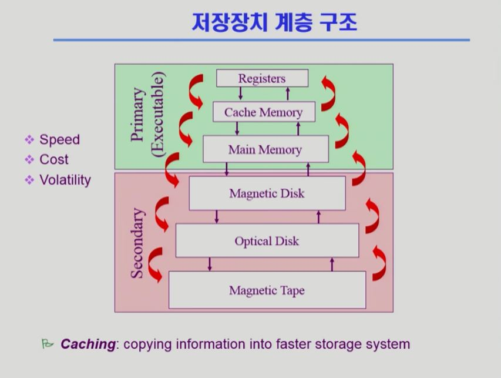
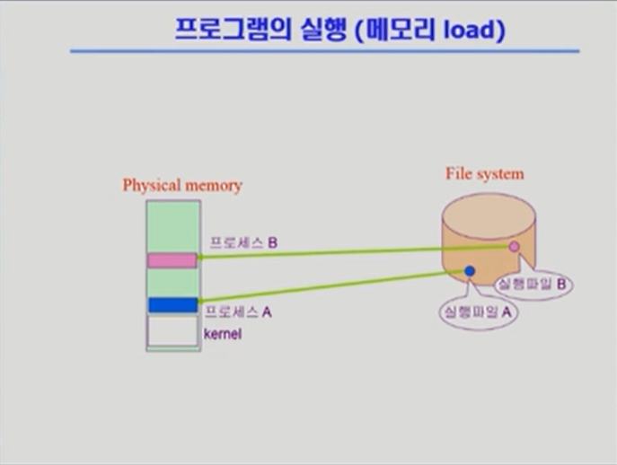
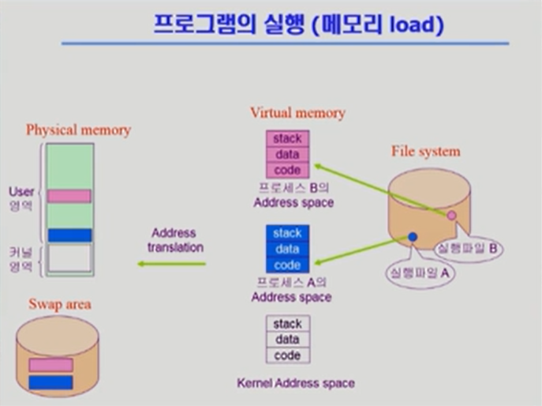
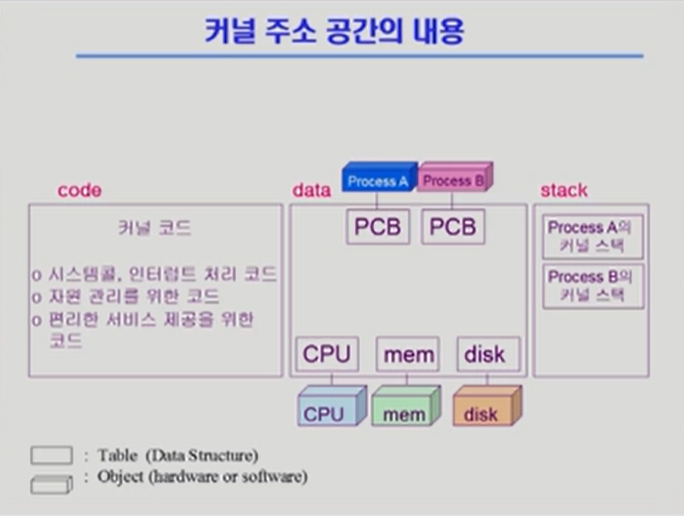

영상: [운영체제](http://www.kocw.net/home/search/kemView.do?kemId=1046323)

[TOC]

 

 

# 강의 사이트

- 반효경의 운영체제 (2017) : http://www.kocw.net/home/cview.do?cid=4b9cd4c7178db077

 

 

# [1 운영체제 개요](https://core.ewha.ac.kr/publicview/C0101020140307151724641842?vmode=f)

### 운영 체제란?

-  컴퓨터 하드웨어 바로 위에 설치되어 사용자 및 다른 모든 소프트웨어와 하드웨어를 연결하는 소프트웨어 계층
- 사용자가 하드웨어를 몰라도 컴퓨터를 편하게 사용할 수 있게 해 줌.
- 매우 복잡하고 까다로운 소프트웨어

 

### 운영 체체의 목적

- 컴퓨터 시스템을 편리하게 사용할 수 있는 환경을 제공

  - 운영체제는 동시 사용자/프로그램들이 각각 독자적 컴퓨터에서 수행하는 것 같은 환상(illusion)을 제공
    - 프로그램은 혼자서 컴퓨터를 쓰는 것처럼 느끼지만, 사실 컴퓨터 안에는 여러 개의 프로그램이 실행되고 있다.
  - 하드웨어를 직접 다루는 복잡한 부분을 운영체제가 대행

- 컴퓨터 시스템의 자원을 효율적으로 관리

  - CPU, 메모리, I/O 장치 등의 효율적 관리

    - 효율성 : 주어진 자원으로 최대한의 성능을 내도록!
      - 컴퓨터가 가지고 있는 메모리는 한정되어 있다.
      - 디스크 스케줄링 : 디스크는 작업을 들어오는 순서대로 처리하지 않는다. 효율적으로 끝낼 수 있는 순서대로 처리한다! 
    - 형평성 : 특정 사용자/프로그램의 지나친 불이익이 발생하지 않도록!
      - 메모리를 적절히 분배 :ㅣ 특정 프로그램이 CPU를 독식하는 것을 막는다.

  - 사용자 및 운영체제 자신의 보호

    

 

### 운영체제의 기능

- I/O : Input/Output
- I/O Controller : 디스크를 가리킴
- 부팅 : 운영체제가 컴퓨터의 메모리가 올라가서 실행되는 것

- 커널 : 메모리에 상주하면서, 항상 메모리가 올라가서 실행됨! → 운영체제의 핵심적인 부분

- 캐싱 : 자주 사용하는 데이터를 메모리 어딘가에 보관해 놓았다가, 추후 요청이 들어올 시 디스크로 가지 않고 메모리에서 데이터를 가져오는 기법

- 인터럽트 : 느린 장치들이 시킨 일이 끝나서  CPU에게 알려야 할 떄 발동되는 현상. 이 현상이 일어나면 무조건 작업이 CPU를 차지하게 된다.

  

 

### 프로세스의 상태

- 프로세스 : 실행 중인 프로그램

- 운영체제는 큐를 만들어서 CPU를 사용하길 원하는 프로그램들을 줄 세워 놓는다.

- 작업이 디스크에 있는 파일을 읽어와야 할 경우, 그 작업은 디스크 입출력 큐로 가게 된다.

  - 디스크 작업이 끝나면 인터럽트를 통해 CPU에게 알림이 가게 된다.

- Scientific Application : I/O 없이 CPU만 계속 사용하는 프로그램

  

 

### CPU 스케줄링

- 어떤 프로그램에게 CPU 사용권을 줄 것인지 결정하는 과정

- FCFS (First-Come First-Served) : 먼저 온 작업이 먼저 CPU를 사용하게 해 주는 방식 → 선착순 실행

  - 비효율적이다.

    

- SJF (Shortest-Job-First) : CPU를 짧게 쓰는 작업에게 먼저 CPU를 사용하게 해 주는 방식 → 대기시간이 가장 적음

  - 효율성은 좋으나 형평성이 좋지 않다.

    

- RR (Round Robin) : CPU를 사용할 수 있는 시간이 정해져있다. 짧은 시간 내에 CPU가 여러 개의 작업에게 번갈아가며 할당된다.

  - 효율적이다. 어떤 작업도 CPU를 오래 기다릴 필요가 없다.

  - CPU를 뺴앗는 방법이 필요 (하드웨어의 지원 필요)

    

 

### 메모리 관리

- 프로그램을 실행시키면 가상 메모리를 거쳐 메모리로 올라가게 된다.

- 가상 메모리에 자신 만의 메모리 공간을 만듦.

- 실제 물리적인 메모리에서 가상 메모리에서 당장 필요한 부분만 올라감.

- 당장 필요한 부분만 물리적인 메모리에 올려놓고 나머지는 디스크의 스왕영역에 보관한다.

- 스왑영역 : 메모리의 연장공간 → 전원이 꺼지면 모두 지워짐

- LRU : 메모리가 꽉 찬 상태에서 새로운 작업이 들어올 때, 기존 작업 중에서 가장 오래 전에 참조한 페이지를 삭제

  - 메모리 관리 뿐만 아니라 여러 방면에서 사용되는 방법

- LFU : 메모리가 꽉 찬 상태에서 새로운 작업이 들어올 때, 기존 작업 중에서 참조횟수가 가장 적은 페이지를 삭제

  

 

### 디스크 스케줄링

- 디스크를 요청하는 작업들이 디스크 큐에 쌓인다.
- 디스크 헤드가 이동하면서 데이터를 읽는다. 
  - 디스크 헤드의 이동이 가장 많은 시간이 소요되므로, 헤더의 이동을 최소화하는 것이 디스크 스케줄링의 핵심이다!
- FCFS (First-Come First-Served) : 먼저 들어온 작업을 먼저 처리해줌
- SSTF (Shortest Seek Time First) : 현재 위치로부터 가까운 작업 순으로 처리해줌.
  - starvation 문제 : 어떤 작업은 영원히 서비스를 받지 못하고 방치될 수 있음. → 효율성은 좋지만 형평성이 좋지 않음!
- SCAN : 한쪽 끝에서 다른 쪽 끝으로 이동하며 가는 길목에 있는 모든 요청을 처리
  - 헤드의 이동거리가 짧다는 장점이 있다.

 

### 저장장치 계층구조와 캐싱

- 위로 올라갈수록 빠르고, 밑으로 내려갈수록 느리다.

- 위로 올라갈수록 비싸고, 밑으로 내려갈수록 비싸다.

- 휘발성 : 전원이 나갈 때 모든 내용이 사라지는 것

- 비휘발성 : 전원이 나가도 내용이 사라지지 않고 유지되는 것 

  - ex) 하드디스크

    

 

### 플래시메모리

- 반도체 장치

- 우리가 사용하는 것은 대부분 NAND형

- 장점 : 전력 소모가 적고 물리적인 충격에 강하다.

- 단점 : 셀 안의 전하량으로 데이터가 0인지 1인지 구분함. → 전하량의 손실에 따른 오류가 발생할 수도 있음.

- 상기의 단점을 소프트웨어로 보완해주어야 함.

  

 

### 운영체제의 종류

- 서버용, PC용, 스마트 디바이스용 운영체제
- 공개 소프트웨어 (Open Source Software) : 소스코드가 공짜로 공개된 소프트웨어
  - ex) 리눅스

 

### 운영체제란 무엇인가?

- 운영체제 : 컴퓨터 하드웨어 바로 위에 설치되어 사용자 및 다른 모든 소프트웨어와 하드웨어를 연결하는 소프트웨어 계층
- 협의의 운영체제(커널) : 운영체제의 핵심 부분으로 메모리에 상주하는 부분
- 광의의 운영체제 : 커널 뿐 아니라 각종 주변 시스템 유틸리티를 포함한 개념

 

### 운영체제의 분류

- 동시 작업 가능 여부
  -  단일 작업 : 한 번에 하나의 작업만 관리
    - MS-DOS 프롬프트 상에서는 한 명령의 수행을 끝내기 전에 다른 명령을 수행시킬 수 없음.
    - 단일 사용자를 위한 운영체제 : MS-DOS, MS Windows
  - 다중 작업 : 동시에 두 개 이상의 작업 처리
    - UNIX, MS Windows 등에서는 한 명령의 수행이 끝나기 전에 다른 명령이나 프로그램을 수행할 수 있음.
    - 다중 사용자를 위한 운영체제 : UNIX, NT Server

- 사용자의 수
  - 단일 사용자
  - 다중 사용자
- 처리 방식
  - 일괄 처리
    - 작업 요청의 일정량 모아서 한꺼번에 처리
    - 작업이 완전 종료될 때까지 기다려야 함
    - 초기 Punch Card 처리 시스템
  - 시분할
    - 여러 작업을 수행할 떄 컴퓨터 처리 능력을 일정한 시간 단위로 분할하여 적용
    - 일괄 처리 시스템에 비해 짧은 응답 시간을 가집 ex) UNIX
    - interactive한 방식
  - 실시간
    - 정해진 시간 안에 어떤한 일이 반드시 종료됨이 보장되어야 하는 실시칸 시스템을 위한 OS
    - 원자로/공장 제어, 미사일 제어, 반도체 장비, 로보트 제어
  - 실시간 시스템의 개념 확장
    - Hard realtime system (경성 실시간 시스템)
    - Soft realtime system (연성 실시간 시스템)

 

### 몇 가지 용어

- Multitasking
- Multiprogramming
- Timesharing
- Multiprocess
- 구분
  - 위의 용어들은 컴퓨터에서 여러 작업을 동시에 수행하는 것을 뜻한다.
  - Multiprogramming은 여러 프로그램잉 메모리에 올라가 있음을 강조
  - Time Sharing은 CPU의 시간을 분할하여 나누어 쓴다는 의미를 강조
- Multiprocessor
  - 하나의 컴퓨터에 CPU(processor)가 여러 개 붙어있음을 의미

 

### 운영체제의 예

- 유닉스(UNIX)
- DOS
- MS Windows
- Handled device를 위한 OS

 

 

# [2 시스템 구조 및 프로그램의 실행 Part-1](https://core.ewha.ac.kr/publicview/C0101020140311132925816476?vmode=f)

### 컴퓨터 시스템 구조

 

### Mode bit

- 사용자 프로그램의 잘못된 수행으로 다른 프로그램 및 운영체제에 피해가 가지 않도록 하기 위한 보호 장치 필요
- Mode bit를 통해 하드웨어적으로 두 가지 모드의 operation 지원
  - 1 (사용자 모드) : 사용자 프로그램 수행
  - 0 (모니터 모드) : OS 코드 수행
- 보안을 해칠 수 있는 중요한 명령어는 모니터 모드에서만 수행가능한 특권 명령으로 규정
- Interrupt나 Exception 발생 시 하드웨어가 mode bit를 0으로 바꿈
- 사용자 프로그램에게 CPU를 넘기기 전에 mode bit를 1로 셋팅
- 모니터 모드 = 커널 모드, 시스템 모드

 

### Timer

- 정해진 시간이 흐른 뒤 운영체제에게 제어권이 넘어가도록 인터럽트를 발생시킴
- 타이머는 매 클럭 틱 때마다 1씩 감소
- 타이머 값이 0이 되면 타이머 인터럽트 발생
- CPU를 특정 프로그램이 독점하는 것으로부터 보호
- 타이머는 time sharing을 구현하기 위해 널리 이용됨
- 타이머는 현재 시간을 계산하기 위해서도 사용

 

### Device Controller

- I/O device controller
  - 해당 I/O 장치유형을 관리하는 일종의 작은 CPU
  - 제어 정보를 위해 control register, status register를 가짐
  - local buffer를 가짐 (일종의 data register)
- I/O는 실제  device와 local buffer 사이에서 일어남
- Device controlelr는 I/O가 끝났을 경우 intterupt로 CPU에 그 사실을 알림
- device driver (장치 구동기) : OS 코드 중 각 장치별 처리루틴

 

 

# [입출력과 인터럽트 (Input-Output and Interrupt)](컴퓨터-구조/5장-기본-컴퓨터의-구조와-설계-Part2/입출력과-인터럽트.md)

### 시스템 콜 (System Call)

- 사용자 프로그램이 운영체제의 서비스를 받기 위해 커널 함수를 호출하는 것

 

### 인터럽트 (Interrupt)

- 인터럽트 당한 시점의 레지스터와 program counter를 save한 수 CPU의 제어를 인터럽트 처리 루틴에 넘긴다.
- 하드웨어 인터럽트 : 하드웨어가 발생시킨 인터럽트
- 소프트웨어 인터럽트 
  - Exception : 프로그램이 오류를 범한 경우
  - System Call: 프로그램이 커널 함수를 호출하는 경우
- 인터럽트 관련 용어
  - 인터럽트 벡터 : 해당 인터럽트의 처리 루틴 주소를 가지고 있음
  - 인터럽트 처리 루틴 : 해당 인터럽트를 처리하는 커널 함수

 

 

# [2 시스템 구조 및 프로그램의 실행 Part-2](https://core.ewha.ac.kr/publicview/C0101020140314151238067290?vmode=f)

### 동기식 입출력과 비동기식 입출력

- 동기식 입출력 (synchronous I/O)
  - I/O 요청 후 입출력 작업이 완료된 후에야 제어가 사용자 프로그램에 넘어감
  - 구현 방법 1
    - I/O가 끝날 때까지 CPU를 낭비시킴
    - 매 시점 하나의 I/O만 일어날 수 있음
  - 구현 방법 2
    - I/O가 완료될 때까지 해당 프로그램에게서 CPU를 빼았음
    - I/O 처리를 기다리는 줄에 그 프로그램을 줄 세움
    - 다름 프로그램에게 CPU를 줌
- 비동기식 입출력 
  - I/O가 시작된 후 입출력 작업이 끝나기를 기다리지 않고 제어가 사용자 프로그램에 즉시 넘어감
- 두 경우 모두 I/O의 완료는 인터럽트로 알려줌

 

### DMA (Direct Memory Access)

- 빠른 입출력 장치를 메모리에 가까운 속도로 처리하기 위해 사용
- CPU의 중재 없이 device controller가 device의 buffer storage의 내용을 메모리에 block 단위로 직접 전송
- 바이트 단위가 아니라 block 단위로 인터럽트를 발생시킴

 

### 서로 다른 입출력 기계어

- I/O를 수행하는 special instrunction에 의해 실행되는 기계어
- Memory Mapped I/O에 의해 실행되는 기계어 

 

### 저장장치 계층 구조

- [12장 메모리 구조](컴퓨터-구조/12장-메모리-구조/12장-메모리-구조.md) 

  

 

### 프로그램의 실행 (메모리 load)

- 프로그램은 파일 시스템에 실행 파일 형식으로 저장되어 있음.

- 실행시키면 프로그램이 메모리에 올라가서 프로세스가 됨.

  

- 그러나 실제로는 위 사진보다 한 단계가 더 있음! 바로 **Virtual memory**!

- 당장 필요한 부분은 물리적인 메모리에 올라가고, 그렇지 않은 부분은 디스크의 Swap area에 올라간다.

- Physical memory의 주소는 물리적인 주소,  Virtual memory의 주소는 논리적인 주소라고 부른다.

  - 주소가 다르기에 주소 변환이 필요하다!

- Virtual memory의 구성 요소

  - stack : 함수의 호출과 리턴이 일어나는 영역. 함수 안에 있는 지역 변수가 저장되기도 한다.

  - data :데이터가 보관되는 영역. 메모리 데이터가 위치한다. 그러나 모든 데이터가 저장되는 것은 아니고, 전역 변수처럼 프로그램이 끝나도 남아있는 데이터들만 위치하는 곳이다.

  - code : 실행파일에 있던 코드가 올라오는 부분. 기계어가 위치한다.

    

 

### 커널 주소 공간의 내용

- **code**

  - 운영 체제가 자원을 효율적으로 관리하고, 사용자에게 편리한 인터페이스를 제공하기 위해서는 코드가 운영체제 커널에 함수 형태로 들어있어야 한다.
  - 인터럽트가 들어왔을 때 어떻게 처리해야 하는지도 커널에 들어있다.
  - 시스템 콜 코드도 커널에 들어있다.

- **data**

  - 운영체제의 데이터 영역에는 모든 하드웨어를 관리하기 위한 자료구조가 있다.
  - 또한 운영체제의 데이터 영역에는 모든 프로세스를 관리하기 위한 자료구조도 있다! → PCB (Process Control Block)

- **stack**

  - 커널의 스택은 각 프로세스마다 별도로 두고 있다.

    

 

### 사용자 프로그램이 사용하는 함수

- 사용자 정의 함수
  - 자신의 프로그램에서 정의한 함수
- 라이브러리 함수
  - 자신의 프로그램에서 정의하지 않고 갖다 쓴 함수
  - 자신의 프로그램의 실행 파일에 포함되어 있다
- 커널 함수
  - 운영체제 프로그램의 함수
  - 커널 함수의 호출 = 시스템 콜
  - 내 프로그램 코드에 들어있지 않고 운영체제 커널의 코드에 들어있다.

 

### 프로그램의 실행

- 사용자 정의 함수나 라이브러리 함수를 실행하면 내 주소 공간의 코드가 유저모드에서 실행된다.
- 시스템 콜을 부르면 CPU 제어권이 운영체제로 넘어가서 커널 모드에서 운영체제의 주소 공간에 있는 코드가 실행된다.
