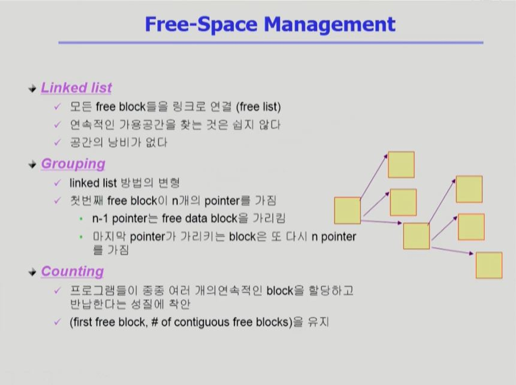

# [파일 시스템 #1](https://core.ewha.ac.kr/publicview/C0101020140516150939191200?vmode=f)

### File and File System

- **File**
  - A named collection of related information
  - 일반적으로 비휘발성의 보조기억장치에 저장
  - 운영체제는 다양한 저장 장치를 file이라는 동일한 논리적 단위로 볼 수 있게 해 줌
  - Operation
    - create, read, write, reposition (lseek), delete, open, close 등
    - open : 파일의 내용이 아닌 메타데이터를 메모리로 올려놓는 작업
    - reposition : 읽어내는 파일의 위치를 변경하는 연산
- File attribute (혹은 파일의 metadata)
  - 파일 자체의 내용이 아니라 파일을 관리하기 위한 각종 정보들
    - 파일 이름, 유형, 저장된 위치, 파일 사이즈
    - 접근 권한 (읽기/쓰기/실행), 시간 (생성/변경/사용), 소유자 등
- File system
  - 운영체제에서 파일을 관리하는 부분
  - 파일 및 파일의 메타데이터, 디렉토리 정보 등을 관리
  - 파일의 저장 방법 결정
  - 파일 보호 등

 

### Directory and Logical Disk

- **Directory**
  - 파일의 메타데이터 중 일부를 보관하고 있는 일종의 특별한 파일
  - 그 디렉토리에 속한 파일 이름 및 파일 attributes들
  - operation
    - search for a file, create a file, delete a file
    - list a directory, rename a file, traverse the file system
- **Partition (= Logical Disk)**
  - 하나의 (물리적) 디스크 안에 여러 파티션을 두는 게 일반적
  - 여러 개의 물리적인 디스크를 하나의 파티션으로 구성하기도 함
  - (물리적)  디스크를 파티션으로 구성한 뒤 각각의 파티션에 file system을 깔거나 swapping(swap area) 등 다른 용도로 사용할 수 있음

 

### open( )

- **open("a/b/c")**

  - 디스크로부터 파일 c의 메타데이터를 메모리로 가지고 옴

  - 이를 위하여 directory path를 search

    - 루트 디렉토리 "/"를 open하고 그 안에서 파일 "a"의 위치 획득
    - 파일 "a"를 open한 후 read하여 그 안에서 파일 "b"의 위치 획득
    - 파일 "b"를 open한 후 read 하여 그 안에서 파일 "c"의 위치 획득
    - 파일 "c"를 open한다.

  - Directory path의 search에 너무 많은 시간 소요

    - Open을 read/write와 별도로 두는 이유임
    - 한번 open한 파일은 read/write 시 directory search 불필요

  - Open file table

    - 현재 open된 파일들의 메타데이터 보관소 (in memory)
    - 디스크의 메타데이터보다 몇 가지 정보가 추가
      - Open한 프로세스의 수
      - File offset : 파일 어느 위치 접근 중인지 표시 (별도 테이블 필요)

  - File descriptor (file handle, file control block)

    - Open file table에 대한 위치 정보 (프로세스 별)

  - 연산 과정

    - 파일을 오픈하게 되면 메타 데이터가 메모리로 올라감

      `
    
    - 시스템콜을 통해 파일 오픈 : 디렉토리를 따라감
    
    - 오픈된 파일의 root directory의 metadata를 메모리에 올림
    
    - root의 content에서 a의 위치를 찾아낸 뒤 b의 metadata를 메모리에 올림
    
    - a의 content에서 b의 위치를 찾아낸 뒤 b의 metadata를 메모리에 올림
    
    - 커널 메모리 영역에서 b의 content를 read한 뒤 사용자 메모리 영역에 내용을 복사해서 보여줌
    
    - 이 환경에서는 LRU, LFU 알고리즘 모두 사용 가능
    
    - 프로세스는 각각 오프셋을 가지고 있음! 그리고 그 오프셋 정보를 관리하는 테이블이 따로 있다.
    
      

 

### File Protection

 

### File System의 Mounting

- 트리형태로 구성됨

  - 하위 디스크의 루트는 상위 디스크의 자식!

    

    

 

### Access Methods

- 시스템이 제공하는 파일 정보의 접근 방식
  -  순차 접근(sequential access)
    - 카세트 테이프를 사용하는 방식처럼 접근
    - 읽거나 쓰면 offset은 자동적으로 증가
  - 직접 접근 (direct access, random access)
    - LP 레코드 판과 같이 접근하도록 함
    - 파일을 구성하는 레코드를 임의의 순서로 접근할 수 있음

 

 

# [파일 시스템 구현 #1](https://core.ewha.ac.kr/publicview/C0101020140520134614002164?vmode=f)

### Allocation of File Data in Disk

- 임의의 크기의 파일을 동일한 크기의 블록에 담아서 저장함
- 방식
  - Contiguous Allocation
  - Linked Allocation
  - Indexed Allocation

 

### Contiguous Allocation

- 방식

  - 연속된 블록에 정보를 저장

  - 이름, 위치 정보 등을 블록에 저장한다 

    

- 단점
  - external fragmentation
    - hole이 생김
  - File grow가 어려움
    - file  생성 시 얼마나 큰 hole을 배당할 것인가?
    - grow 가능 VS 낭바 (internal fragmentation)
  
- 장점
  - Fast I/O
    - 한 번의 seek/rotaion으로 많은 바이트 transfer
    - Realtime file 용으로, 또는 이미 run 중이던 process의 swapping용
  - Direct access(=random access) 가능

 

### Linked Allocation

- 방식

  - 다음 블록의 위치 정보를 각 블록이 가지고 있고, 그 정보를 기반으로 블록이 연결된 형태

    

- 장점

  - External fragmentation 발생 안 함

- 단점

  - No random access
  - 직접 접근이 불가능함
  - Reliability 문제
    - 한 sector가 고장나 pointer가 유실되면 많은 부분을 잃음
  - Pointer를 위한 공간이 block의 일부가 되어 공간 효율성을 떨어뜨림
    - 512 bytes/sector, 4 bytes/pointer

- 변형

  - File-allocation table (FAT) 파일 시스템
    - 포인터를 별도의 위치에 보관하여 reliablity의 공간효율성 문제 해결

 

### Indexed Allocation

- 방식

  - index block에 위치 정보를 담아 저장

  - index block을 통해 직접 접근이 가능해짐!

  - Hole이 생기는 문제도 해결 가능

    

- 장점

  - Extrenal fragmentation이 발생하지 않음
  - Direct access 가능

- 단점

  - Small file의 경우 공간 낭비 (실제로 많은 file들이 small)
    - 아무리 작은 파일이라도 최소 두 개의 block이 필요 (index block 때문!!!)
  - Too Large file의 경우 하나의 block으로 index를 저장하기에 부족
    - 해결 방안
      1. linked scheme
      2. multi-level index

 

### UNIX 파일시스템의 구조

- 가장 기본적인 파일시스템 구조

- 4개의 블록으로 구성

  - Boot block
  - Super block
  - Inode list
  - Data block

- 항상 Boot block이 맨 앞에 온다!

- 실제 파일 시스템에서는 디렉토리에 메타 데이터가 모두 저장되지는 않는다!

  - 디렉토리에는 이름만 저장되어 있고 메타 데이터는 Inode list에 저장된다.

  - 파일 크기에 따라 single indirect, double indirect, triple indirect로 접근 방법이 나뉨

    

    

 

### FAT File System

- MS에서 만든 File System

- 위치 정보를 FAT에 저장하고 위치 정보를 디렉토리가 가짐!

  

 

### Free-Space Management

 

### Directory Implementation

 

### VFS and NFS

- Virtual File System (VFS)

  - 서로 다른 다양한 file system에 대해 동일한 시스템 콜 인터페이스 (API)를 통해 접근할 수 있게 해주는 OS의 layer

- Network File System (NFS)

  -  분산 시스템에서는 네트워크를 통해 파일이 공유될 수 있음
  - NFS는 분산 환경에서의 대표적인 파일 공유 방법임

- 구현

  

 

## [파일 시스템 구현 #2](https://core.ewha.ac.kr/publicview/C0101020140523142954456205?vmode=f)

### Page Cache and Buffer Cache

- Page Cache

  - virtual memoty의 paging system에서 사용하는 page frame을 caching의 관점에서 설명하는 용어
  - Memory-Mapped I/O를 쓰는 경우 file의 I/O에서도 page cache 사용

- Memory-Mapped I/O

  - File의 일부를 virtual memory에 mapping 시킴
  - 매핑시킨 영역에 대한 메모리 접근 연산은 파일의 입출력을 수행하게 함

- Buffer Cache

  - 파일 시스템을 통한 I/O 연산은 메모리의 특정 영역인 buffer cache 사용
  - File 사용의 locality 활용
    - 한 번 읽어온 block에 대한 후속 요청 시 butter cache에서 즉시 전달
  - 모든 프로세스가 공용으로 사용
  - Replacement algorithm 필요 (LRU, LFU 등)

- Unified Buffer Cache

  - 최근의 OS에서는 기존의 buffer cache가 page cache에 통합됨

    

    

 

### 프로그램의 실행

