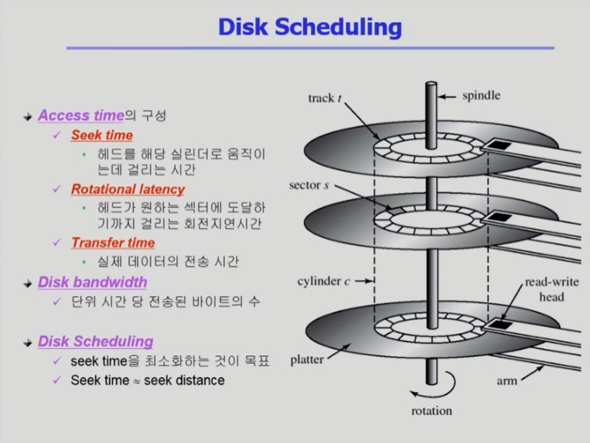
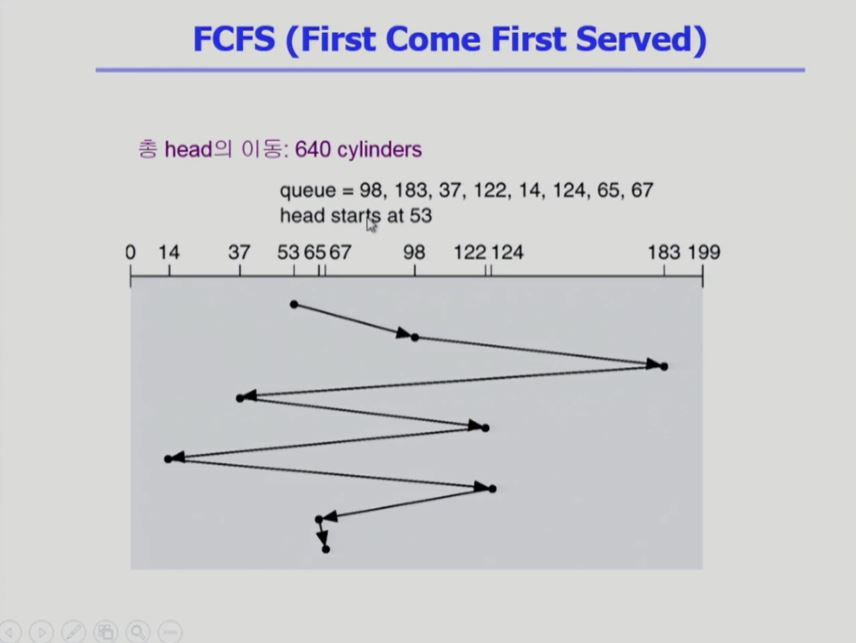
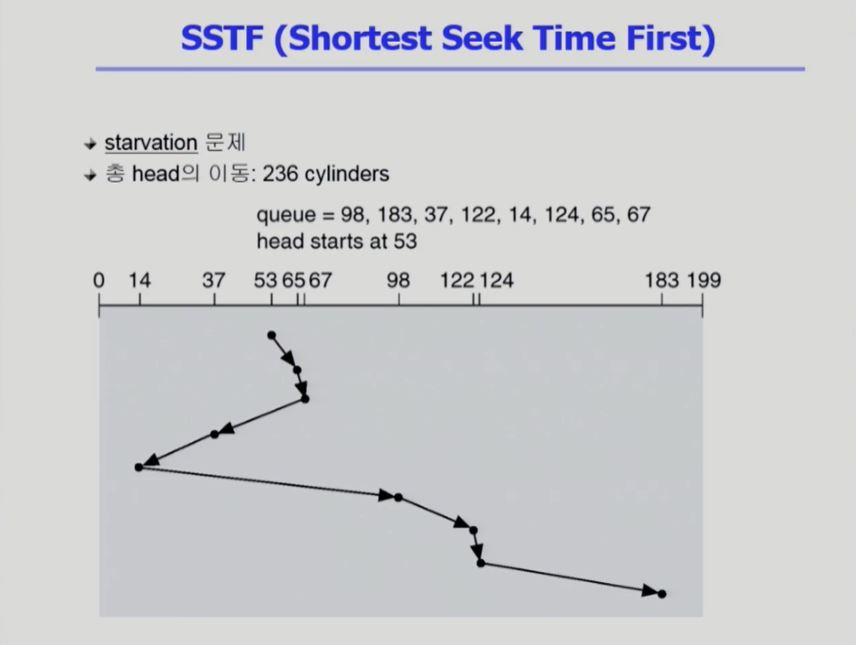
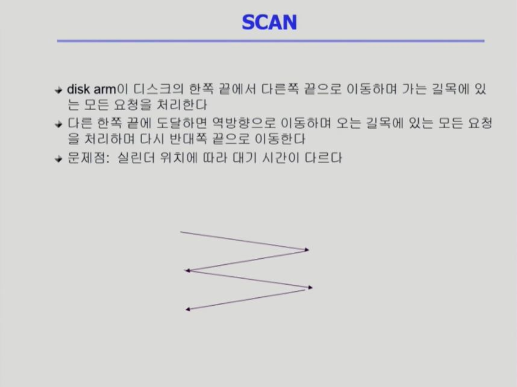
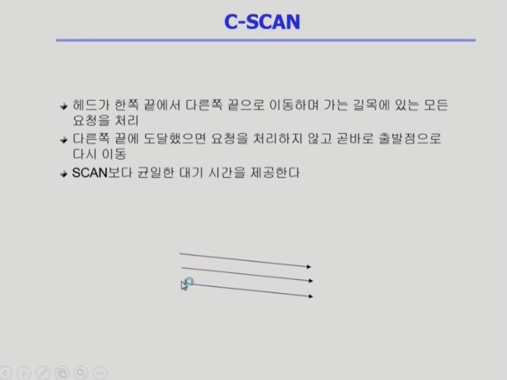
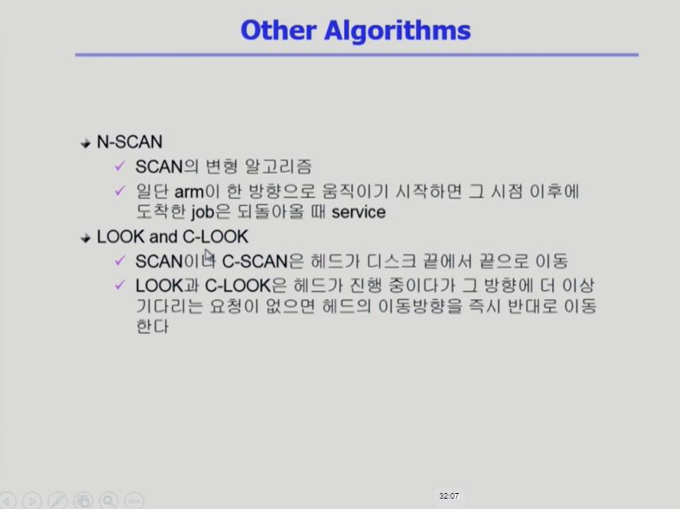
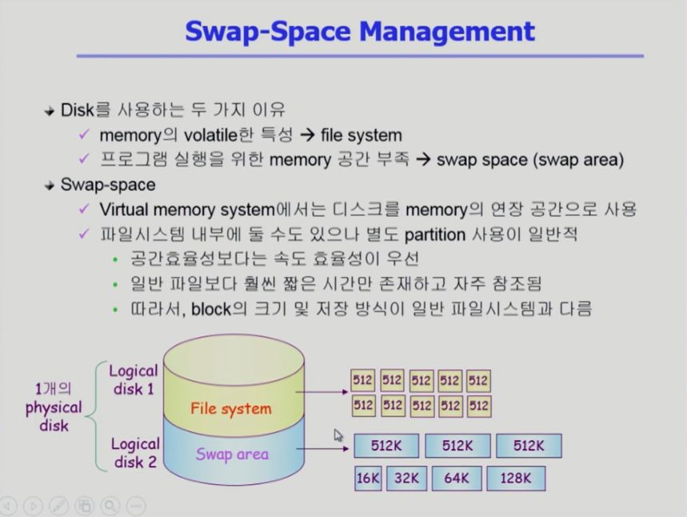
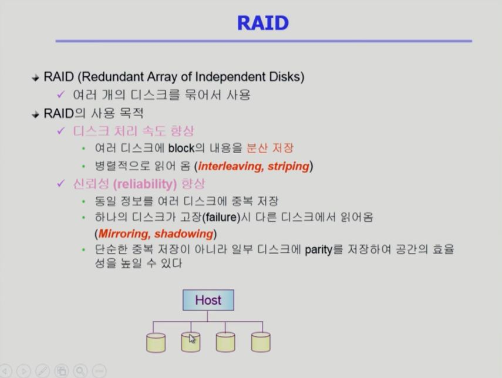

[TOC]

 

 

# [디스크 관리 및 스케쥴링 #1](https://core.ewha.ac.kr/publicview/C0101020140523151255773807?vmode=f)

### Disk Structure

- logical block
  - 디스크의 외부에서 보는 디스크의 단위 정보 저장 공간들
  - 주소를 가진 1차원 배열처럼 취급
  - 정보를 전송하는 최소 단위
- Sector
  - Logical block이 물리적인 디스크에 매핑된 위치
  - Sector 0은 최외곽 실린더의 첫 트랙에 있는 첫 번째 섹터이다

 

### Disk Management

- physicla fomatting (Low-level formatting)
  - 디스크를 컨트롤러가 읽고 쓸 수 있도록 섹터들로 나누는 과정
  - 각 섹터는 header + 실제 data(보통 512 bytes) + trailer로 구성
  - header와 trailer는 sector number, ECC (Error-Correcting Code) 등의 정보가 저장되며 controller가 직접 접근 및 운영
- Partitioning
  - 디스크를 하나 이상의 실린더 그룹으로 나누는 과정
  - OS는 이것을 독립적 disk로 취급 (logical disk)
- Logical Formatting
  - 파일시스템을 만드는 것
  - FAT, inode, free space 등의 구조 포함
- Booting
  - ROM에 있는 "small bootstrap loader"의 실행
  - sector 0 (boot block)을 load하여 실행
  - sector 0은 "full Bootstrap loader program"
  - OS를 디스크에서 load하여 실행

 

### Disk Scheduling

 

### Disk Scheduling Algorithm

- FCFS(First Come First Service)
- SSTF(Shortest Seek Time First)
- SCAN
- C-SCAN
- Other Algorithms

 

### FCFS(First Come First Service)

 

### SSTF(Shortest Seek Time First)

 

### SCAN

 

### C-SCAN

 

### Other Algorithms

 

### Disk-Scheduling Algorithm의 결정

- SCAN, C-SCAN 및 그 응용 알고리즘은 LOOK, C-LOOK 등이 일반적으로 디스크 입출력이 많은 시스템에서 효율적인 것으로 알려져 있음
- File의 할당 방법에 따라 디스크 요청이 영향을 받음
- 디스크 스케줄링 알고리즘은 필요할 경우 다른 알고리즘으로 쉽게 교체할 수 있도록 OS와 별도의 모듈로 작성되는 것이 바람직하다

 

 

# [디스크 관리 및 스케쥴링 #2](https://core.ewha.ac.kr/publicview/C0101020140527124647396004?vmode=f)

### Swap-Space Management

 

### RAID

