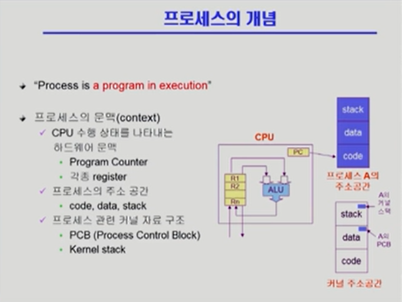

# [프로세스 #1](https://core.ewha.ac.kr/publicview/C0101020140318134023355997?vmode=f)

### 프로세스의 개념

- 실행 중인 프로그램 (Process is a program in exucution)

- 프로세스의 문맥(context)

  - 시간에 따라 달라지는 프로세스의 현재 상태를 나타내는 개념

  - CPU 수행 상태를 나타내는 하드웨어 문맥

    - Program Counter
    - 각종 Register

  - 프로세스의 주소 공간

    - code, data, stack

  - 프로세스 관련 커널 자료 구조'

    - PCB (Process Control Block)

    - Kernel Stack

      

 

### 프로세스의  상태 (Process State)

- 프로세스는 상태(state)가 변경되며 수행된다. 크게 아래의 세 가지 상태가 있다.
  - Running
    - CPU를 잡고 instrtuction을 수행 중인 상태
    - 기계어를 수행함
  - Ready
    - CPU를 기다리는 상태 (메모리 등 다른 조건을 모두 만족하고)
  - Blocked (wait, sleep)
    - CPU를 주어도 당장 instruction을 수행할 수 없는 상태
    - Process 자신이 요청한 event(예 : I/O)가 즉시 만족되지 않아 이를 기다리는 상태
    - ex) 디스크에서 파일을 읽어와야 하는 경우
    - 공유 데이터 : 여러 데이터가 공유하는 데이터
      - 공유 데이터 사용을 기다리는 상황에서 Blocked가 일어날 수도 있다!
- 그리고 그 외 부가적으로 아래의 두 가지 상태가 있다.
  - New
    - 프로세스가 생성 중인 상태
  - Terminated
    -  수행(execution)이 끝난 상태

- 위 상태들 간의 전이는 인터럽트를 통해 일어난다!

  

- CPU의 자원을 내놓게 되는 상황

  - 타이머 인터럽트가 생겨서 CPU를 내놓고 레디 큐에 들어가야 되는 상황

  - 작업이 오래 걸려서 Blocked가 되는 상황. 이 때 작업이 끝나서 인터럽트가 걸려서 작업이 레디 큐에 들어가게 된다.

  - 작업이 종료되어서 CPU를 내놓게 되는 상황

    

 

### Process Control Block(PCB)

- 운영체제가 각 프로세스를 관리하기 위해 프로세스당 유지하는 정보
  - 모든 프로세스가 대등한 것은 아니다! 각 프로세스는 Priority를 가진다.
- PCB는 운영체제 커널의 주소 공간에 있다.
- 다음의 구성 요소를 가진다. (구조체로 유지)
  - OS가 관리상 사용하는 정보
    - Process state, Process ID
    - scheduling information, priority
  - CPU 수행 관련 하드웨어 값
    - Program coutner, registers
  - 메모리 관련
    - Code, data, stack의 위치 정보
  - 파일 관련
    - Open file descriptors

 

### 문맥 교환 (Context Switch)

- CPU를 한 프로세스에서 다른 프로세스로 넘겨주는 과정

- CPU.가 다른 프로세스에게 넘어갈 때 운영체제는 다음을 수행

  - CPU를 내어주는 프로세스의 상태를 그 프로세스의 PCB에 저장
  - CPU를 새롭게 얻는 프로세스의 상태를 PCB에서 읽어옴

  

- 문맥 교환은 사용자 프로세스 A에 사용자 프로세스 B로 넘어갈 때에 일어나며, 이 떄 반드시 커널의 개입이 있다!

- 문맥 교환에서는 cache memory flush가 일어나서 오버헤드가 크다.

  

  

 

### 프로세스를 스케줄링하기 위한 큐

- 프로세스가 실행되면 레디큐에 들어와서 CPU를 얻는다.
- 오래 걸리는 작업을 요청하면 I/O 큐에 들어가서 줄을 서고, I/O 큐가 끝나면 다시 CPU를 얻을 권리를 가진다.
- fork : 자식 프로세스를 만드는 것 자식 프로세스를 만들면 본인도 실행된다.
- 자식 프로세스는 자신과 동일한 프로세스이며, CPU를 차지하기 위한 경쟁상대가 된다.

 

### 스케줄러 (Scheduler)

- 

 

 

# [프로세스 #2](https://core.ewha.ac.kr/publicview/C0101020140321141759959993?vmode=f)

### 질문 답변 > [1, 2장 운영체제 개요 및 컴퓨터시스템의 구조](운영체제/1,-2장-운영체제-개요-및-컴퓨터시스템의-구조.md)

### Thread

- 

## 프로세스 #3

### Single and Multithreaded Processes

- 

### Benefits of Threads

- 

### Implementation of Threads

-