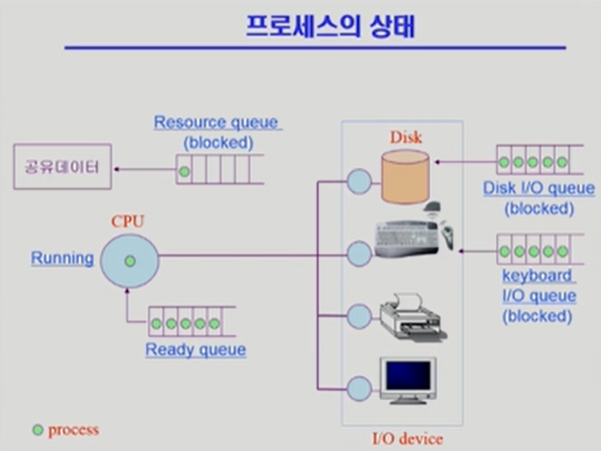
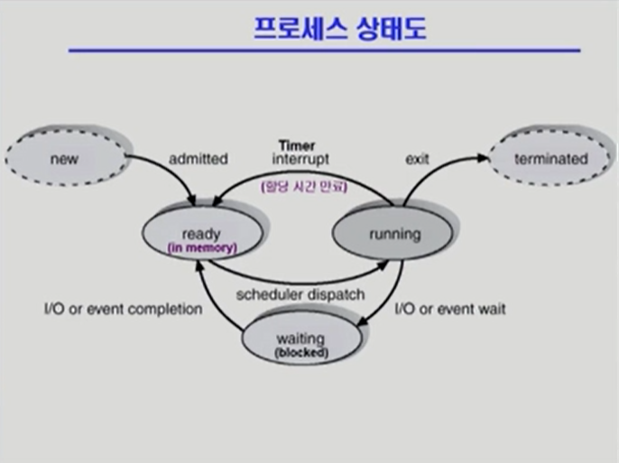
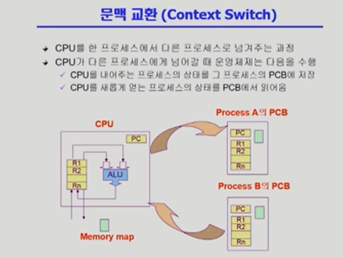
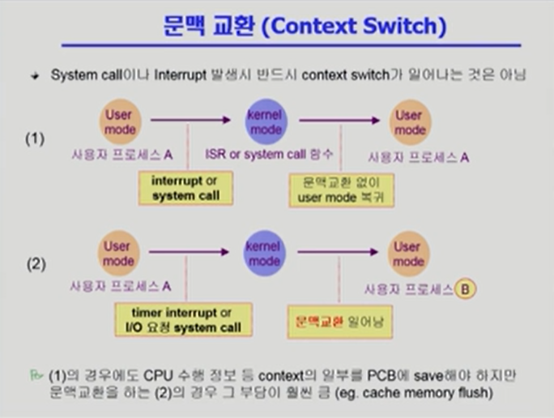
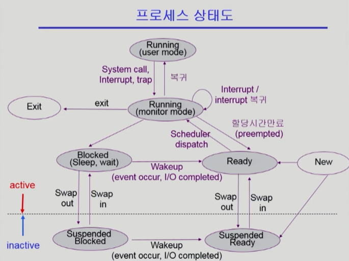
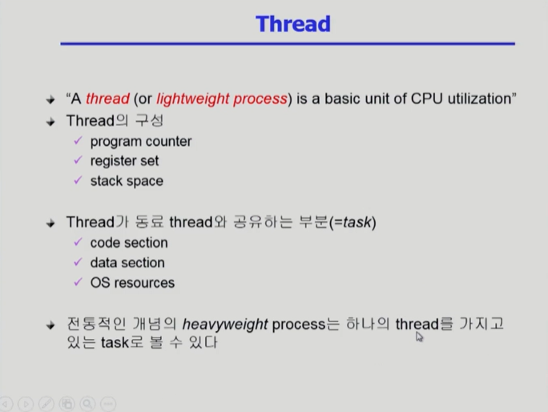
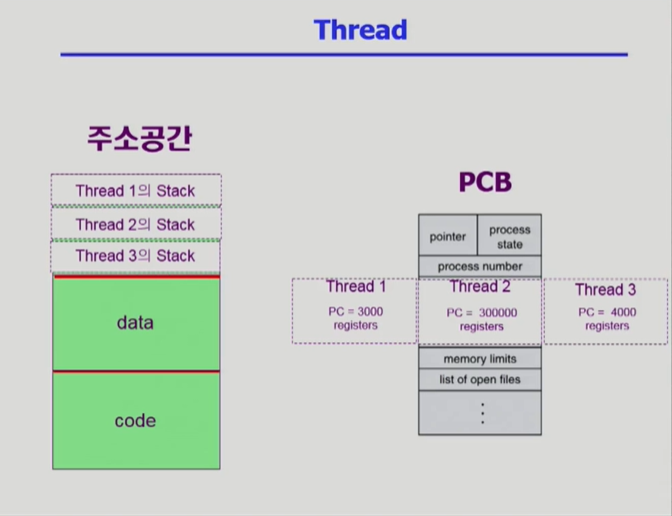
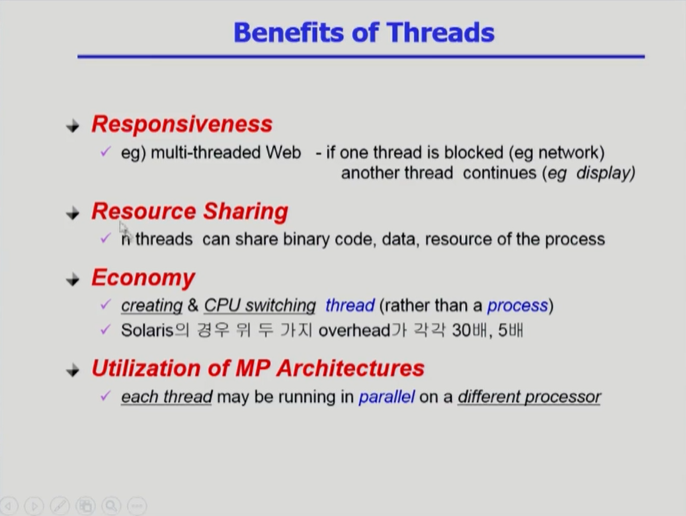
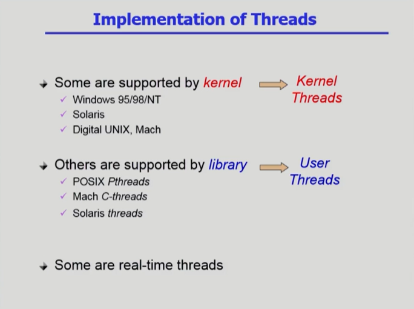

# [프로세스 #1](https://core.ewha.ac.kr/publicview/C0101020140318134023355997?vmode=f)

### 프로세스의 개념

- 실행 중인 프로그램 (Process is a program in exucution)

- 프로세스의 문맥(context)

  - 시간에 따라 달라지는 프로세스의 현재 상태를 나타내는 개념

  - CPU 수행 상태를 나타내는 하드웨어 문맥

    - Program Counter
    - 각종 Register

  - 프로세스의 주소 공간

    - code, data, stack

  - 프로세스 관련 커널 자료 구조'

    - PCB (Process Control Block)

    - Kernel Stack

      

 

### 프로세스의  상태 (Process State)

- 프로세스는 상태(state)가 변경되며 수행된다. 크게 아래의 세 가지 상태가 있다.
  - **Running**
    - CPU를 잡고 instrtuction을 수행 중인 상태
    - 기계어를 수행함
  - **Ready**
    - CPU를 기다리는 상태 (메모리 등 다른 조건을 모두 만족하고)
  - **Blocked (wait, sleep)**
    - CPU를 주어도 당장 instruction을 수행할 수 없는 상태
    - Process 자신이 요청한 event(예 : I/O)가 즉시 만족되지 않아 이를 기다리는 상태
    - ex) 디스크에서 파일을 읽어와야 하는 경우
    - 공유 데이터 : 여러 프로세스가 공유하는 데이터
      - 공유 데이터 사용을 기다리는 상황에서 Blocked가 일어날 수도 있다!
  - **Suspended (stopped)**
    - 외부적인 이유로 프로세스의 수행이 정지된 상태
    - 프로세스틑 통째로 디스크에 swap out 된다.
    - **ex)** 운영체제 내부에서 메모리 경합이 너무 심해서 프로세스를 쫓아낸 경우
    - **ex)** 사용자가 프로그램을 일시 정시시킨 경우(break key) 시스템이 여러 이유로 프로세스를 잠시 중단시킴 (메모리에 너무 많은 프로세스가 올라와 있을 때)

- Blocked와 Suspended

  - 둘 다 프로세스가 CPU를 얻지 못하는 상태
  - Blocked : 자신이 요청한 event가 만족되면 **Ready**
    - 프로세스는 계속 실행 중
  - Suspended : 외부에서 resume해 주어야 **Active**
    - 프로세스가 아예 정지된 상태

- 그리고 그 외 부가적으로 아래의 두 가지 상태가 있다.
  - New
    - 프로세스가 생성 중인 상태
  - Terminated
    -  수행(execution)이 끝난 상태

- 위 상태들 간의 전이는 인터럽트를 통해 일어난다!

  

- CPU의 자원을 내놓게 되는 상황

  - 타이머 인터럽트가 생겨서 CPU를 내놓고 레디 큐에 들어가야 되는 상황

  - 작업이 오래 걸려서 Blocked가 되는 상황. 이 때 작업이 끝나서 인터럽트가 걸려서 작업이 레디 큐에 들어가게 된다.

  - 작업이 종료되어서 CPU를 내놓게 되는 상황

    

 

### Process Control Block(PCB)

- 운영체제가 각 프로세스를 관리하기 위해 프로세스당 유지하는 정보
  - 모든 프로세스가 대등한 것은 아니다! 각 프로세스는 Priority를 가진다.
- PCB는 운영체제 커널의 주소 공간에 있다.
- 다음의 구성 요소를 가진다. (구조체로 유지)
  - OS가 관리상 사용하는 정보
    - Process state, Process ID
    - scheduling information, priority
  - CPU 수행 관련 하드웨어 값
    - Program coutner, registers
  - 메모리 관련
    - Code, data, stack의 위치 정보
  - 파일 관련
    - Open file descriptors

 

### 문맥 교환 (Context Switch)

- CPU를 한 프로세스에서 다른 프로세스로 넘겨주는 과정

- CPU가 다른 프로세스에게 넘어갈 때 운영체제는 아래의 과정을 수행

  - CPU를 내어주는 프로세스의 상태를 그 프로세스의 PCB에 저장
  - CPU를 새롭게 얻는 프로세스의 상태를 PCB에서 읽어옴

  

- 문맥 교환은 사용자 프로세스 A에 사용자 프로세스 B로 넘어갈 때에 일어나며, 이 떄 반드시 커널의 개입이 있다!

- 문맥 교환에서는 cache memory flush가 일어나서 오버헤드가 크다.

  

  

 

### 프로세스를 스케줄링하기 위한 큐

- 프로세스가 실행되면 레디큐에 들어와서 CPU를 얻는다.
- 오래 걸리는 작업을 요청하면 I/O 큐에 들어가서 줄을 서고, I/O 큐가 끝나면 다시 CPU를 얻을 권리를 가진다.
- fork : 자식 프로세스를 만드는 것. 자식 프로세스를 만들면 본인도 실행된다.
- 자식 프로세스는 자신과 동일한 프로세스이며, CPU를 차지하기 위한 경쟁상대가 된다.

 

### 스케줄러 (Scheduler)

- Long-term scheduler (장기 스케줄러 or job scheduler)

  - 시작 프로세스 중 어떤 것들을 ready queue로 보낼지 결정
  - **프로세스에 memory 및 각종 자원을 주는 문제**
  - **degree of Multiprogramming을 제어**
    - degree of Multiprogramming : 메모리에 프로그램이 올라가는 정도, 메모리에 올라가는 프로그램의 수
  - time sharing system에는 보통 장기 스케줄러가 없음 (무조건 ready)
    - 요즘 시스템에는 거의 장기 스케줄러가 없다.

- Short-term scheduler (단기 스케줄러 or CPU scheduler)

  - 어떤 프로세스를 다음 번에 running시킬지 결정
  - **프로세스에 CPU를 주는 문제**
  - 충분히 빨라야 함 (millisecond 단위)
    - 자주 호출되기 때문!

- Medium-Term Scheduler (중기 스케줄러 of Swapper)

  - **여유 공간 마련을 위해 프로세스를 통째로 메모리에서 디스크로 쫓아냄** (메모리가 부족할 때)

  - 프로세스에게서 memory를 뺏는 문제

  - **degree of Multiprogramming을 제어**

    

 

### Suspended Blocked와 Suspended Ready

- Suspended Blocked : Suspended 상태에서 Blocked 상태가 된 것
- Suspended Ready : Suspended 상태에서 Ready 상태가 된 것
- 위 두 상태가 Active 상태로 들어가기 위해서는 외부에서의 작업이 필요하다!

 

### Running

- 위 상태도에서의 Running은 커널 모드에서의 Running
- 운영체제가 Running한다는 말은 쓰지 않는다!

 

### Interrupt

- 디스크 I/O 인터럽트는 시스템 인터럽트이자 하드웨어 인터럽트!
- I/O가 시작될 때는 운영체제에서 요청을 하는 과정에서 시스템 인터럽트(시스템 콜)이 일어남.
- I/O가 끝날 때에는 디스크 컨트롤러가 CPU에게 인터럽트를 걸어서 시스템을 끝낸다.

 

 

# [프로세스 #2](https://core.ewha.ac.kr/publicview/C0101020140321141759959993?vmode=f)

### 질문 답변 > [1, 2장 운영체제 개요 및 컴퓨터시스템의 구조](운영체제/1,-2장-운영체제-개요-및-컴퓨터시스템의-구조.md)

### Thread

- 프로세스 중에서, CPU의 수행 단위를 가리키는 것

- 프로세스를 보다 효율적으로 사용할 수 있게 해 줌!

  - 동일한 작업에 대해 각각 프로세스를 만들어주는 것은 비효율적!
  - 그래서 동일한 작업에 대해서는 하나의 프로세스만 두고, 스레드를 여러 개 만들어준다!
    - 다만 이 경우, 보안 상의 문제가 발생할 수는 있음.

- 문맥 교환은 오버헤드가 많이 드는 작업인데, 스레드 간의 작업 교환은 이러한 단점이 없어서 효율적이다!

  

  

 

### Thread의 장점

- 다중 스레드로 구성된 태스크 구조에서는 하나의 서버 스레드가 blocked(waiting) 상태인 동안에도 동일한 태스크 내의 다른 스레드가 실행(running)되어 빠른 처리를 할 수 있다.

- 동일한 일을 수행하는 다중 스레드가 협력하여 높은 처리율(throughput)과 성능 향상을 얻을 수 있다.

- 스레드를 사용하면 병렬성을 높일 수 있다.

  - 비동기식 입출력이 가능해짐!

    

 

### 스레드의 구현

- 커널 스레드

  - 운영체제가 알고 있고, 운영체제가 지원하는 스레드

- 유저 스레드

  - 사용자 프로그램 내의 프로세스 차원에서 관리되는 스레드

  - 상태 변화 시 운영체제로의 요청이 필요함.

    
