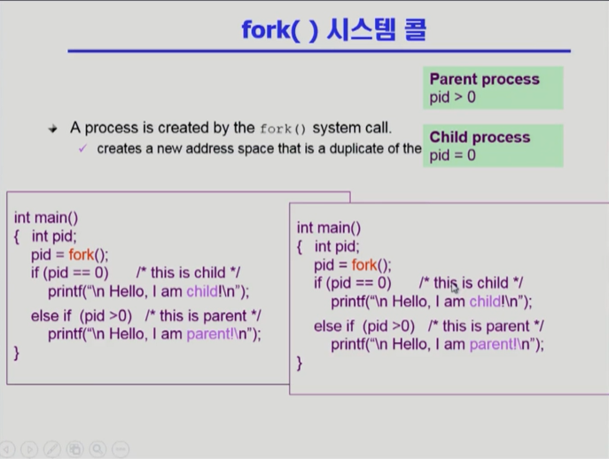
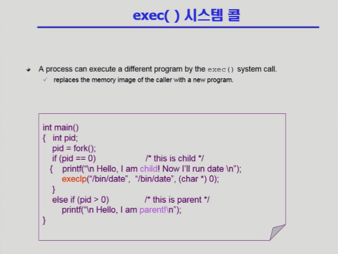
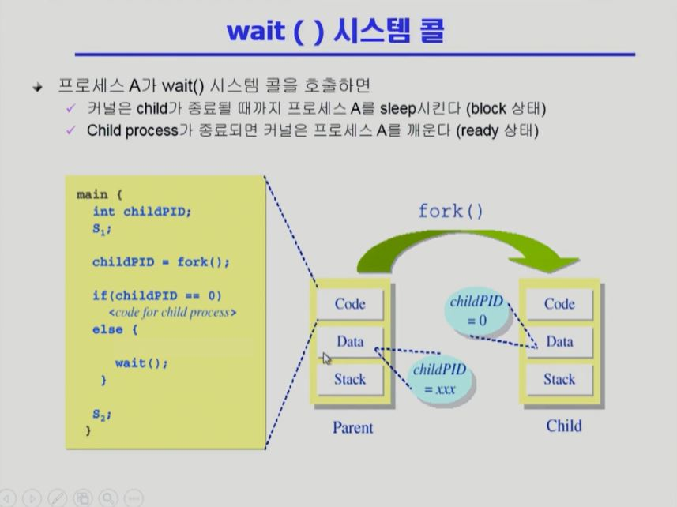
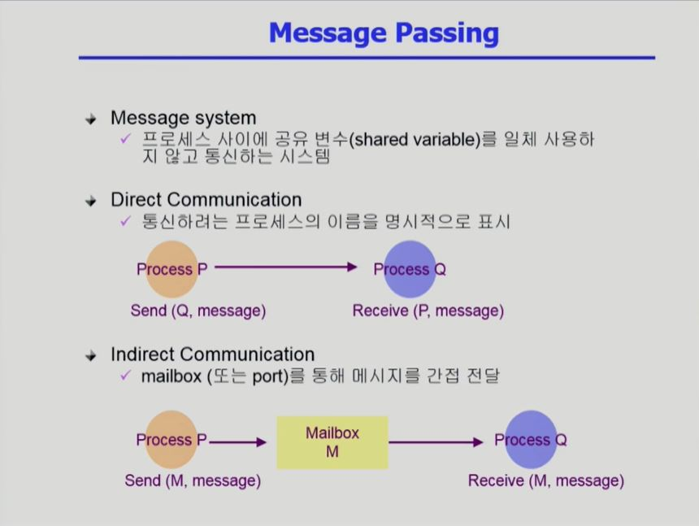
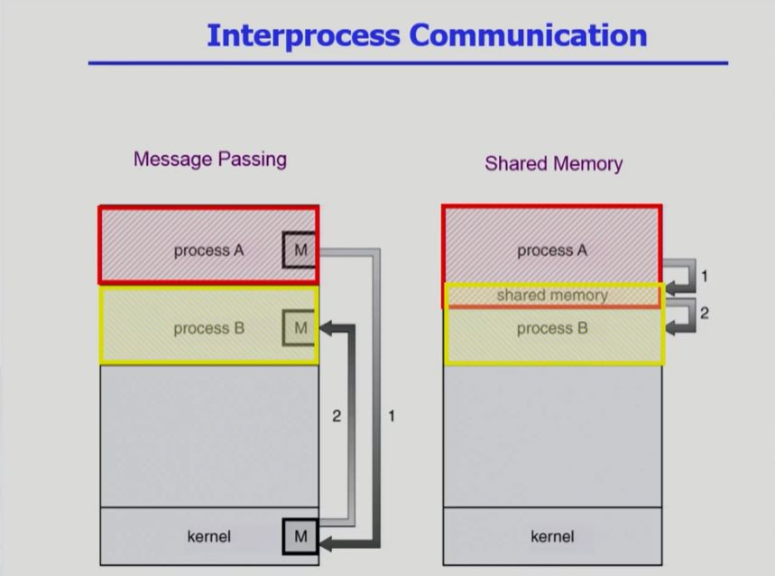
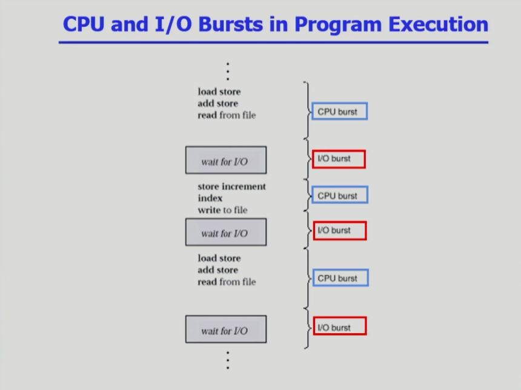
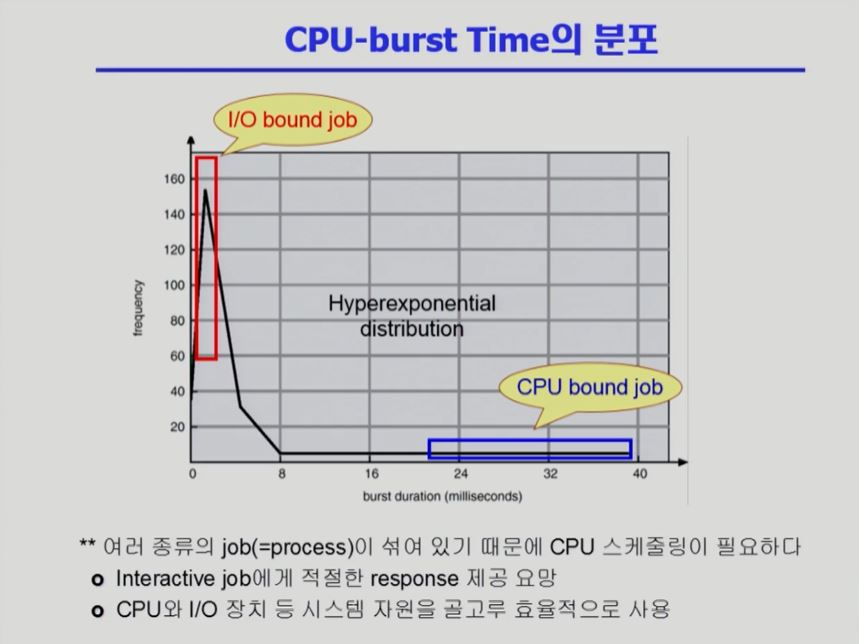

[TOC]

<hr>

<br>

<br>

## [프로세스 관리 #1](https://core.ewha.ac.kr/publicview/C0101020140321144554159683?vmode=f)

### 프로세스 생성 (Process Creation)

- 부모 프로세스(parent process)가 자식 프로세스(children process) 생성
  - 복제 생성이 됨!
  - 프로세스를 만드는 행위는 운영체제의 fork() 시스템 콜에 의해 이루어진다!
- 프로세스의 트리(계층 구조) 형성
- 프로세스는 자원을 필요로 함
  - 운영체제로부터 받는다.
  - 부모와 공유한다.
- 자원의 공유
  - 부모와 자식이 모든 자원을 공유하는 모델
  - 일부를 공유하는 모델
  - 전혀 공유하지 않는 모델
- 수행 (Execution)
  - 부모와 자식은 공존하며 수행되는 모델
  - 자식이 종료(terminate)될 때까지 부모가 기다리는(wait) 모델
- 주소 공간 (Address space)
  - 자식은 부모의 공간을 복사함 (binary and OS data)
  - 자식은 그 공간에 새로운 프로그램을 올림
- 유닉스의 예
  - fork() 시스템 콜이 새로운 프로세스를 생성
    - 부모를 그대로 복사 (OS data except PID + binary)
    - 주소 공간 할당
  - fork 다음에 이어지는 exec() 시스템 콜을 통해 새로운 프로그램을 메모리에 올림
    - 새로운 프로그램을 기존 프로그램에 덮어씌우는 것!

<br>

### 프로세스 종료 (Process Termination)

- 프로세스가 마지막 명령을 수행한 후 운영체제에게 이를 알려줌 (**exit**)
  - 자식이 부모에게 output data를 보냄 (via **wait**)
  - 프로세스의 각종 자원들이 운영체제에게 반납됨.
- 부모 프로세스가 자식의 수행을 종료시킴 (**abort**)
  - 이 때 자식이 먼저 종료되고 부모가 종료된다!
  - 자식이 할당 자원의 한계치를 넘어섬.
  - 자식에게 할당된 태스크가 더 이상 필요하지 않음.
  - 부모가 종료(exit)하는 경우
    - 운영체제는 부모 프로세스가 종료하는 경우 자식이 더 이상 수행되도록 두지 않는다.
    -  단계적인 종료

<br>

<br>

## [프로세스 관리 #2](https://core.ewha.ac.kr/publicview/C0101020140325134428879622?vmode=f)

### 프로세스와 관련한 시스템콜

- **fork()**

  - 부모 프로세스와 컨텍스트가 완전히 동일한 자식 프로세스가 생성된다.

  - 자식 프로세스는 부모 프로세스가 실행된 이후에 실행된다.

  - 자식 프로세스와 부모 프로세스는 리턴하는 결과값을 통해 구분한다!

    

- **exec()**

  - 새로운 프로그램이 덮어씌워져서 기존 프로그램은 잊혀진다!

    - 아래 코드의 경우, exec() 실행 후 다시 main으로 돌아오지 않는다!
    
  - ```cp  A B```를 exec()로 표현하기 : ```execlp("cp", "cp", "A", "B". (char*) 0);```

  - ```ls -l```을 exect()로 표현하기 : ```execlp("ls", "ls", "-l", (char*) 0);```

    

- **wait()**

  - 부모 프로세스가 wait() 시스템 콜을 호출하게 되면 자식 blocked 상태가 되어서 CPU를 얻지 못한다.

  - 자식 프로세스가  종료되면 부모 프로세스는 CPU를 얻을 수 있게 된다.

    - 자식이 종료되기 전까지 부모는 blocked 상태!
    - wait() 시스템 콜을 사용하지 않으면 부모와 자식은 CPU를 얻기 위한 경쟁 상태이다.

  - 결국, wait() 시스템 콜은 자식 프로세스가 끝날 때까지 부모 프로세스를 blocked 시키기 위하여 사용하는 것이다!

    

- **exit()**

  - 프로세스의 종료
    - 자발적 종료
      - 마지막 statement 수행 후 exit() 시스템 콜을 통해
      - 프로그램에 명시적으로 넣어주지 않다도 main 함수가 리턴되는 위치에 컴파일러가 넣어줌
    - 비자발적 종료
      - 부모 프로세스가 자식 프로세스를 강제 종료시킴
        - 자식 프로세스가 한계치를 넘어서는 자원 요청
        - 자식에세 할당된 태스크가 더 이상 필요하지 않음
      - 키보드로 kill, break 등을 친 경우
      - 부모가 종료하는 경우
        - 부모 프로세스가 종료하기 전에 자식들이 먼저 종료됨.
  - exit() 시스템 콜을 호출하게 되면 모든 자원을 반납하고 부모 프로세스에게 본인이 죽는다는 정보를 전달하고 죽게 됨.

<br>

### 프로세스 간 협력

- 독립적 프로세스 (Independent process)
  - 프로세스는 각자의 주소 공간을 가지고 수행되므로 원칙적으로 하나의 프로세스틑 다른 프로세스의 수행에 영향을 미치지 못함.
  - 프로세스는 기본적으로 경쟁 관계다.
    - 프로세스는 독립적으로 동작하며, 자기 혼자만 컴퓨터를 사용한다는 전제로 만들어졌기 때문에 서로 간섭하거나 협력하지 않는다.
    - 프로세스는 다른 프로세스의 메모리 위치에 접근할 수 없다! 자기 자신의 주소 공간 만을 볼 수 있기 때문.
- 협력 프로세스 (Cooperating process)
  - 프로세스 협력 메커니즘을 통해 하나의 프로세스가 다른 프로세스의 수행에 영향을 미칠 수 있음.
- 프로세스 간 협력 메커니즘 (IPC : Interprocess Communication)
  - 프로세스 간에 정보를 주고 받거나 협력을 하는 메커니즘.
  - 메시지를 전달하는 방법
    - **message passing** : 커널을 통해 메시지 전달
  - 주소 공간을 공유하는 방법
    - **shared memory** : 서로 다른 프로세스 간에도 일부 주소 공간을 공유하게 하는 shared memory 메커니즘이 있음.
    - thread : thread는 사실 상 하나의 프로세스이므로 프로세스 간 협력으로 보기는 어렵지만 동일한 process를 구성하는 thread들 간에는 주소 공간을 공유하므로 협력이 가능. 기본적으로 주소 공간을 공유할 수 있도록 생성되므로 협력이 훨씬 더 쉽다.

<br>

### Message Passing

- Message system

  - 프로세스 사이에 공유 변수(shared variable)를 일체 사용하지 않고 통신하는 시스템

- Direct Communication

  - 통신하려는 프로세스의 이름을 명시적으로 표시

- Indirect Communication

  - mailbox(또는 port)를 통해 메시지를 간접 전달

  - 전달하려는 프로세스가 아닌 다른 프로세스가 Mailbox를 열람해 메시지를 확인할 수도 있다.

    

<br>

### Interprocess communication

- Message Passing
  - 프로세스 A가 프로세스 B에게 메시지를 보내려고 할 때 운영체제가 메시지 전달의 매개체가 된다.
  - 프로세스 A가 프로세스 B에게 메시지를 보내겠다고 운영체제에게 시스템 콜을 하면, 운영체제가 메시지를 프로세스 B에게 전달해준다.

- Shared Memory

  - 프로세스 간에 겹쳐지는 영역이 shared memory이다.
  - 원칙적으로 각 프로세스는 본인들만의 code, data, stack만 접근할 수 있기 때문에 메모리 공간을 공유할 수 없다.
  - 그래서 운영체제에게 시스템 콜을 하여 메모리를 공유할 수 있도록 부탁한다.
  - 메모리를 공유하면 협력이 가능해진다! 따라서 프로세스 간의 커뮤니케이션이 가능해진다.
  - 주의점 : 프로세스 간에 반드시 서로 신뢰할 수 있어야 한다! 어느 한 쪽이라도 신뢰할 수 없는 상태면 문제가 생긴다.

  

<br>

### CPU and I/O Bursts in Program Execution

- 아래 이미지는 하나의 프로세스의 일생

- 보통 CPU burst와 I/O burst가 번갈아가면서 일어남

  - CPU burst : CPU를 가지고 기계어를 실행하는 단계
  - I/O burst : I/O를 하는 단계

- 프로그램 종류마다 CPU burst의 주기와 I/O burst의 주기는 다르다!

  

<br>

### CPU-burst Time의 분포

- X축이 CPU burst의 시간 : CPU를 한 번에 얼마나 쓰는가?

- CPU bound job : CPU를 길게 쓰는 프로그램

- I/O bound job : CPU를 짧게 쓰는 프로그램

  - 사람과 interaction하는 프로그램들이 많음!
  - I/O bound job이 CPU를 빨리 얻을 수 있게 하는 것이 좋다!
  - I/O bound job이CPU를 빨리 얻지 못하면 I/O 장치가 놀게 되는 상황이 벌어진다.

- CPU 스케줄링 : 프로세스가 여러 개 있을 때, 어떤 프로세스에게 CPU를 먼저 줄 것이며, 얼마나 CPU를 줄 것인가?

  - 프로세스에는 CPU bound job과 I/O. bound job이 섞여있기에 CPU 스케줄링이 매우 중요하다!

    

<br>

### 프로세스의 특성 분류

- I/O-bound process
  - CPU를 잡고 계산하는 시간보다 I/O에 많은 시간이 필요한 job
  - many short CPU bursts
- CPU-bound process
  - 계산 위주의 job
  - few very long CPU bursts

<br>

### CPU Scheduler & Dispatcher

- **CPU Scheduler**
  - Ready 상태의 프로세스 중에서 이번에 CPU를 줄 프로세스를 고른다.
- **Dispatcher**
  - CPU의 제어권을 CPU scheduler에 의해 선택된 프로세스에게 넘긴다.
  - 이 과정을 context switch(문맥 교환)라고 한다.
- 위 두 가지는 모두 운영체제 코드의 일부
- CPU 스케줄링이 필요한 경우는 프로세스에게 다음과 같은 상태 변화가 있는 경우이다.
  1. Running → Blocked (예 : I/O 요청하는 시스템 콜)
  2. Running → Ready (예 : 할당시간 만료로 timer interrupt)
  3. Blocked → Ready (예 : I/O 완료 후 인터럽트)
  4. Termimate
- 1, 4에서의 스케줄링은 nonpreemptive (=강제로 빼앗지 않고 자진 반납)
- 다른 스케줄링은 preemptive (=강제로 빼앗음)

<br>

### Performance Index (= Performance Measure, 성능 척도)

- CPU utilization (이용률)
  - keep the CPU as busy as possible
  - 높을수록 좋다.
- Throughoutput (처리량)
  - number of processes that complete their execution per time unit
  - 많을수록 좋다
- Turnaround time (소요시간, 반환시간)
  - amount of time to execute a particular process
  - CPU burst를 하러 와서 I/O burst로 나간 시간
  - CPU를 사용한 시간과 CPU를 기다린 시간을 모두 합친 시간
  - 짧을수록 좋다.
- Waiting time (대기시간)
  - amount of time a process has been waiting in the ready queue
  - CPU를 사용하기 위해 기다린 전체 시간
  - 짧을수록 좋다.
- Response time (응답시간)
  - amount of time it takes from when an request was submitted until the first response is produced, not output (for time-sharing environment)
  - 최초로 CPU를 얻기까지 걸리는 시간
  - 짧을수록 좋다.