[TOC]

 

 

# CPU와 프로세스

### CPU and I/O Bursts in Program Execution

- 아래 이미지는 하나의 프로세스의 일생

- 보통 CPU burst와 I/O burst가 번갈아가면서 일어남

  - CPU burst : CPU를 가지고 기계어를 실행하는 단계
  - I/O burst : I/O를 하는 단계

- 프로그램 종류마다 CPU burst의 주기와 I/O burst의 주기는 다르다!

  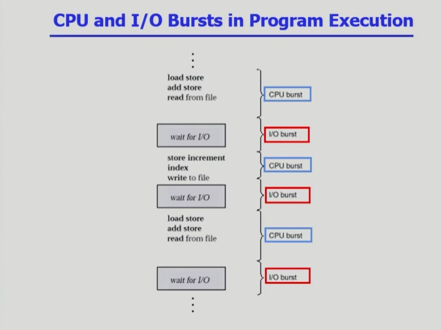

 

### CPU-burst Time의 분포

- X축이 CPU burst의 시간 : CPU를 한 번에 얼마나 쓰는가?

- CPU bound job : CPU를 길게 쓰는 프로그램

- I/O bound job : CPU를 짧게 쓰는 프로그램

  - 사람과 interaction하는 프로그램들이 많음!
  - I/O bound job이 CPU를 빨리 얻을 수 있게 하는 것이 좋다!
  - I/O bound job이CPU를 빨리 얻지 못하면 I/O 장치가 놀게 되는 상황이 벌어진다.

- **CPU 스케줄링 : 프로세스가 여러 개 있을 때, 어떤 프로세스에게 CPU를 먼저 줄 것이며, 얼마나 CPU를 줄 것인가?**

  - 프로세스에는 CPU bound job과 I/O. bound job이 섞여있기에 CPU 스케줄링이 매우 중요하다!

    

 

### 프로세스의 특성 분류

- I/O-bound process
  - CPU를 잡고 계산하는 시간보다 I/O에 많은 시간이 필요한 job
  - many short CPU bursts
- CPU-bound process
  - 계산 위주의 job
  - few very long CPU bursts

 

### CPU Scheduler & Dispatcher

- **CPU Scheduler**
  - Ready 상태의 프로세스 중에서 이번에 CPU를 줄 프로세스를 고른다.
- **Dispatcher**
  - CPU의 제어권을 CPU scheduler에 의해 선택된 프로세스에게 넘긴다.
  - 이 과정을 context switch(문맥 교환)라고 한다.
- 위 두 가지는 모두 운영체제 코드의 일부
- CPU 스케줄링이 필요한 경우는 프로세스에게 다음과 같은 상태 변화가 있는 경우이다.
  1. Running → Blocked (예 : I/O 요청하는 시스템 콜)
  2. Running → Ready (예 : 할당시간 만료로 timer interrupt)
  3. Blocked → Ready (예 : I/O 완료 후 인터럽트)
  4. Termimate
- 1, 4에서의 스케줄링은 nonpreemptive (=강제로 빼앗지 않고 자진 반납)
- 다른 스케줄링은 preemptive (=강제로 빼앗음)

 

### Performance Index (= Performance Measure, 성능 척도)

- CPU utilization (이용률)
  - keep the CPU as busy as possible
  - 높을수록 좋다.
- Throughoutput (처리량)
  - number of processes that complete their execution per time unit
  - 많을수록 좋다
- Turnaround time (소요시간, 반환시간)
  - amount of time to execute a particular process
  - CPU burst를 하러 와서 I/O burst로 나간 시간
  - CPU를 사용한 시간과 CPU를 기다린 시간을 모두 합친 시간
  - 짧을수록 좋다.
- Waiting time (대기시간)
  - amount of time a process has been waiting in the ready queue
  - CPU를 사용하기 위해 기다린 전체 시간
  - 짧을수록 좋다.
- Response time (응답시간)
  - amount of time it takes from when an request was submitted until the first response is produced, not output (for time-sharing environment)
  - 최초로 CPU를 얻기까지 걸리는 시간
  - 짧을수록 좋다.

 

 

# CPU 스케줄링 알고리즘

### FCFS (First-Come First-Served)

- nonpreemptive 알고리즘

- 선착순으로 먼저 오는 순서대로 처리함.

- 비효율적인 방법 

  - Convoy effect  (호위 효과) : 맨 앞에 대기시간이 긴 작업이 들어온다면 평균 대기 시간이 증가한다!

    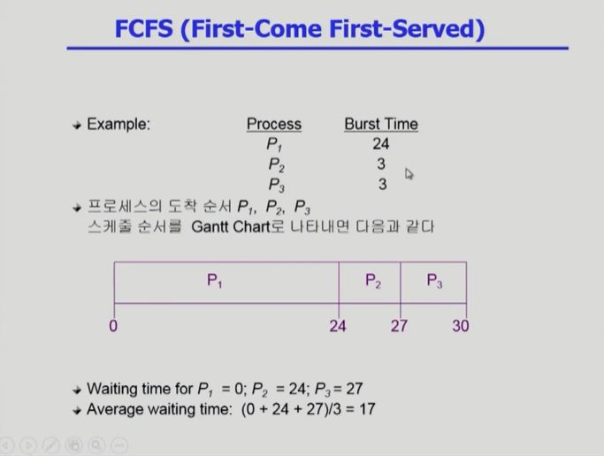

    

 

### SJF (Shortest-Job-First)

- CPU를 가장 짧게 쓰는 작업에게 먼저 CPU를 넘겨줌

- 각 프로세스의 다음 번 CPU burst time을 가지고 스케줄링에 활용

- CPU burst time이 가장 짧은 프로세스를 제일 먼저 스케줄

- Two schemes

  - Nonpreemptive
    - 일단 CPU를 잡으면 이번 CPU  burst가 완료될 때까지 CPU를 선점(preemption)당하지 않음.
  - Preemptive
    - 현재 수행 중인 프로세스의 남은 burst time보다 더 짧은 CPU burst time을 가지는 새로운 프로세스가 도착하면 CPU를 빼앗김.
    - 이 방법을 Shortest-Remaining-Time-First (SRTF)이라고도 부른다.
    - 이 방법이 optimal이다!

- SJF is optimal

  - 주어진 프로세스들에 대해 **minimum average waiting time**을 보장

- 단점

  - starvation 

    - burst time이 긴 작업은 영원히 기다려야 할 수도 있다. (큐가 계속 쌓일 수 있으므로!)

  - 어떤 작업이 CPU를 길게 쓰고 짧게 쓰는지 미리 알 수가 없다.

    - 따라서 예측을 해야하는데, 과거의 CPU Burst Time을 통해 작업시간을 예측한다.

      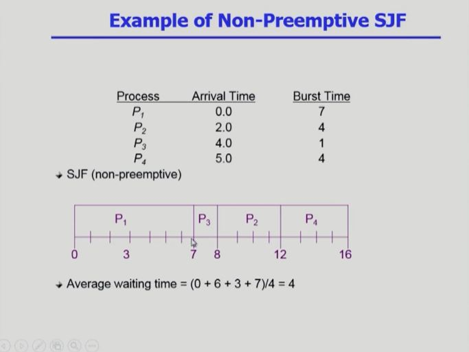

      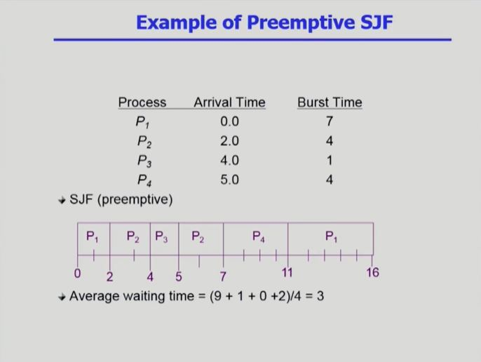

- 다음 CPU Burst TIme의 예측

  - 3번 알파는 가중치를 나타낸다!

  - 직전 CPU Burst Time을 가장 많이 반영하고, 과거로 갈수록 CPU Burst Time이 반영되는 가중치가 작아진다.

    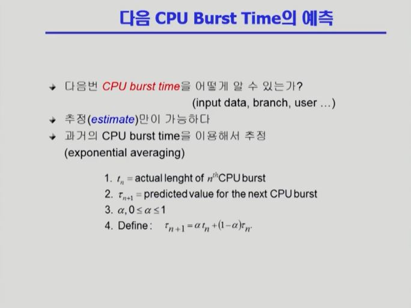

    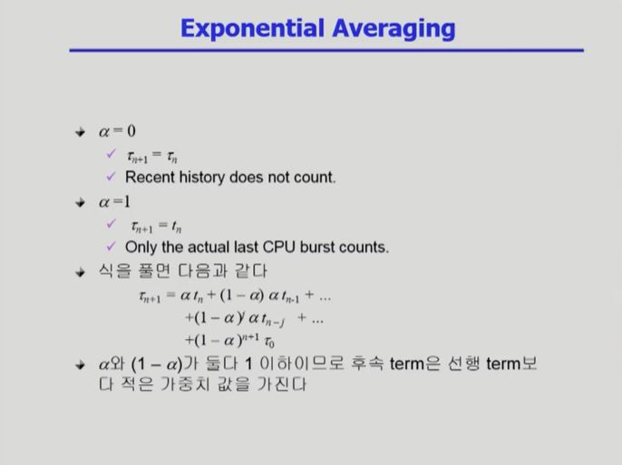

 

### Priority Scheduling

- 우선순위가 높은 작업에게 CPU를 주는 방식

  - 우선순위는 보통 정수로 주어지는데, 정수의 크기가 작을 수록 우선 순위가 높다! (정수 = 순위)

- 구현 방식

  - preemptive : 우선 순위가 더 높은 작업이 들어오면 CPU를 빼앗김.
  - nonpreemptive : 우선 순위가 더 높은 작업이 들어와도, 현재 CPU를 차지하고 있는 작업이 끝나야 CPU를 차지할 수 있음.

- SJF도 사실은 일종의 Priority Scheduling

- 문제점

  - Starvation : 우선 순위가 낮은 작업은 영원히 실행되지 않을 수도 있다.

- 해결 방법

  - Aging : 오래 기다린 작업을 우대해주는 방법

    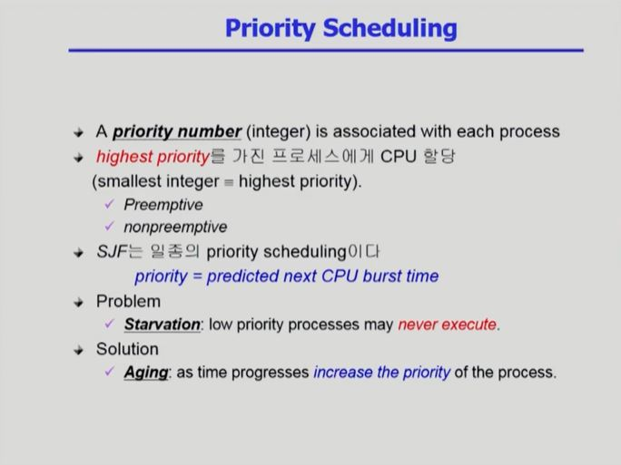

 

### Round Robin (RR)

- preemptive 방식

  - timer를 활용하여 일정시간이 되면 CPU를 다른 작업에게 넘겨준다.

- Response time이 짧다는 것이 장점!

- 대기 시간이 CPU Burst Time에 비례한다는 특징이 있다.

- 작업시간이 동일한 작업들만 있을 경우에는 비효율적이다.

  - 짧은 작업과 긴 작업이 섞여 있을 경우에 효과적!

    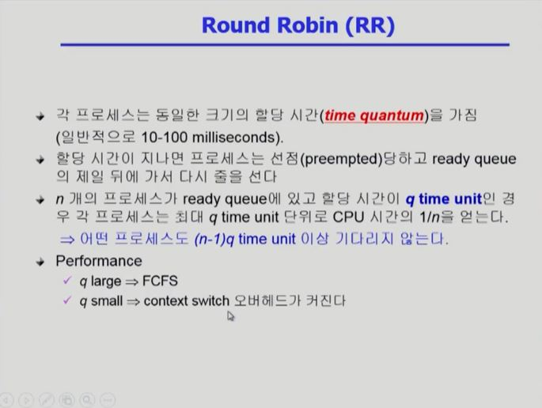

    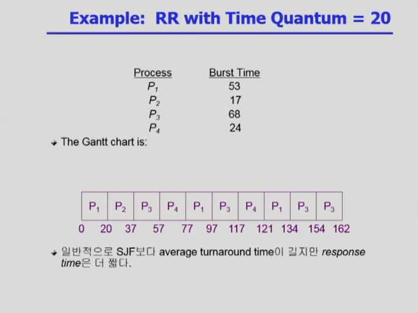

    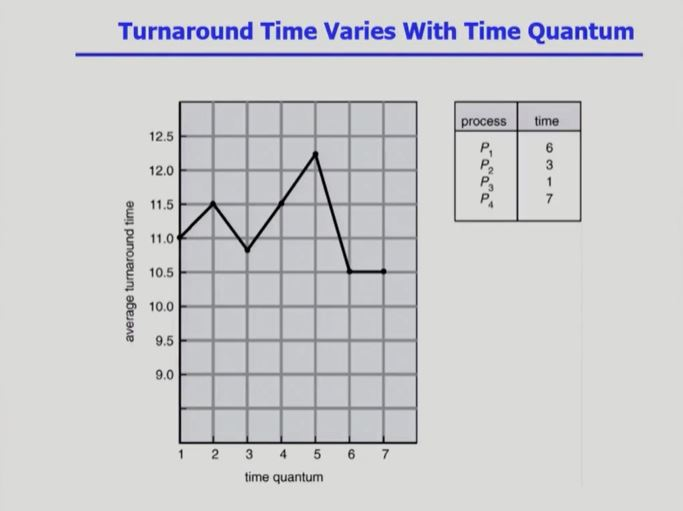

 

### Multilevel Queue

- CPU는 하나인데 줄은 여러 개

  - foreground
  - background

- Fixed priority scheduling

  - 무조건 foreground에 우선순위를 두는 것
  - background에 대해  starvation이 일어날 가능성이 있음.

- Time slice

  - 우선순위를 각 큐에 적절하게 할당

- 큐에 한 번 들어가면 다른 큐로 이동할 수 없다!

  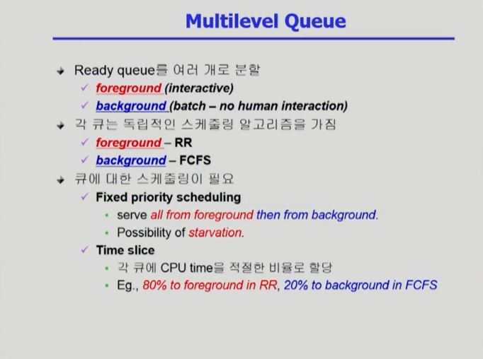

  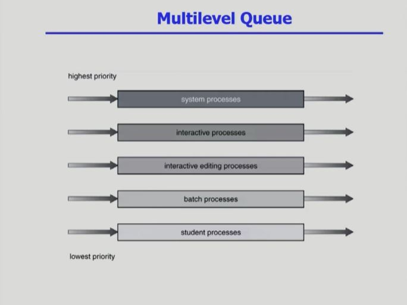

 

### Multilevel Feedback Queue

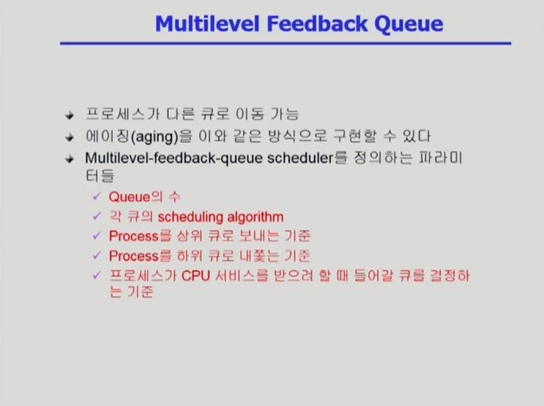

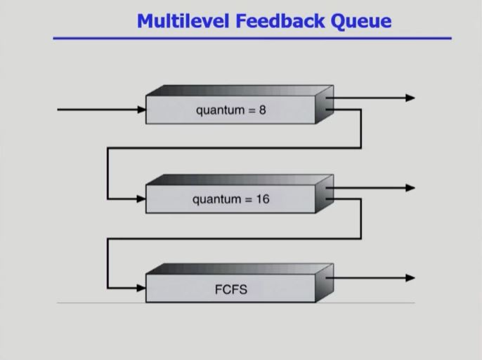

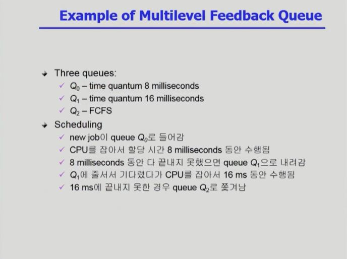

 

### Multiple-Processor Scheduling

- CPU가 여러 개인 경우 스케줄링은 더욱 복잡해짐
- Homogeneous processor인 경우
  - Queue에 한 줄로 세워서 각 프로세서가 알아서 꺼내가게 할 수 있다.
  - 반드시 특정 프로세서에서 수행되어야 하는 프로세스가 있는 경우에는 문제가 더 복잡해짐
- Load Sharing
  - 일부 프로세서에 job이 몰리지 않도록 부하를 적절히 공유하는 메커니즘 필요
  - 별개의 큐를 두는 방법 VS 공동 큐를 사용하는 방법
- Symmetric Multiprocessing (SMP)
  - 각 프로세서가 각자 알아서 스케줄링 결정
  - 모든 CPU가 대등하게 일을 함!
- Asymmetric multiprocessing
  - 하나의 프로세서가 시스템 데이터의 접근과 공유를 책임지고 나머지 프로세서는 거기에 따름
  - 하나의 CPU가 대장 CPU가 되는 형태

 

### Real-Time Scheduling

- CPU를 사용할 수 있는 Deadline이 생김
  - Deadline을 어기지 않게  스케줄링을 하는 것이 중요함!
- 온라인 스케줄링 : 프로세스의 CPU 도착 시각을 모르는 상황에서 스케줄링하는 것
  - 지금까지의 스케줄링은 모두 온라인 스케줄링이다!
- 오프라인 스케줄링 : 프로세스의 CPU 도착 시각을 알고 있는 상황에서 스케줄링하는 것
  - Hard real-time systems는 Deadline을 지키는 것이 중요하기 때문에 오프라인 스케줄링을 사용하는 경우도 많다.
- Hard real-time systems
  - Hard real-time task는 정해진 시간 안에 반드시 끝내도록 스케줄링해야 함
- Soft real-time computing
  - Soft real-time task는 일반 프로세스에 비해 높은 priority를 갖도록 해야 함
  - 무조건 Deadline을 지켜야 한다는 점은 아니지만, Deadline을 어겼을 시 불편함이 생김
    - ex) 동영상 끊김
  - Deadline을 엄격히 지켜주면 좋지만 비용이 많이 들기에 일반 프로세스와 섞어서 활용한다.
  - 그래도 동영상 끊김 등의 문제가 일어나면 안 되기에 우선순위 부여 등의 방법으로 최대한 Deadline 이내에 프로세스가 처리되도록 한다.

 

### Thread Scheduling

- Local Scheduling
  - User level thread의 경우 사용자 수준의  thread library에 의해 어떤 thread를 스케줄할지 결정
  - 운영체제는 thread의 존재를 모르고 사용자 본인이 내부에 여러 개의 thread를 둔다.
    - 프로세스가 CPU를 받은 후, 어떤 thread를 스케줄 할 지 스스로 결정
- Global Scheduling
  - Kernel level thread의 경우 일반 프로세스와 마찬가지로 커널의 단기 스케줄러가 어떤 thread를 스케줄할지 결정
    - 운영체제가 직접 어느 thread에게 CPU를 줄 지 결정한다.

 

### Algorithm Evaluation

- Queueing models

  - 확률 분포로 주어지는 arrival rate와 service rate 등을 통해 각종 performance index 값을 계산
  - 굉장히 이론적인 방법 → 수식 계산을 사용함
  - 아래 그림의 Server를 CPU로 생각하면 됨

- Implementation (구현) & Measurement (성능 측정)

  - 실제 시스템에 알고리즘을 구현하여 실제 작업(workload)에 대해서 성능을 측정 비교
  - 리눅스 환경에서 사용됨

- Simulation (모의 실험)

  - 알고리즘을 모의 프로그램으로 작성 후 trace를 입력으로 하여 결과 비교

  - trace : simulation의 input data

    - trace가 신빙성이 있어야 한다!
    -  신빙성이 중요하기에 trace를 실제 프로그램으로부터 추출해서 사용하는 경우도 있다.

    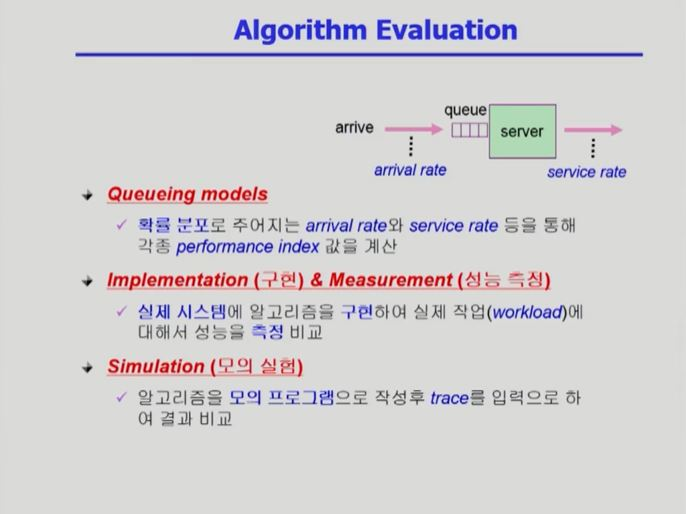