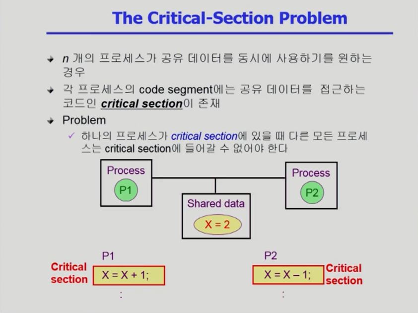
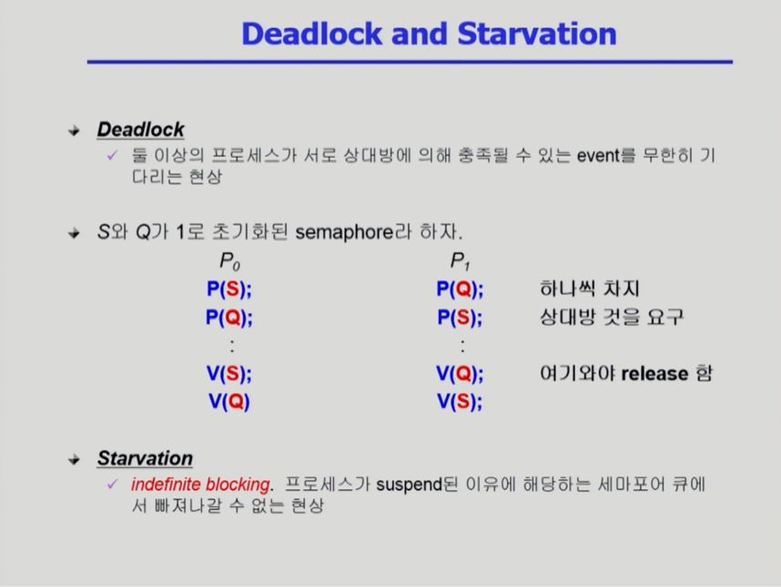
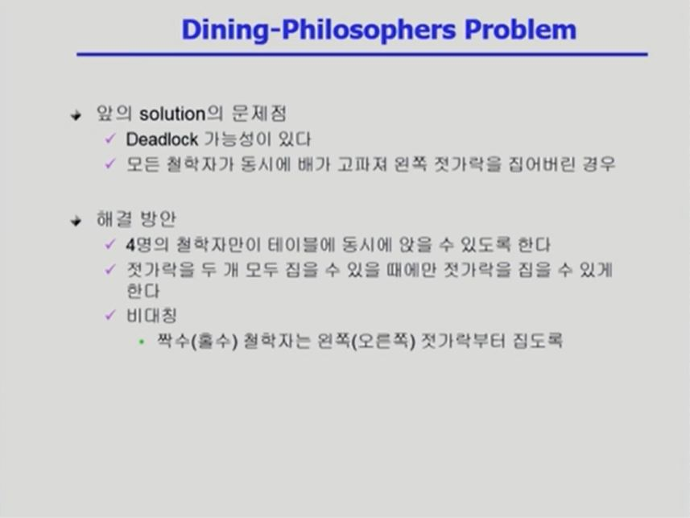

[TOC]

<br>

<br>

# [프로세스 동기화 #1](https://core.ewha.ac.kr/publicview/C0101020140401134252676046?vmode=f)

### 데이터의 접근

- Data는 I/O 장치 등을 통해 외부에서 들어옴.

- 연산은 컴퓨터 내부의 CPU에서 이루어짐.

- 연산은 항상 외부의 데이터를 받은 뒤에 이루어진다.

- 연산 결과는 다시 외부로 반환된다.

  

<br>

### Race Condition

- 데이터를 여러 군데에서 동시에 접근해서 연산을 하게 되면 문제가 생김.

- 아래 그림의 경우, 언뜻 보기에는 count가 다시 원래대로 돌아올 것 같지만 ```count--```가 ```count++``` 이전의 원래 값을 가져갔기에 count는 감소한 상태가 된다.

- CPU가 하나만 있다고 꼭 이런 문제가 안 생기는 것은 아님!

- 그렇가도 CPU가 여러 개라고 해서 꼭 이런 문제가 생기는 것은 아니다!

- 문제가 생기는 이유 : 운영체제가 끼어드는 경우

  - 프로세스는 시스템 콜을 통해 본인이 못 하는 일을 운영체제에게 대신 해달라고 요청할 수가 있음.

  - 만약 프로세스 A가 시스템 콜을 하는 타이밍과 프로세스 B가 시스템 콜을 하는 타이밍이 겹치면, 운영체제가 동일한 데이터를 다루는 과정에서 Race Condition이 일어날 수 있음.

    

<br>

### OS에서의 Race Condition

- 언제 발생하는가?

  1. kernel 수행 중 인터럽트 발생 시
  2. Process가 system call을 하여 kernel mode로 수행 중인데 context switch가 일어나는 경우
  3. Multiprocessor에서 shared memory 내의 kernel data

- 사례

  

  

  

  

  - 위 사진의 방법 1은 오버헤드가 많이 듦!

- 추가 해결방안

  - Shared Memory를 사용해서 데이터 상황을 공유하는 방안이 있다.

<br>

### Process Synchronization 문제

- 공유 데이터(shared data)의 동시 접근(concurrent access)은 데이터의 불일치 문제(inconsistency)를 발생시킬 수 있다.
- 일관성(consistency) 유지를 위해서는 협력 프로세스(cooperating process) 간의 **실행 순서(orderly execution)**를 정해주는 메커니즘 필요
- Race condition
  - 여러 프로세스 들이 동시에 공유 데이터를 접근하는 상황
  - 데이터의 최종 연산 결과는 마지막에 그 데이터를 다룬 프로세스에 따라 달라짐
- race condition을 막기 위해서는 concurrent process는 동기화(synchronize)되어야 한다.

- Example of a Race Condition

  

- The Critical-Section Problem

  - n개의 프로세스가 공유 데이터를 동시에 사용하기를 원하는 경우

  - 각 프로세스의 code segment에는 공유 데이터를 접근하는 코드인 critical section이 존재

  - Problem

    - 하나의 프로세스가 critical section에 있을 때 다른 모든 프로세스는 critical section에 들어갈 수 없어야 한다.

    - 이걸 구현하기 위해 critial-section에 lock을 거는 방법이 있다.

      

<br>

### 프로그램적 해결법의 충족조건

- Mutual Exclusion (상호 배제)
  - 프로세스 Pi가 Critical Section 부분을 수행 중이면 다른 모든 프로세스들은 그들의 Critical Section에 들어가면 안 된다.
- Progress (진행)
  - 아무도 Critical Section에 있지 않은 상태에서 Critical Section에 들어가고자 하는 프로세스가 있으면 Critical Section에 들어가게 해주어야 한다.
- Bounded Waiting (유한대기)
  - 프로세스가 Critical Section에 들어가려고 요청한 후부터 그 요청이 허용될 때까지 다른 프로세스들이 Critical Section에 들어가는 횟수에 한계가 있어야 한다.
- 가정
  - 모든 프로세스의 수행 속도는 0보다 크다.
  - 프로세스들 간의 상대적인 수행 속도는 가정하지 않는다.

- Initial Attempts to Solve Problem

  

<br>

### Algorithm 1

- 이 알고리즘을 사용하면 두 프로세스가 동시에 Critical Section에 들어가는 일은 없음.

- 그러나 프로세스가 반드시 Critical Section에 번갈아 들어가야 하기에, 내 프로세스가 들어가기 위해서는 반드시 상대 프로세스가 끝날 때까지 기다려야 한다는 단점이 있음.

- 따라서 내 프로세스가 자주 Critical Section에 들어가고, 상대방은 자주 Critical Section에 들어가지 않는다면 내 차례가 돌아오지 않는다는 문제점이 발생한다.

- 충족 조건에서 상호 배제는 충족했지만 진행을 충족하지 못했다.

  

<br>

### Algorithm 2

- flag를 사용하는 알고리즘

  - flag를 통해 동시 접근을 막는다.
  - flag를 통해 접근 의사를 표현한다.
  - Critical Section을 들어갔나 나오면 flag 변수가 무조건 false가 된다.

- 상호 배제는 충족하지만 진행을 충족하지 못 한다.

  - flag 변수가 true인 것은 Critical Section에 들어가겠다는 의사를 표현한 것이지,  Critical Section에 들어갔다는 뜻이 아니다.

  - 그런데 상대방의 flag 변수가 true인 것만 보고 Critical Section에 들어가 있다는 착각을 하여, 아무도 Critical Section에 들어가 있지 않는데 어느 프로세스도 Critical Section을 이용하지 못하는 문제가 발생할 수 있다.

     

<br>

### Algorithm 3 (Peterson's Algorithm)

- Algorithm 1과 Algorithm 2의 변수들이 모두 활용됨

- flag 변수가 true인 상황에 한해서 turn을 진행시킨다.

- 문제점

  - 기다리면서 계속 CPU를 사용하며 자원을 낭비하는 문제가 발생한다.

    

<br>

### Synchronization Hardware

- Test_and_set()

  - 변수를 읽고 변수값을 세팅하는 과정을 atomic하게 수행

    

<br>

<br>

# [프로세스 동기화 #2](https://core.ewha.ac.kr/publicview/C0101020140404151340260748?vmode=f)

### Semaphores

- 일종의 추상 자료형

- P 연산 : 자원을 획득하는 과정

- V 연산 : 자원을 반납하는 과정

- 자원은 공유 자원으로, 자원을 사용하는 코드가 P 연산과 V 연산 사이에 오게 된다.

  

<br>

### Critical Section of n Processes

- semaphore 변수를 사용 : 1로 초기화

- semaphore가 지원되면 Critical Section 문제를 효율적으로 해결할 수 있다.

- semaphore 변수가 0이면 CPU를 바로 반납하게 하는(blocked 상태) 방식으로 busy-wait 문제를 해결할 수 있다.

  

<br>

### Block / Wakeup Implementation

- semaphore 변수들을 잠재워서 줄 세운다.

  

- P 연산 시 무조건 1을 뺀다.

- V 연산 시 무조건 1을 증가시킨다. 

  - 이 때, 값이 꼭 양수가 된다는 보장이 없다!
  - 값이 음수면 누군가가 이 세마포어를 기다리면서 잠들고 있다는 뜻이다.
  - 값이 양수면 세마포어가 남아돌아서 어느 누구도 쓰고 싶어하지 않는 상황이다.

- 따라서 여기서의 S의 값은 자원의 양을 의미하는 것이 아니다.

  

<br>

### Whick is better?

- Block/Wakeup 방식이 일반적으로는 더 좋다.

- Critical Section의 길이마 매우 짧은 경우에는 Busy-Wait 방식이 더 좋다.

- Critical Section의 길이보다는, Critical Section에 대한 경쟁이 치열한가 아닌가로 비교하는 것이 더 정확하다.

  

<br>

### Two Types of Semaphores

- **Counting semaphore**
  - 도메인이 0 이상인 임의의 정수값
  - 주로 resource counting에 사용
- **Binary semaphore (=mutex)**
  - 0 또는 1 값만 가질 수 있는 semaphore
  - 주로 mutual exclusion(lock/unlock)에 사용

<br>

### Deadlock and Starvation

- Deadlock 상태는 상대방의 자원을 요구할 때, 상대방이 이미 자원을 사용하고 있어서 얻지 못하는 문제 상황을 가리킨다. 이 상황으로 인해 작업이 수행되지 못하고 영원히 기다리게 된다!

  - 자원은 반드시 작업이 다 끝난 다음에야 내놓을 수 있기 때문에 발생하는 문제이다!

    

- 해결 방법 : 작업의 획득 순서를 설정해놓으면 된다!

  - ex) Q를 얻기 위해서는 반드시 먼저 P를 얻어야만 한다.

    

<br>

<br>

# [프로세스 동기화 #3](https://core.ewha.ac.kr/publicview/C0101020140411143154161543?vmode=f)

### Classical Problems of Syncronization

- Bounded-Buffer Problem (Producer-Consumer Problem)
- Readers-Writers Problem
- Dining-Philosophers Problem

<br>

### Bounded-Buffer Problem (Producer-Consumer Problem)

- Bounded-Buffer는 크기가 유한한 공유 버퍼를 가리킨다.

- 생산자 프로세스와 소비자 프로세스가 있다.

  - 생산자 프로세스 : 데이터를 만들어서 버퍼에 집어넣는 역할
  - 소비자 프로세스 : 데이터를 꺼내가는 역할

- 여러 개의 생산자 프로세스가 동시에 데이터를 집어넣으려고 할 때, 어느 한 쪽의 데이터가 유실되는 문제가 발생한다.

  - 이 문제를 막기 위해  공유 버퍼에 접근할 때 lock을 걸어서 다른 프로세스의 접근을 막은 다음에 데이터를 집어넣고, 비어 있는 버퍼의 위치를 다음 위치로 변경한다.
  - 버퍼의 위치가 변경되면 lock을 푼다.

- 여러 개의 소비자 프로세스가 하나의 데이터에 동시에 접근하려는 상황이 발생할 수도 있다.

  - 마찬가지로 공유 버퍼에 lock을 걸어서, 데이터를 확실하게 꺼낸 뒤 버퍼의 위치를 다음 위치로 변경하고 lock을 푼다.

- 문제의 해결 조건

  1. 공유 버퍼에 lock을 걸고 풀 수 있어야 한다.
  2. 생산자 입장 : 비어있는 버퍼가 존재해야 한다. → 빈 버퍼가 곧 자원이 된다!
  3. 소비자 입장 :  내용이 들어있는 버퍼가 존재해야 한다. → 내용이 들어있는 버퍼가 곧 자원이 된다!

- 자원의 개수를 셀 때 세마포어가 중요한 역할을 한다.

  - Counting Semaphore를 이용하여 내용이 들어있는 버퍼, 비어있는 버퍼의 개수를 센다.

  - Binary Semaphore를 이용하여 공유 버퍼에 lock을 걸거나 푼다.

    

- 코드

  - mutex : lock을 거는 세마포어 변수

  - 생산자 프로세스는 데이터를 만들어서 버퍼에 집어넣는다. 이 때 버퍼가 공유 데이터이므로 접근하기 전에 lock을 풀고 데이터 주입과 버퍼 위치 이동이 끝나면 lock을 푼다. 내용이 채워진 버퍼의 개수가 증가한다.

    - 이 때 빈 버퍼가 없으면 생산자 프로세스는 소비자 프로세스가 빈 버퍼를 만들어줄 때까지 기다려야 한다.

  - 소비자 프로세스는 내용이 들어있는 버퍼를 획득한 뒤 lock을 걸고 데이터를 가져간다. 데이터 추출과 버퍼 위치 이동이 끝나면 lock을 푼다. 빈 버퍼의 개수가 증가한다.

    - 이 때 내용이 들어있는 버퍼가 없으면 소비자 프로세스는 생산자 프로세스가 버퍼에 내용을 채워줄 때까지 기다린다.

      

<br>

### Readers-Writers Problem

- 공유 데이터는 DB

- Reader는 동시에 접근해도 문제가 없으므로 여럿이 접근해도 되도록 허용

- Writer는 동시 접근을 하면 안 되므로 막음!

- db : lock을 걸기 위한 세마포어 변수

- mutex : readcount에 lock을 걸기 위한 변수

  

- 코드

  - Reader는 DB에 대한 동시 접근을 가능하게 해야 하기에 코드가 더 복잡함.

  - Startvation이 발생할 수 있다는 문제점이 있음!

    - 기존의 Reader의 접근을 다 처리하기도 전에 또 Reader가 도착할 경우, Writer가 실행되지 못 한다.

    - 해결 방법 : 일정 시간 간격을 둬서, 그 이내에 도착하는 Reader에게만 접근 권한을 준다! (신호등과 같은 원리)

      

<br>

### Dining-Philosophers Problem

- 5명의 철학자에 앉는다.

- 철학자는 생각을 하고 밥을 먹는다.

- 철학자가 배고파지는 주기는 각자 다르다.

- 밥을 먹으려면 젓가락 두 개(한 쌍)을 모두 집어야 한다.

- 여기서 문제는, 젓가락은 공유 데이터이다! 모두에게 두 개가 주어지지 않는다.

- 이 때, 모든 철학자들이 동시에 배고파져서 모두 하나의 젓가락을 집으면, 그 누구도 식사를 하지 못하는 문제가 발생한다.

  

- 문제점과 해결방안

  

- 두 번째 해결 방안을 구현한 코드

  - Monitor의 개념을 담고 있다!

  - 0이면 젓가락 두 개를 모두 잡을 수 있는 상태, 1은 하나만 집을 수 있는 상태

  - self는 권한을 나타내는 변수

    - 0으로 초기화한 뒤, 젓가락을 들 수 있으면 0, 젓가락을 들 수 없으면 1을 설정한다.

  - mutex는 state에 lock을 걸기 위한 변수

    

<br>

### Monitor

- 공유 데이터를 중심으로 함수가 만들어져 있음
  - 공유 데이터에 대한 접근을 책임진다!
  - 공유 데이터에 대한 접근은 Moniotr 안의 함수를 통해서만 가능하다.
  - 공유 데이터에 대한 동시 접근을 막는다.

- 세마포어에서는 동기화 문제를 프로그래머가 책임져야했지만, Monitor에서는 그럴 필요가 없다.

  

  

  

- 자원의 여분이 없을 때 대기시키는 큐의 역할을 하는 것이 condition variable

  

<br>

### Monitor의 사용 예시

- **Bounded-Buffer Problem**

  - 자원을 세는 변수 없이 큐만 운용함.

  - 큐의 특성 상 버퍼의 개수를 셀 필요가 없기 때문!

  - 큐에서 대기하고 있는 프로세스가 없으면 아무런 일도 일어나지 않음.

    

- **Dining Philosophers Example**

  - 젓가락을 들 수 있는 여부를 알기 위해 다른 철학자들의 상태를 파악한다.

  - 젓가락을 내려놓으면 인접 철학자들의 배고픔 여부를 확인하여, 배고픈 상태라면(큐에서 대기하는 상태라면) 젓가락을 들 수 있게 해준다.

    