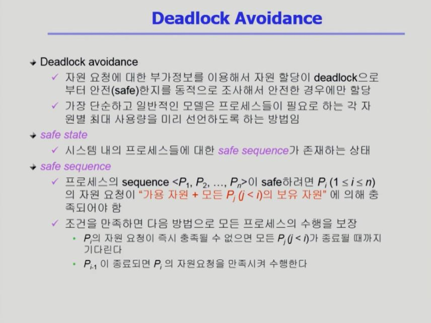
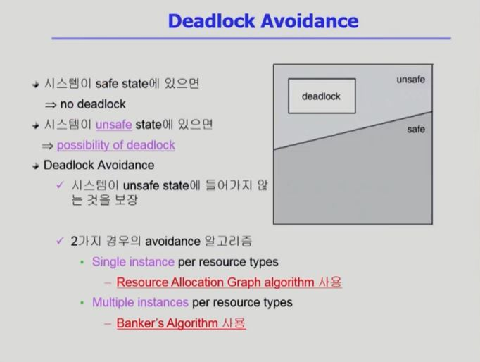

# [교착상태 #1](https://core.ewha.ac.kr/publicview/C0101020140411151510275738?vmode=f)

# [교착상태 #2](https://core.ewha.ac.kr/publicview/C0101020140415131030840772?vmode=f)

### The Deadlock Problem

- 더 이상 도저히 진행이 불가능한 상태

- 모든 프로세스가 스스로 가진 자원을 내놓지 않고, 다른 프로세스가 가진 자원을 기다리는 상태

- 자원은 소프트웨어 자원일 수도 있고, 하드웨어 자원일 수도 있다.

  

  

 

### Deadlock 발생의 4가지 조건

- Deadlock은 아래의 4가지 조건을 모두 만족해야 발생한다.

  

 

### Resource-Allocation Graph(자원할당그래프)

- 동그라미가 프로세스, 사각형이 자원

- 자원에서 프로세스로 가는 화살표 : 프로세스가 자원을 차지하고 있다.

- 프로세서에서 자원으로 가는 화살표 : 프로세스가 자원을 요청하고 있다.

  

 

### Deadlock의 처리 방법

- Deadlock Prevention

- Deadlock Avoidance
  - Resource Allocation Graph algorithm
  - Example of Banker's Algorithm
  
- Deadlock Detection and recovery

- Deadlock Ignorance

  

 

### Deadlock Prevention

 

### Deadlock Avoidance

 

### Deadlock Avoidance의 상세

 

### Resource-Allocation Graph

 

### Banker's Algorithm

 

### Dealock Detection and Recovery

​			

​			

 

### Deadlock Ignorance

