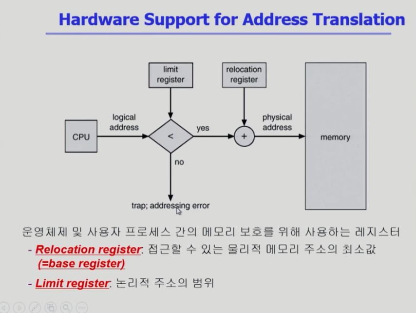
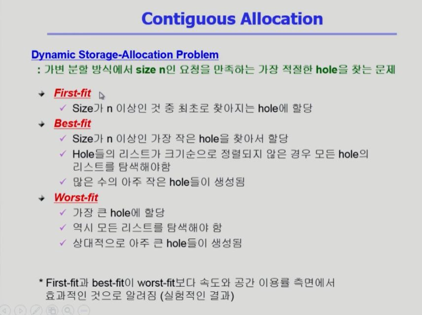
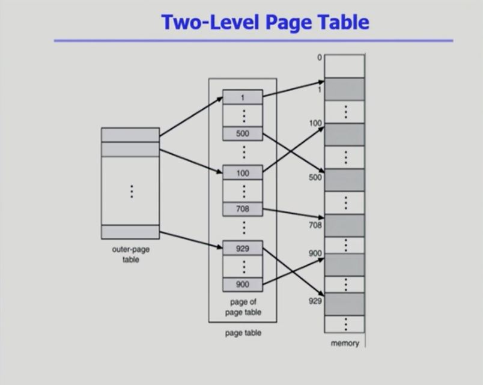

[TOC]

 

 

# [메모리 관리 #1](https://core.ewha.ac.kr/publicview/C0101020140425151219100144?vmode=f)

### Logical vs. Physical Address

- Logical address (= virtual address)

  - 프로세스마다 독립적으로 가지는 주소 공간
  - 각 프로세스마다 0번지부터 시작
  - **CPU가 보는 주소는 logical address임**

- Physical address

  - 메모리에 실제 올라가는 위치
  - 가상 주소와 물리적인 주소 간에 주소 변환이 필요함!

- 주소 바인딩 (주소 변환) 

  - 주소를 결정하는 것

  - 하드웨어가 해 줌.

  - Symbolic Address : 프로그래머가 바라보는 주소 (변수)

    

 

### 주소바인딩(Address Binding)

- Complie time binding

  - 컴파일하는 시점에 물리적인 주소가 결정됨
  - 비효율적
  - 절대 코드(absolute  code) 생성

- Load time binding

  - 프로그램이 실행되는 시점에 물리적인 주소가 결정됨.
  - 프로그램이 시작되는 시점에 주소 바인딩이 이루어지고, 물리적인 주소가 바뀌지 않음.
  - 재배치가능코드(relocatable code) 생성
  - 물리적인 주소 자체가 논리적인 주소

- Execution time binding (= Run time binding)

  - 프로그램이 실행되는 시점에 물리적인 주소가 결정됨.

  - 프로그램이 시작되는 시점에 주소 바인딩이 이루어지고, 물리적인 주소가 중간중간 바뀔 수 있음.

  - 재배치가능코드(relocatable code) 생성

  - 접근할 때마다 주소 계산

    

    

 

### Memory-Management Unit(MMU)

- 

  

 

### Dynamic Relocation

- 레지스터 두 개가 사용됨 : 물리적인 메모리의 시작 위치를 담고 있음!

  

 

### Hadware Support for Address Translation

1. CPU가 logical address를 주면 MMU는 limit register보다 작은지 확인한다.

2. 작으면 변환시키고, 크면 악의적인 접근이므로 trap을 발생시킨다.

3. 정상적인 접근이면 메모리 주소를 구해서 메모리게 접근을 한다.

   

 

### Some Treminologies

- Dynamic Loading
- Dynamic Linking
- Overlays
- Swapping

 

### Dynamic Loading

- 프로세스 전체를 메모리에 미리 다 오릴는 것이 아니라 해당 루틴이 불려질 때 메모리에 load하는 것
- memory utilization의 향상
-  가끔씩 사용되는 많은 양의 코드의 경우 유용
  - ex) 오류 처리 루틴
- 운영체제의 특별한 지원 없이 프로그램 자체에서 구현 가능 (OS는 라이브러리를 통해 지원 가능)
- Loading : 메모리로 올리는 것

 

### Overlays

- 메모리에 프로세스의 부분 중 실제 필요한 정보만을 오릶
- 프로세스의 크기가 메모리보다 클 때 유용
- 운영체제의 지원없이 사용자에 의해 구현
- 작은 공간의 메모리를 사용하던 초창기 시스템에서 수작업으로 프로그래머가 구현
  - Manual Overlay
  - 프로그래밍이 매우 복잡

 

### Swapping

- Swapping
  - 프로세스를 일시적으로 메모리에서 backing store로 쫓아내는 것
- Backing store (=swap area)
  - 디스크 : 많은 사용자의 프로세스 이미지를 담을 만큼 충분히 빠르고 큰 저장 공간
- Swap in / Swap out
  - 일반적으로 중기 스케줄러(swapper)에 의해 swap out 시킬 프로세스 선정
  - priority-based CPU scheduling algorithm
    - priority가 낮은 프로세스를 swapped out 시킴
    - priority가 높은 프로세스를 메모리에 올려 놓음
  - Compile time 혹은 load time binding에서는 원래 메모리 위치로 swap in 해야 함 (비효율적!)
  - Execution time binding에서는 추후 빈 메모리 영역 아무 곳에나 올릴 수 있음
  - swap time은 대부분 transfer time(swap되는 양에 비례하는 시간)임

 

### Dynamic Linking

- Linking을 실행 시간(execution time)까지 미루는 기법
- Static linking (static library)
  - 라이브러리가 프로그램의 실행 파일 코드에 포함됨
  - 실행 파일의 크기가 커짐
  - 동일한 라이브러리를 각가의 프로세스가 메모리에 올리므로 메모리 낭비
    - ex) printf 함수의 라이브러리 코드
- Dynamic linking (shared library, .so, .dll)
  - 라이브러리 실행시 연결(link)됨
  - 라이브러리 호출 부분에 라이브러리 루틴의 위치를 찾기 위한 stub이라는 작은 코드를 둠
  - 라이브러리가 이미 메모리에 있으면 그 루틴의 주소로 가고, 없으면 디스크에서 읽어옴
  - 운영체제의 도움이 필요

 

### Allocation of Physical Memory

 

### Continuous Allocation

- 외부 조각 : 프로그램이 할당되지 못한 공간

- 내부 조각 : 프로그램에 할당되었으나, 사용되지 못하고 낭비되는 공간

- Compaction은 Run-time Binding에서만 가능

  

  

  

  

  

 

 

# [메모리 관리 #2](https://core.ewha.ac.kr/publicview/C0101020140429132440045277?vmode=f)

### Paging

- Paging
  - Process의 virtual memory를 동일한 사이즈의 page 단위로 나눔
  - Virtual memory의 내용이 page 단위로 noncontiguous하게 저장됨
  - 일부는 backing storage에, 일부는 physical memory에 저장

- Basic Method

  - physical memory를 동일한 크기의 frame으로 나눔
  - logical memory를 동일 크기의 page로 나눔 (frame과 같은 크기)
  - 모든 가용 frame들을 관리
  - page table을 사용하여 logical address를 physical address로 변환
  - External fragmentation(외부 조각) 발생 안함
  - Internal fragmentation(내부 조각) 발생 가능

- Paging Example

  

 

### Address Translation Architecture

- 아래 사진의 d는 오프셋을 가리킴!

- 오프셋 : 위치가 얼마나 떨어져 있는지는 나타내는 정보

  

 

### Implementation of Page Table

- Page table은 main memory에 상주
- **Page-table base register(PTBR)**가 page table을 가리킴
- **Page-table length register(PTLR)**가 테이블 크기를 보관
- 모든 메모리 접근 연산에는 2번의 memory access 필요
- page table 접근 1번, 실제 data/instruction 접근 1번
- 속도 향상을 위해 asscociative register 혹은 **translatoini look-aside buffer(TLB)**라 불리는 고속의 lookup hardware cache 사용

 

### Paging Hardware with TLB

- TLB는 페이지 번호와 프레임 번호를 쌍으로 가지고 있음!

- 탐색 시간이 오래 걸려서 오버헤드가 크다.

  

 

### Associative Register

- Associative registers(TLB) : parallel search가 가능
  - TLB에는 page table 중 일부만 존재
- Address translation
  - page table 중 일부가 associative reigster에 보관되어 있음
  - 만약 해당 page #가 associative register에 있는 경우 곧바로 frame #을 얻음
  - 그렇지 않은 경우 main memory에 있는 page table로부터 frame #를 얻음
  - TLB는 context switch 때 flush (remove old entries)

 

### Effective Access Time

 

### Two-Level Page Table

 

### Two-Level Paging Example

 

### Address Translation Scheme

 

### Multilevel Paging and Performance

 

###  Valid (v) / Invalid (i) Bit in a Page Table

 

 

# [메모리 관리 #3](https://core.ewha.ac.kr/publicview/C0101020140502151452123728?vmode=f)

### Memory Protection

 

### Inverted Page Table Architecture

 

### Shared Page

- Shared code
  - Re-entrance Code ( = Pure Code)
  - read-only로 하여 프로세스 간에 하나의 code만 메모리에 올림
    - ex) text editores, compilers, window systems
  - Shared code는 모든 프로세스의 logical address space에서 동일한 위치에 있어야 함
- Private code and data
  - 각 프로세스들은 독자적으로 메모리에 올림
  - Private data는 logical address space의 아무 곳에 와도 무방

 

### Segmentation

 

### Segmentation Architecture

 

### Segmentation with Paging

