[TOC]

 

 

# [가상 메모리 #1](https://core.ewha.ac.kr/publicview/C0101020140509142939477563?vmode=f)

### Demand Paging

- 실제로 필요할 때 page를 메모리에 올리는 것

  - I/O 양의 감소
  - Memory 사용량 감소
  - 빠른 응답 시간
  - 더 많은 사용자 수용

- Valid/Invalid bit의 사용

  - Invalid의 의미

    - 사용되지 않는 주소 영역인 경우
    - 페이지가 물리적 메모리에 없는 경우

  - 처음에는 모든 page entry가 invalid로 초기화

  - address translation 시에 invalid bit이 set되어 있으면 "page default"

    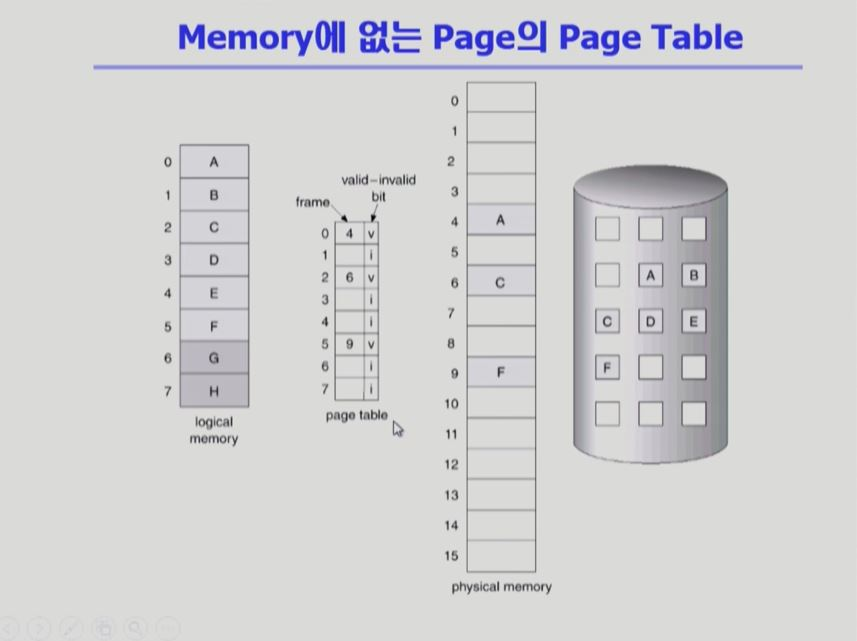

 

### Page Fault

- invalid page를 접근하면 MMU가 trap을 발생시킴 (page fault trap)

- Kernal mode로 들어가서 page fault handler가 invoke됨

- 다음과 같은 순서로 page fault를 처리한다.

  1. Invalid reference? 

     ex) bad address, protection violation → abort process

  2. Get an empty page frame. (없으면 뺏어온다 : replace)

  3. 해당 페이지를 disk에서 memory로 읽어온다.

     1. Disk I/O가 끝나기까지 이 프로세스는 CPU를 preempt 당함 (block)
     2. Disk read가 끝나면 page tables entry 기록, valid/invalid bit = "valid"
     3. ready queue에 process를 insert → dispatch later

  4. 이 프로세스가 CPU를 잡고 다시 running

  5. 아까 중단되었던 instruction을 재개

     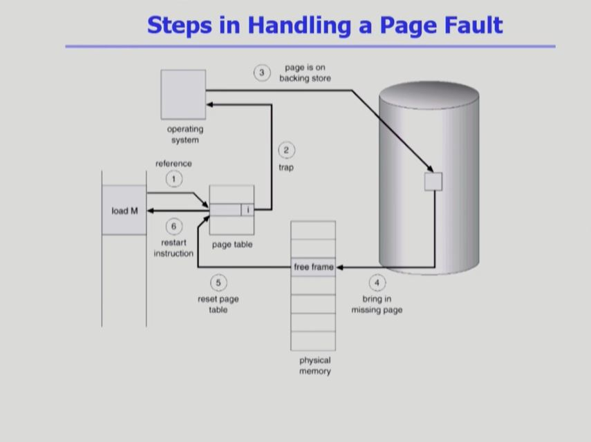

     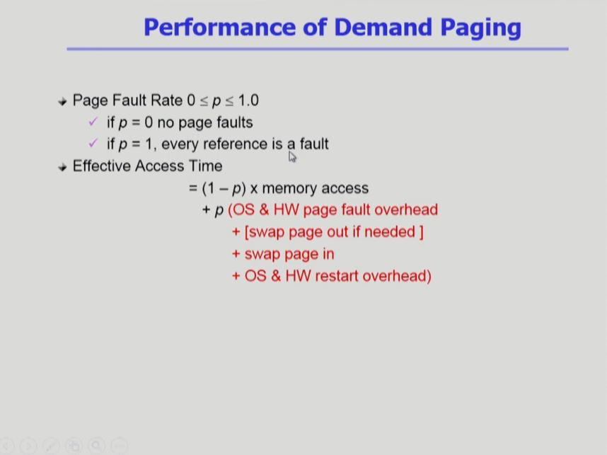

 

### Free frame이 없는 경우

 

### Page Replacement

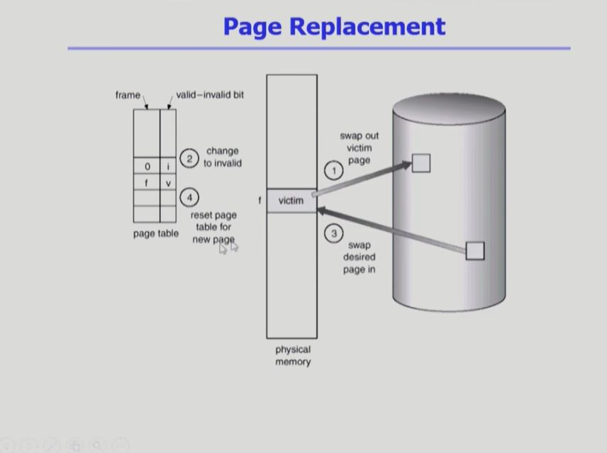

 

### Optimal Algorithm

- 실제 시스템에서 사용하는 것이 아니고, 미래의 참조가 가능하다는 이론적인 가정 하에 사용 됨!

- 기존의 페이지 테이블에 저장한 페이지가 들어올 경우, 저장된 정보를 사용함!

- 아무리 좋은 알고리즘을 만든다 하더라고, Optimal Algorithm보다 좋을 수는 없다!

  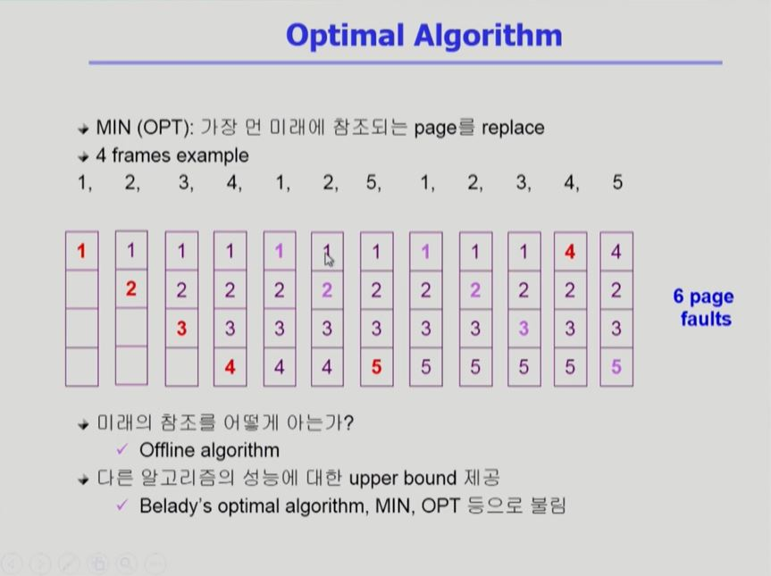

 

### FIFO(First In First Out) Algorithm

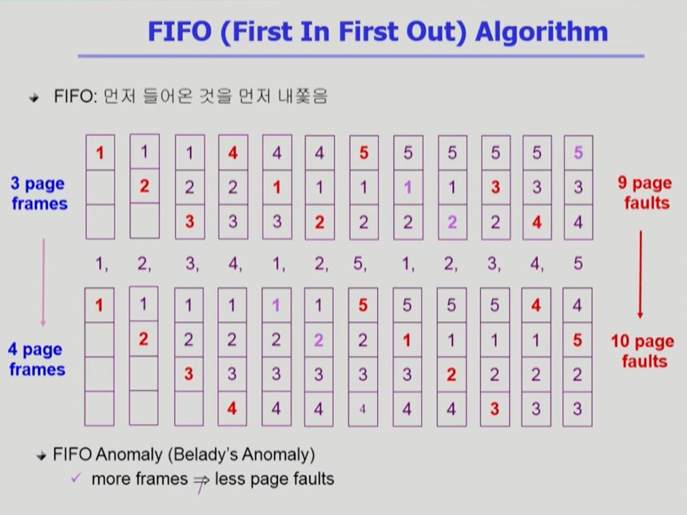

 

### LRU(Least Recently Used) Algorithm

 

### LFU(Least Frequently Used) Algorithm

- 참조 횟수가 동률일 경우, 보다 오래된 페이지를 replace!

  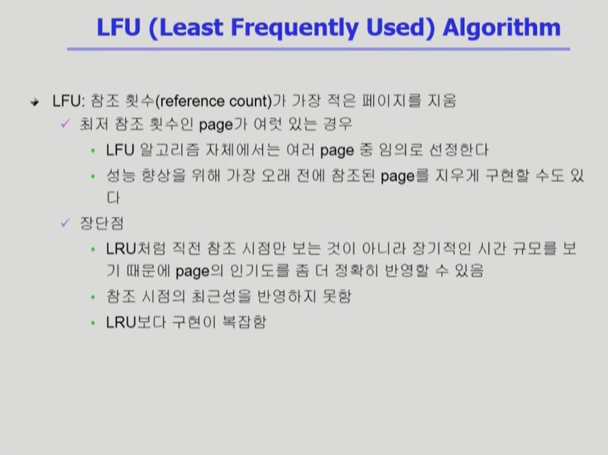

 

### LRU와 LFU 알고리즘의 예제 및 구현

- 예제

  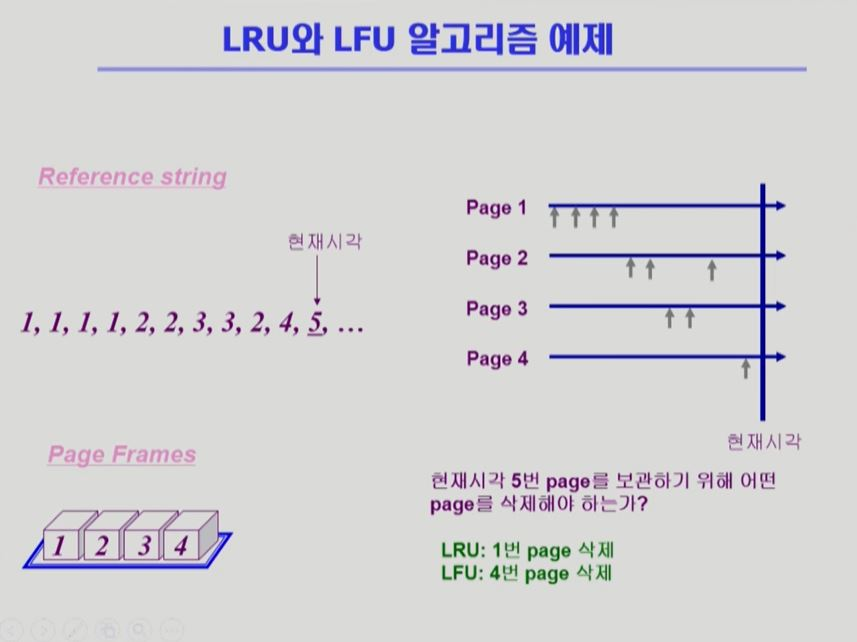

- 구현

  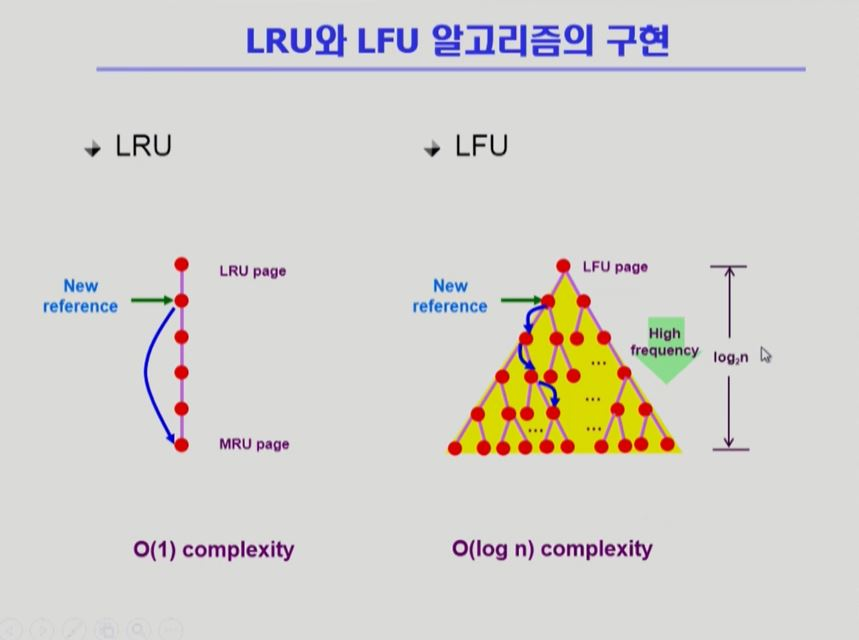

 

 

# [가상 메모리 #2](https://core.ewha.ac.kr/publicview/C0101020140513133424380501?vmode=f)

### 다양한 캐슁 환경

- 캐슁 기법
  - 한정된 빠른 공간(=캐슁)에 요청된 데이터를 저장해 두었다가 후속 요청 시 캐쉬로부터 직접 서비스하는 방식
  - paging system. 외에도 cache memory, buffer caching, Web caching 등 다양한 분야에서 사용
- 캐쉬 운영의 시간 제약
  - 교체 알고리즘에서 삭제할 항목을 결정하는 일에 지나치게 많은 시간이 걸리는 경우 실제 시스템에서 사용할 수 없음
  - Buffer caching이나 Web caching의 경우
    - O(1)에서 O(log n) 정도까지 허용
  - Paging system인 경우
    - page default인 경우에만 OS가 관여함
    - 페이지가 이미 메모리에 존재하는 경우 참조시각 드으이 정보를 OS가 알 수 없음
    - O(1)의 LRU의 list 조작조차 불가능

 

### Clock Algorithm

- Clock Algorithm
  - LRU의 근사(approximation) 알고리즘
  - 여러 명칭으로 불림
    - Second chance algorithm
    - NUR(Not Used Recently) 또는 NRU(Not Recently Used)
  - Reference bit을 사용해서 교체 대상 페이지 선정 (circular list)
  - reference bit가 0인 것을 찾을 때까지 포인터를 하나씩 앞으로 이동
  - 포인터 이동하는 중에 reference bit 1은 모두 0으로 바꿈
  - Reference bit이 0인 것을 찾으면 그 페이지를 교체
  - 한 바퀴 되돌아와서도(= second chance) 0이면 그 떄에는 repalce 당함
  - 자주 사용되는 페이지라면 second chance가 올 때 1
- Clock algorithm의 개선
  - reference bit(access bit)과 modified bit(dirty bit)을 함께 사용
  - reference bit = 1 : 최근에 참조된 페이지
  - modified bit = 1 : 최근에 변경된 페이지 (I/O를 동반하는 페이지)
    - 1인 경우 쫓아낼 때 디스크에 기록한 뒤 쫒아내고, 아닐 경우 그냥 쫓아낸다 

- 어떤 페이지를 쫓아낼 지 운영체제가 결정함

  - 결정 기준은 비트!

  - 최근에 사용되었으면 비트가 1, 아니면 0

  - 비트가 0인 페이지를 쫓아냄

    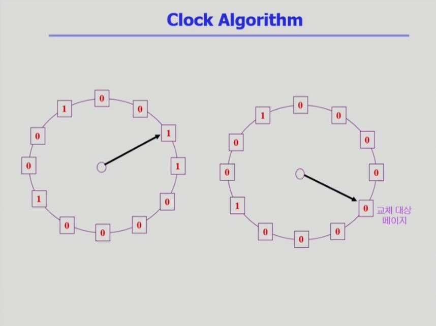

 

### Page Frame의 Allocation

- Allocation problem : 각 process에 얼마만큼의 page frame을 할당할 것인가?
- Allocation의 필요성
  - 메모리 참조 명령어 수행 시 명령어, 데이터 등 여러 페이지 동시 참조
    - 명령어 수행을 위해 최소한 할당되어야 하는 frame의 수가 있음
  - Loop를 구성하는 page들은 한꺼번에 allocate 되는 것이 유리함
    - 최소한의 allocation이 없으면 매 loop마다 page default
- Allocation Scheme
  - Equal allocation : 모든 프로세스에 똑같은 갯수 할당
  - Proportional allocatio : 프로세스 크기에 비례하여 할당
  - Priority allocation : 프로세스의 priority에 따라 다르게 할당

 

### Global vs. Local Replacement

- Global replacement
  - 각 프로세스에 별도의 메모리 할당을 하지 않음.
  - Replace 시 다른 process에 할당된 frame을 빼앗아 올 수 있다.
  - Process 별 할당량을 조절하는 또 다른 방법임
  - FIFO, LRU, LFU 등의 알고리즘을 gloabal replafement로 사용시에 해당
  - Working set, PFF 알고리즘 사용
  - 장점 : 메모리를 많이 사용하는 프로세스에게 frame을 많이 할당할 수 있다.
- Local replacement
  - 자신에게 할당된 frame 내에서만 replacement
  - FIFO, LRU, LFU 등의 알고리즘을 process 별로 운영시

 

### Thrashing

- X축은 메모리에 올라와있는 프로세스의 갯수, Y축은 CPU 이용률

- 그래프에서 이용률이 감소하는 구간이 Thrashing 구간

  - 각각의 프로세스가 메모리를 너무 조금씩 가지고 있어서 계속 page default가 일어남

    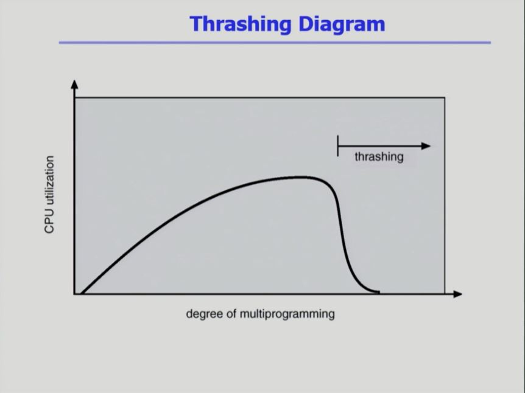

    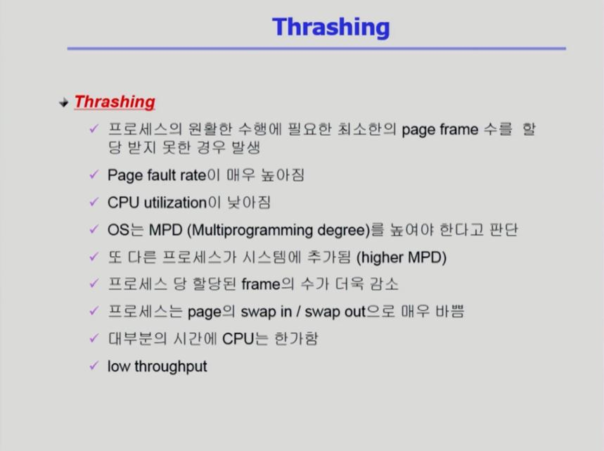

 

### Working-Set Model

- Locality of reference
  - 프로세스는 특정 시간 동안 일정 장소만을 집중적으로 참조한다.
  - 집중적으로 참조되는 해당 page들의 집합을 locality set이라 함
- Working-set Model
  - Locality에 기반하여 프로세스가 일정 시간 동안 원활하게 수행되기 위해 한꺼번에 메모리에 올라와 있어야 하는 page들의 집합을 Working Set이라 정의함.
  - Working Set 모델에서는 process의 working set 전체가 메모리에 올라와 있어야 수행되고 그렇지 않을 경우 모든 frame을 반납한 후 swap out (suspend)
  - Thrashing을 방지함
  - Multiprogramming degree을 결정함.

 

### Working-Set Algorithm

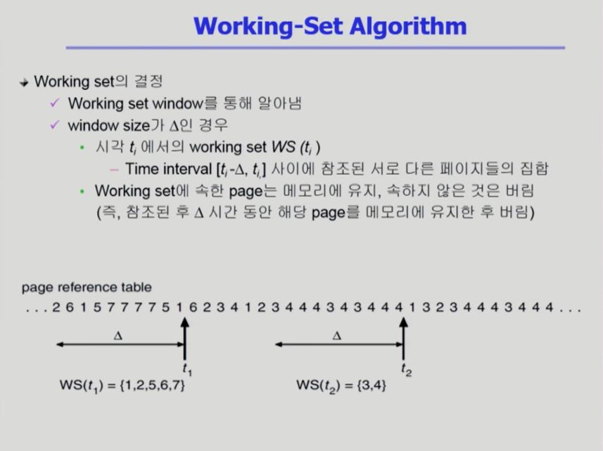

 

### PFF(Page-Fault Frequency) Scheme

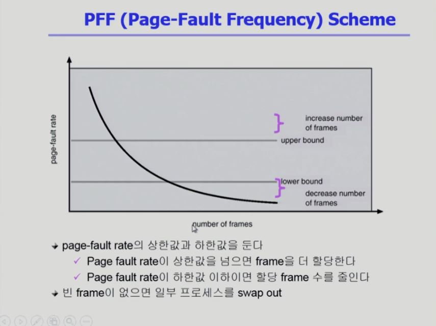

 

### Page Size의 결정

- Page size를 감소시키면
  - 페이지 수 증가
  - 페이지 테이블 크기 증가
  - Intermal fragmentation  감소
  - Disk transfer의 효율성 감소
    - Seek/rotation VS transfer
  - 필요한 정보만 메모리에 올라와 메모리 이용이 효율적
    - Locality의 활용 측면에서는 좋지 않음.
- Trend
  - Larger page size